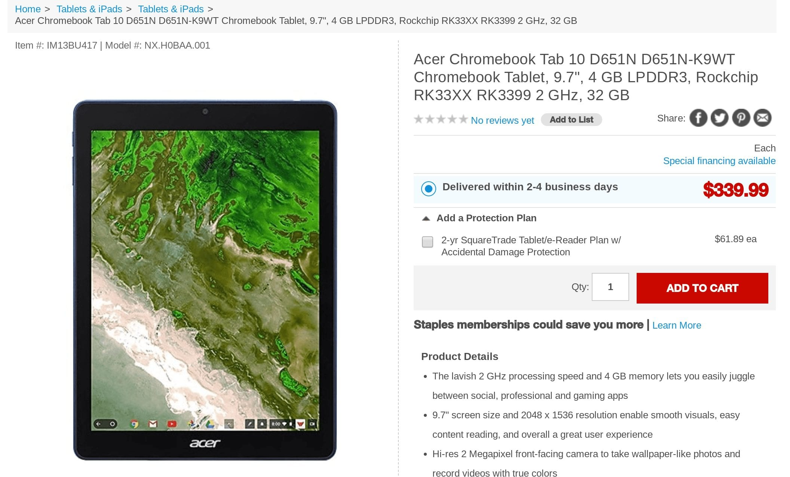

Well this is unexpected: [Staples has the Acer Chromebook Tab 10 on its store website](https://www.staples.com/acer-chromebook-tab-10-d651n-d651n-k9wt-chromebook-tablet-9-7-4-gb-lpddr3-rockchip-rk33xx-rk3399-2-ghz-32-gb/product_IM13BU417) for $339, or $10 over the MSRP. Acer has repeatedly said the first Chrome OS tablet would only be available through commercial channels since the slate is meant for the education market, but Staples is a hybrid store: It caters to both business and consumer markets. And its the first online retailer selling the Tab 10 with a physical retail presence.

Does that mean you might see the [Acer Chromebook Tab 10](https://www.aboutchromebooks.com/tag/acer-chromebook-tab-10/) in Staples stores? Possibly, although I'm leery of that happening based on my conversations with Acer.

Of course, the company could change its mind at any point in time. So it's possible you can get some hands on time with the 9.7-inch tablet running Chrome OS with Android app support before buying one.

Although it's good to see another online store selling the tablet, don't get too excited if you've already decided to buy one: I added it to my cart and the site said it was out of stock. That's odd since the main listing says delivery in 2 to 4 business days. However, that could just be a temporary inventory challenge so you might want to check the site on a regular basis if you're interested in getting one of these.

I'm finalizing my review of the Acer Chromebook Tab 10 and still [answering your questions about it](https://www.aboutchromebooks.com/news/acer-chromebook-tab-10-review-unit-is-here-got-questions/), so expect a full write up in the coming days. One teaser thought to leave you with though: I think this is a better Android tablet -- it recently got [support for the Google Duo app](https://www.aboutchromebooks.com/news/google-duo-acer-chromebook-tab-10-hp-chromebook-x2/) -- than a Chrome OS device and I'll explain why in my review.
