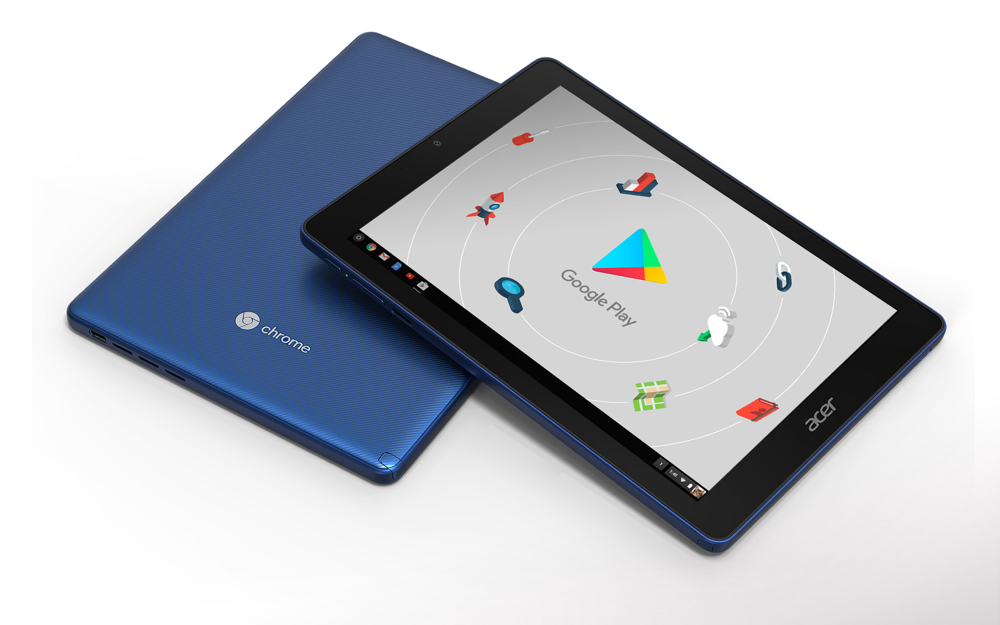

Fresh out of the box is the [Acer Chromebook Tab 10](https://www.acer.com/ac/en/US/content/series-features/acerchromebooktab10), the first Chrome OS tablet to hit the market. Acer shipped me this loaner device, which like all review units I receive must be returned. Acer is allowing me 60 to 90 days before I have to return it, which is good because software updates over time can definitely impact how well a device does or doesn't work.

If you missed the [announcement of the Acer Chromebook Tab 10](https://www.acer.com/ac/en/US/press/2018/360016) back in March, here's a brief rundown on the hardware:

- 9.7-inch IPS touchscreen with 2048 x 1536 resolution
- 2 GHz Rockchip RK3399 processor (also known as the [OP1](http://whatisop.com/), which is in the Samsung Chromebook Plus and Asus Chromebook Flip 101)
- 4 GB of LPDDR3 RAM and 32 GB of integrated flash storage
- microSD card slot for storage expansion
- One USB Type-C port for power and connectivity
- Front-facing 2MP camera and rear-facing 5MP camera
- Headphone jack
- Wacom stylus pen
- 802.11ac Wi-Fi and Bluetooth 4.1
- Dimensions of 6.78" x 9.38" x 0.39"
- Weight of 1.2 pounds

Two quick notes since this my first review for About Chromebooks, although I've reviewed scores of phones, tablets and Chromebooks for other sites since 2004: One, I _don't_ rush my reviews. Instead, I take at least five to seven days to actually use the device. I may write up or share video of first impressions, but that's all they are -- first impressions.

And two: I _always_ try to review a device for its intended use and audience. In this case, that means from an education perspective, since that's the main target for the $329 Acer Chromebook Tab. However, I know that many regular consumers are interested in the tablet as well, so I'll also provide information from that perspective too.

Lastly, since this is a unique device in that it's a small tablet that runs Chrome OS, I'm sure many readers have questions. While I may not be able to answer them all, send 'em my way at [kevin@aboutchromebooks.com](mailto:kevin@aboutchromebooks.com) or in the comments below, and I'll try to address as many as possible at the bottom section of the review.

Time to start tablet-ing and find out if [Chrome OS tablets truly will be a game changer](https://www.aboutchromebooks.com/opinion/why-chrome-tablets-will-be-a-game-changer/)!
