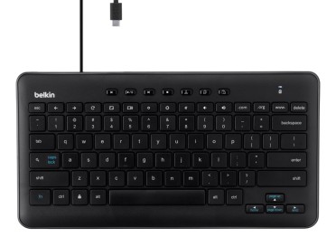

I've found that using the [Acer Chromebook Tab 10](https://www.aboutchromebooks.com/news/acer-chromebook-tab-10-review-unit-is-here-got-questions/) with a keyboard makes me more productive with the 9.7-inch tablet. Belkin must agree because today the company announced [a pair of keyboards that work with the Tab 10](https://www.prnewswire.com/news-releases/belkin-introduces-usb-c-keyboard-for-chrome-os-at-iste-2018-300671619.html): Both are wired with a USB-C connector and one of the pair has an integrated stand for the Chrome OS tablet.

Belkin says both will be available this summer, which is perfect timing for any schools that are deploying Acer Chromebook Tab 10 devices in the coming school year. [The base model will cost $39.99](http://www.belkin.com/us/p/P-B2B190/) while the option [with stand adds another $10 of that](http://www.belkin.com/us/p/P-B2B191/). Personally, I'd opt for the one with the stand so that the tablet isn't lying flat on a desk or table.

Both are "ready for standardized tests with SBAC and PARCC testing compliance" and are plug-and-play with Chrome OS: There are no drivers or software to install. I'm glad to see these are wired units because Bluetooth on Chrome OS tends to be a little flaky. And in the classroom, teachers won't want to troubleshoot wireless connectivity issues.

Obviously, these keyboards aren't specific to the Acer Chromebook Tab 10, although Belkin specifically notes compatibility with the tablet.

So if there are any other Chrome OS tablets on the way, these would surely work with them. Heck, if you have an [HP Chromebook X2](https://www.aboutchromebooks.com/news/hp-chromebook-x2-arrives-as-the-first-detachable-chromebook-tablet/) and don't want to travel with the HP keyboard base, this might make for a nice travel keyboard.
