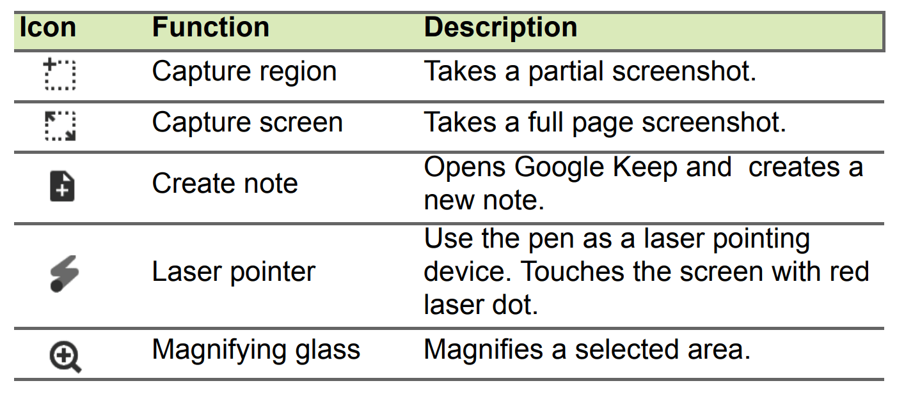

[After missing its initial April release date](https://www.aboutchromebooks.com/news/looks-like-the-acer-chromebook-tab-10-release-date-is-june-or-later/), the Acer Chromebook Tab 10 is still hard to purchase, with only third-party stores offering the first Chrome OS tablet. Acer may be readying general availability, however, now that the [Acer Chromebook Tab 10 user manual(PDF)](https://www.aboutchromebooks.com/wp-content/uploads/2018/06/Acer-Chromebook-Tab-10-User-Manual.pdf) is on the [company's support site](https://www.acer.com/ac/en/US/content/support-product/7678?b=1).

I've been checking Acer's support site daily for the manual and it finally showed up. There aren't many surprises in the manual, since Acer shared all of the specs and features when it [announced the Chrome tablet back in March](https://www.aboutchromebooks.com/opinion/why-chrome-tablets-will-be-a-game-changer/). In case you missed that news, here's a quick rundown of what you get for $329:

- 9.7-inch IPS touchscreen display at 2048 x 1536 resolution
- A 2 GHz RockChip processor (the same as you'll find in the Samsung Chromebook Plus)
- 4 GB of RAM and 32 GB of integrated storage, plus a microSD card slot for additional storage
- Front-facing 2 MP camera, rear-facing 5 MP camera
- 802.11ac Wi-Fi and Bluetooth 4.1
- Wacom digitizer and included stylus
- Weight of 1.2 pounds

Although you probably want to use the included Acer power adapter for charging the device through its USB Type C port, you will have other options. The Acer Chromebook Tab 10 says the port supports 45W power bricks with at either 5, 9, 15 or 20V.

And if you're familiar with any current Chromebook that includes a stylus, the Acer Chromebook Tab 10 works just like those: Remove the stylus and you'll see a pop-up menu showing various pen functions.

With the user manual now available, I'm hoping we see direct sales of this tablet from Acer begin within the next week or two.

Keep in mind that the device is meant for the education market, so if you plan to buy a Chromebook Tab 10 for personal / consumer use, you'll want to keep your expectations in check when it comes to build quality, performance and the like. It should be fine for a basic Chrome OS device and Android app support, but you'll get a more powerful detachable, but larger, tablet with the [$599 HP Chromebook X2](https://www.aboutchromebooks.com/news/hp-chromebook-x2-now-at-some-best-buys-plus-an-early-hands-on-video-look/).
