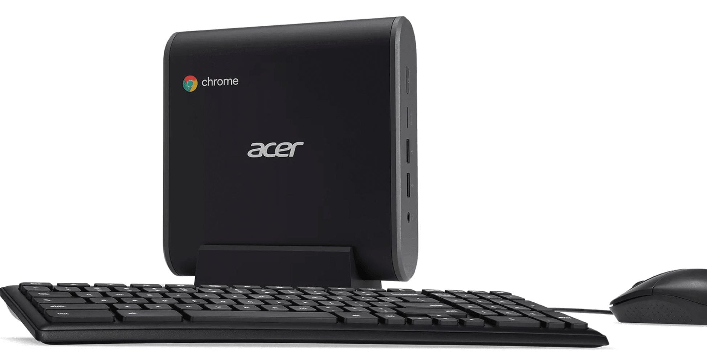

Following in the footsteps of Asus and HP, Acer now has its official landing page for new Chromeboxes up and running. You still can't purchase direct at the time of this writing but you can see more [details of the four configuration Chromebox CXI3 options](https://www.acer.com/ac/en/US/content/professional-models/desktops/acerchromeboxcxi3), with some choices priced lower than Acer's peers.

Take the Core i3 choice for example. [HP doesn't even offer one for the Chromebox G2](https://www.aboutchromebooks.com/news/hp-chromebox-g2-available-release-date-cost/), so if you skip the base Celeron model, you jump to a $549 Core i5 unit. The Acer Chromebox CXI3 with a 2.7 GHz Core i3 7130U processor, 8 GB of memory and 64 GB of storage is priced at $459.99. Asus has a similar model with [slightly older 2.4 GHz Core i3 7100U](https://ark.intel.com/compare/124977,95442), the same memory capacity but 32 GB of storage and [a third-party pre-order price of $479](https://www.aboutchromebooks.com/news/official-asus-chromebox-3-overview-page-has-a-few-surprising-specs/). That's $20 more for less local storage and a marginally slower CPU.

The other three Chromebox CXI3 configurations are what you'd expect and priced accordingly, although the starting price is higher than HP, for example: The HP Chromebox G2 base model starts at $199. Acer's entry price is $289.99 for the same 1.8 GHz Celeron, 4 GB of RAM and 32 GB of storage.

Rounding out the Acer options are the $519.99 eighth-generation Core i5 model clocked at 1.6 GHz, with 8 GB memory and 64 GB of local storage, while $759.99 ups the processor to an eighth-gen Core i7 running at 1.8 GHz and double the RAM.

Keep in mind that all four of the Acer configurations include a USB keyboard and mouse. HP doesn't if you order direct and Asus has made no mention of any included peripherals as of yet for its Chromeboxes.
