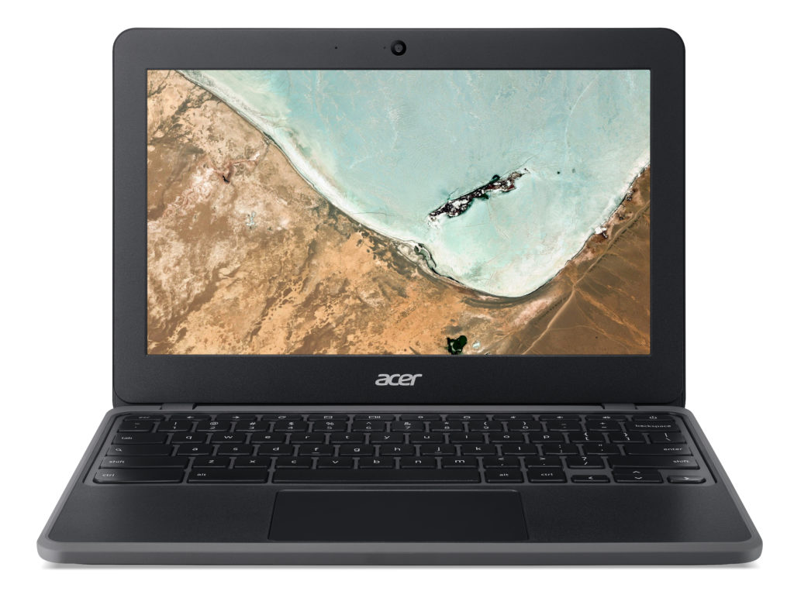
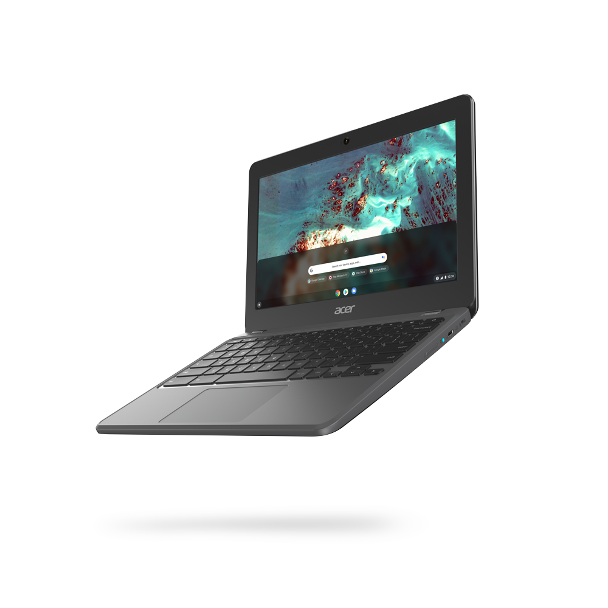
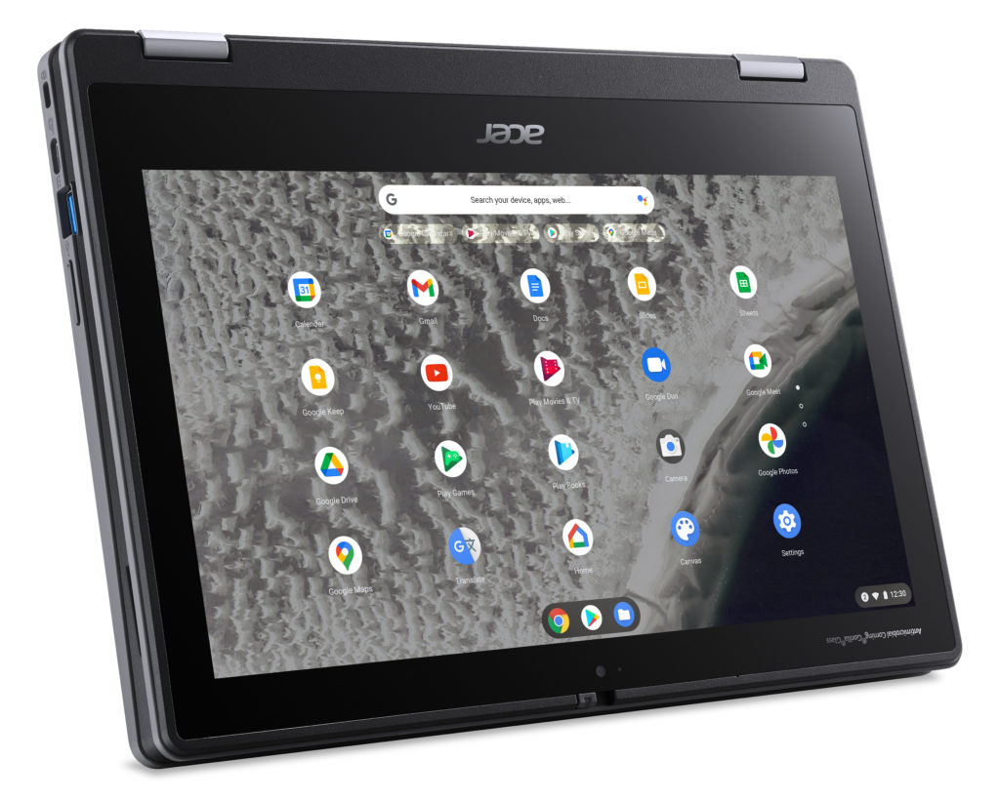
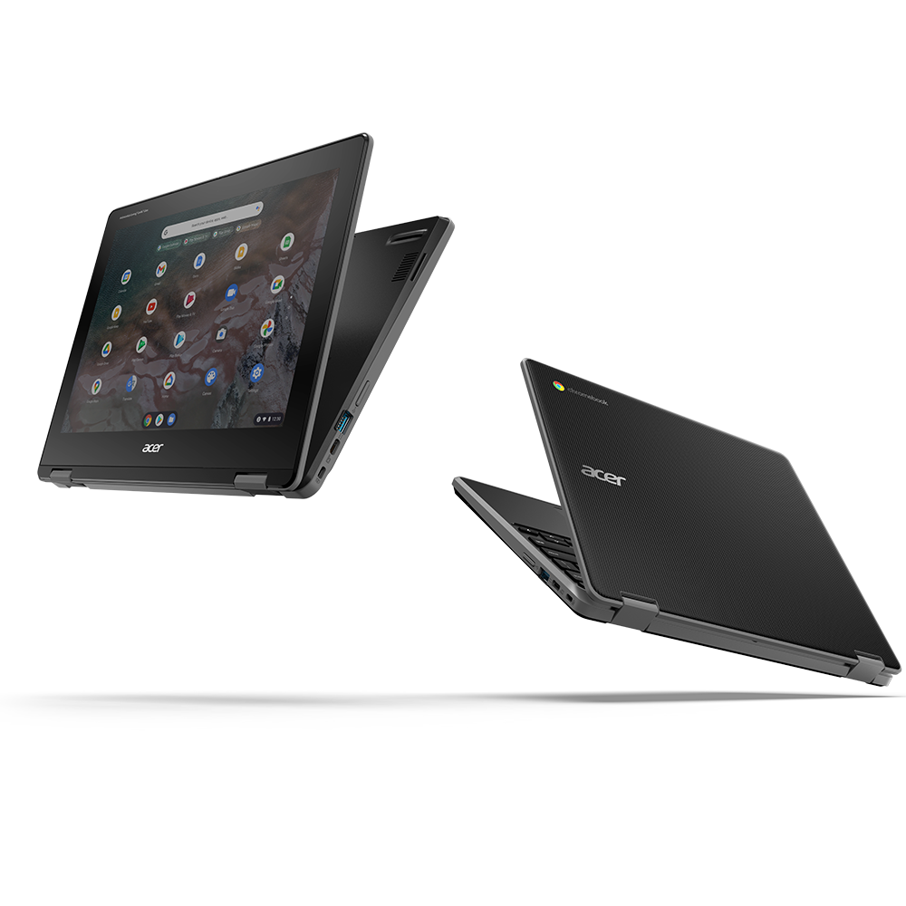

At the annual BETT show for education on Tuesday, Acer introduced four new Chromebooks specifically designed with students in mind. The [Acer Chromebook 311 and 511 devices](https://news.acer.com/acer-releases-pair-of-new-11-inch-chromebooks-for-education) run on ARM chips from MediaTek and Qualcomm, while the [Acer Chromebook Spin 511 and 512 models](https://news.acer.com/acer-debuts-two-durable-convertible-chromebooks-for-the-education-market#:~:text=Acer%20Debuts%20Two%20Durable%2C%20Convertible%20Chromebooks%20for%20the%20Education%20Market,-Editor's%20Summary&text=TAIPEI%2C%20TAIWAN%20(Jan.%2019,Chromebook%20Spin%20511%20(R753T).) use Intel Celeron and Pentium Silver processors.

All four of these classroom Chromebooks are built to withstand bumps and drops, with some models even offering antimicrobiobial coatings to fight germs. They all pass the MIL-STD 810H, with some rated safe at a four-foot drop and more than 132 pounds of downward pressure.

The two clamshell devices are interesting to me, mainly because Acer didn't use the same ARM chip vendors.

The Acer Chromebook 311, for example, runs on the MediaTek MT8183 chipset. If that sounds familiar, that's because it's the same silicon found in the [Lenovo Duet Chromebook, which was my Chromebook of the year pick in 2020](https://www.aboutchromebooks.com/news/my-pick-for-2020-chromebook-of-the-year/). For the education market, it's a good choice for a Chromebook. [Zero-touch enrollment](https://support.google.com/chrome/a/answer/10130175?hl=en&ref_topic=9028498) on the devices makes it easier for schools to manage and deploy.

Acer has been a little tight-lipped on the full specs, but we have a few of them.

The Acer Chromebook 311 has an 11.6-inch display (likely 720p) with a touch option, wide-view HDR webcam, and claimed run-time of up to 20 hours. Availability begins this month in North America, starting at $299.99, while EMEA markets can purchase in March, starting at 269 Euros.

The Acer Chromebook 511 is powered by Qualcomm's Snapdragon 7c platform, the same one that I used for [my Acer Chromebook Spin 513 first look in October](https://www.aboutchromebooks.com/news/hello-acer-chromebook-spin-513-the-first-with-a-qualcomm-snapdragon-7c/).

This 11.6-inch Chromebook features a spill-resistant keyboard thanks to a built-in drainage system. By using the Snapdragon chipset, the Chromebook 511 can be had with integrated LTE for mobile connectivity.

Acer says that this model can also run for up to 20 hours on a charge, although I would think that figure is based on Wi-Fi, not LTE, usage. Availability begins in April for North America, starting at $399.99, while EMEA markets can purchase in March, starting at 399 Euros.

The Acer Chromebook Spin 511 appears similar to the regular 511, with a few exceptions.

First, it's powered by the aforementioned Intel processors. Second, it's a full convertible 11.6-inch Chromebook, not a clamshell, with IPS HD screen. The design, build, and durability testing all remain. However, you lose a bit in the battery life: Acer says to expect 10 hours, given the choice of the chipset. Configurations with up to 8 GB of memory and 64 GB of eMMC storage will be available.

An 88-degree webcam with a physical privacy shutter comes standard as does an 8MP "world view" camera for use in tent or tablet mode. We've seen this setup on the [original Samsung Galaxy Chromebook](https://www.aboutchromebooks.com/news/samsung-galaxy-chromebook-hands-on-yes-its-as-nice-as-it-looks/) in the past. I wouldn't have a need for it, but there are education use-cases that could benefit.

Unique to the new lineup is the Acer Chromebook Spin 512. Yes, it's powered by the same processors as the Spin 511. In fact, much about it is the same except for one key detail.

Instead of an 11.6-inch 16:9 display like the Spin 511, Acer chose a 12-inch, HD+ IPS screen with a 3:2 aspect ratio, for less vertical scrolling. You don't see too many education Chromebooks with the taller 3:2 displays.

Both the Spin 511 and 512 use Antimicrobial Corning Gorilla Glass for the screens, while the Spin 512 extends that protection to the keyboard as well. The Spins also support WiFi 6 and Bluetooth 5.1. Each has two reinforced USB 3.2 Type-C ports and two reinforced USB 3.2 Type-A ports as well.

Availability for both begins in April for North America, while EMEA regions can buy them a month earlier. Pricing for the Acer Chromebook Spin 511 starts at $399.99 / 369 Euros. Acer Chromebook Spin 512 pricing begins at $429.99 / 399 Euros.

Overall, these are heavily ruggedized devices with more than enough processing power and battery life for many students and school districts. And I like the choice of a 3:2 aspect ratio in the classroom, although I'm biased as that's what I prefer. Base pricing seems in line with what you get as well too. However, I'd like to see the full specs and pricing options before suggesting schools line up for purchasing.
