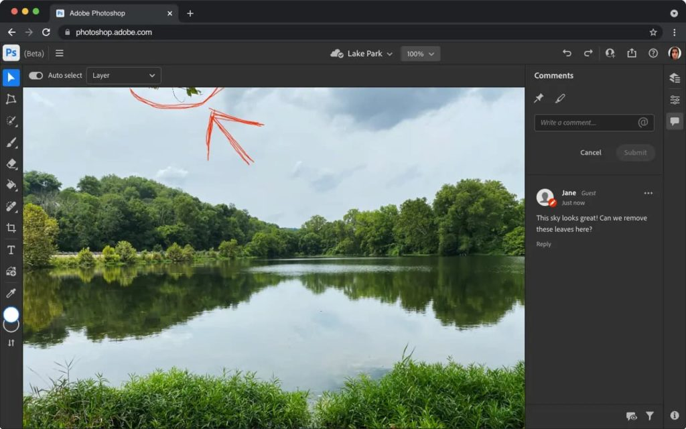

At the Adobe MAX event this week, [Adobe announced](https://blog.adobe.com/en/publish/2021/10/26/photoshop-ships-major-updates-across-desktop-ipad-apps-extends-light-editing-collaboration-features-web-beta.html#gs.e446c6) a slew of new features for its Photoshop desktop clients. It also introduced beta support for limited Photoshop usage on the web, making Adobe Photoshop on Chromebooks a potential reality. That would supplement [currently available photo editor options for Chromebooks, some of which use Linux](https://www.aboutchromebooks.com/news/5-reasons-you-might-want-to-run-linux-on-your-chromebook/).

To be clear, Photoshop in the browser is currently meant to supplement workflows for users of the desktop and web clients. As such, this news doesn't bring a full-fledged Adobe Photoshop on Chromebooks experience. Still, it's a promising development for people using Chrome OS instead of other desktop operating systems.

Here's the official statement to illustrate (no pun intended), what's new:

> In addition, we are trying something new by introducing a public beta of a new web-based share for comment workflow in Photoshop that is accompanied by a preview of a small set of Photoshop editing features all running on the web. In this beta, you and your collaborators can open and view your work in the browser, provide feedback, and make basic edits without having to download or launch Photoshop. Photoshop on the web (beta) is part of our vision of the Creative Cloud on the web that we also announced today.

Creative Cloud subscribers that want to share links to their images can do so, which actually isn't new.

What is novel is the ability to open those images in the browser, and add or reply to comments in a multi-user workflow. However, there are now some very basic editing tools available in the browser as well.

> We are beginning to explore Photoshop editing workflows on the web as part of the beta. Starting today, you will see some limited editing features like simple layers, selection tools, masking, and more. We are starting with workflows for retouching and adjusting images, some of the most common Photoshop use cases

Clearly, there's a long way to go before Photoshop on Chromebooks becomes commonplace. And there are many unanswered questions, such as will this require a Creative Cloud subscription? I'd guess yes it would, although Adobe could offer a lighter, lower-priced "browser only" subscription, or a mobile app and browser product.

Either way, this is promising!

In the meantime, I'd suggest people who want an Adobe Photoshop on Chromebooks experience consider other options. If you have Linux enabled on your Chromebook, for example, you can [install GIMP via Flatpak](https://www.gimp.org/downloads/) or point your browser [to the Photopea editor](https://www.photopea.com/) for online image editing.
