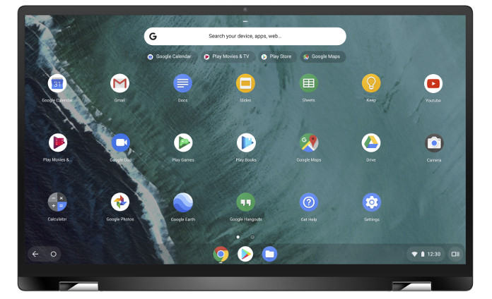
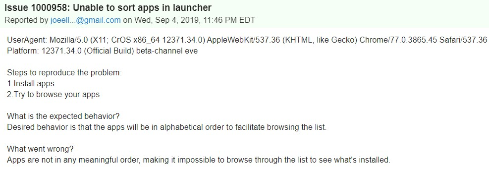

I can't believe it's 2020 and I'm saying this, but you still cannot sort applications of any kind on a Chromebook.

When a new app is installed, the app shortcut simply gets added to the next available space in the Chrome OS Launcher and when that space is full, a new Launcher page is created with the next app shortcut appearing.

[Chromebooks have been commercially available since 2011,](https://www.aboutchromebooks.com/news/chrome-os-is-10-years-old-heres-the-first-demo-from-2009/) although the CR-41 arrived in 2010, and they still don't have what I consider to be a basic, "must-have" feature for an operating system.

In a way, I understand why. Everything at Google revolves around searching.

And when I worked at Google, I _rarely_ saw my peers scrolling through an app launcher on any device, whether it was a phone or a laptop (typically MacBooks and Chromebooks). Instead, they searched for an app with just a few keystrokes, tapped the search result, and moved on.

But that's not always how people _outside_ of Google find applications on their devices. And more importantly, what's the point of having a Launcher interface at all if you expect that everyone will just search for the app they want?

What has made this situation markedly worse over the past few years is the addition of both Android and Linux apps. At least for the latter, [any Linux app installs made through Chrome OS get grouped in a folder called Linux Apps](https://www.aboutchromebooks.com/news/how-to-install-linux-apps-on-a-chromebook-without-ever-touching-linux/). That doesn't happen with Progressive Web Apps or Android software.

You can create your own app folders and manage apps yourself if you want, so that's something. But one of the things I like about Chrome OS is that the operating system doesn't get in your way. Meaning: it lets you focus on doing things, not managing things.

So even a **_basic_** sort feature by type of app (Android, Chrome OS, Linux, and PWA) would a start. Alphabetical app sorting would be a nice option too.

The way the Launcher works now, I've actually started to manage my apps and ended up with 7 Launcher pages, some of them either empty or with a single app. That's not very useful.

I'm sure there are multiple bugs (read: feature requests) for app sorting in the Launcher but I'm not going to search for them all. [I did find this one](https://bugs.chromium.org/p/chromium/issues/detail?id=1000958), which is relatively recent and has 63 people following it. I starred it follow along too and if you're in the "let's get app sorting in the Launcher" camp, you might want to do the same.

_Note: I've closed off comments for this post as of 8/13/3020; there are some in the approval queue that have devolved into personal attacks between commenters, which adds no value to the discussion._
