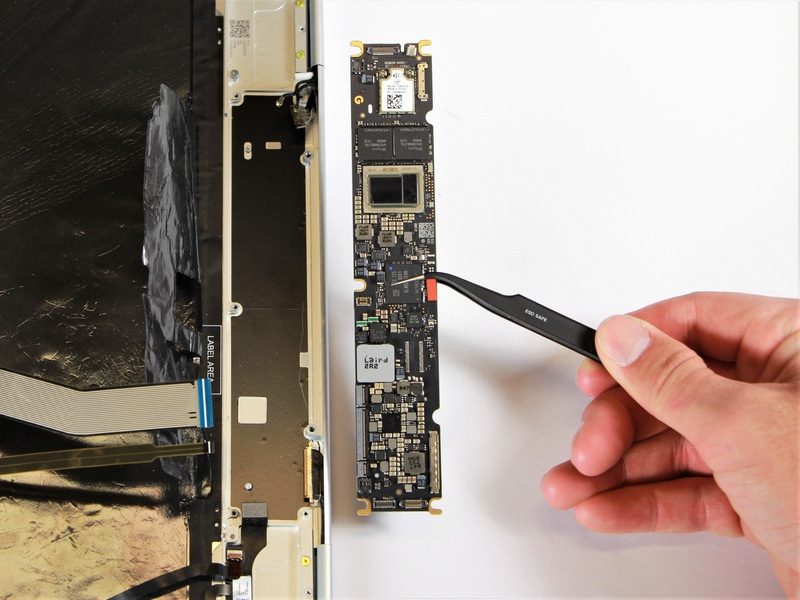

In case you missed it today, reviews for the new Apple Mac Mini, MacBook Air, and MacBook Pro were published. They're nearly universal in their praise: The ARM-based Apple Silicon M1 chips compare favorably to the best that Intel and AMD have to offer in the x86 space. And now more than ever, I'm [wishing Google could do the same for Chromebooks](https://www.aboutchromebooks.com/news/apples-own-chips-inside-arm-powered-macs-show-why-google-needs-to-make-custom-silicon-for-chromebooks/).

Before getting into that though, here are some selected quotes from reviewers using the ARM-based Mac products to set the scene.

[Matthew Panzarino, TechCrunch](https://techcrunch.com/2020/11/17/yeah-apples-m1-macbook-pro-is-powerful-but-its-the-battery-life-that-will-blow-you-away/):

> I personally tested the 13” M1 MacBook Pro and after extensive testing, it’s clear that this machine eclipses some of the most powerful Mac portables ever made in performance while simultaneously delivering 2x-3x the battery life _at a minimum._ 

[Andrei Frumasanu, AnandTech](https://www.anandtech.com/show/16252/mac-mini-apple-m1-tested/):

> The performance of the new M1 in this “maximum performance” design with a small fan is outstandingly good. The M1 undisputedly outperforms the core performance of everything Intel has to offer, and battles it with AMD’s new Zen3, winning some, losing some.

[Harry McCracken, Fast Company](https://www.fastcompany.com/90576013/apple-macbook-air-review-m1-apple-silicon-2020):

> In this household, the old Macs include a 2016 MacBook Pro with an Intel Core i7 chip and a 2018 MacBook Air with a Core i5. Both have 16 GB of RAM, double the quantity in the new Air I’ve been trying. Using iMovie to save a 74-second 4K video took more than five minutes on the 2018 MacBook Air, and sent its cooling fan into a tizzy. It took two and a half minutes on the MacBook Pro. And on the new Air—which, with its efficient M1 chip, doesn’t need a fan—it took just 49 seconds.

I could go on and on but I'll leave it to you to [seek out and read the reviews if you want](https://www.techmeme.com/201117/h1555).

Long story short: Apple's custom chip can not only keep with some of the fastest processors from Intel and AMD, it can beat them in some cases from a performance standpoint. And, more importantly, it does so using less power, which leads to big improvements in battery life.

So let's get back to Chromebooks.

Pixelbook motherboard with Intel chipset

These days, most are powered by Intel's lineup, ranging from the lowly Celeron all the way up to a Core i7. Much of a Chromebook's price, performance and capabilities revolve around that choice of chip. Yes, there have been a few [AMD-powered Chromebooks](https://www.aboutchromebooks.com/news/new-14-inch-amd-powered-lenovo-chromebook-s345-breaks-cover-329-at-best-buy/), which use the same architecture as Intel, but not many.

The rest are made up of ARM-based chipsets typically found in phones and have a similar instruction set to Apple's M1 processor. But those, such as the [superb Lenovo Chromebook Duet](https://www.aboutchromebooks.com/news/the-249-lenovo-duet-chromebook-is-back-in-stock-at-walmart/), usually offer entry-level to (at best) mid-range performance. None of them can compete with the new Mac products when it comes to performance.

That's because the Qualcomm's, MediaTek's, Samsung's and others who design ARM-based processors don't deviate as much as Apple from the base ARM designs.

If you're not familiar with ARM, they don't make chips. Instead, they design the chip architecture and offer various licensing agreements to companies, depending on how much those companies want to tweak or change the design.

Apple has a full architecture license as do some of the other ARM-based chip designers I just mentioned. But nobody is advancing those designs like Apple. Nobody really has to since they're all using the same software, be it Android or Chrome OS. So ARM-based Chromebooks are relegated to using more common, almost "off the shelf" processors.

Google could change that. Indeed, I suggested this back in June when Apple announced it would be moving from Intel x86 silicon to its own in-house ARM designs (emphasis mine):

> "Google has to rely on mostly off-the-shelf processors that are commodities. It’s hard to optimize fully in that case. And Apple’s advantage here isn’t just a single CPU architecture, but soon a unified application ecosystem, something that Google doesn’t have. Closing the loop then, **_a customized ARM architecture processor combined with Chrome OS fully optimized for that custom processor_** is clearly lacking right now in the Chromebook space."

Without designing a chip that's fully integrated with Chrome OS, Google and its partners aren't offering the best Chromebook experience that could be had.

Think of it this way: Why are Apple iOS devices generally rock solid and often better performing than the majority of Android devices even though the specs favor the latter?

It's because of that tight hardware and software integration that's optimized for the best experience. The chipsets are designed to make the software performance sing. That's not how Chromebooks are made, unfortunately.

Here's another thought experiment to highlight this point: If it was possible to install, optimize and run Chrome OS on a Mac laptop powered by the new M1 chip, how would you expect it to run? I think it would run circles around any Chromebook available today while also offering a massive battery life gain.

Obviously, this scenario is hypothetical and will never happen as I described it.

But it could be real in the sense that Google, who has designed some ML and other chips, create processors meant to run Chrome OS. I don't mean to partner with a Samsung or a Qualcomm. I mean get the best and brightest chip designers available that Apple hasn't already snatched up and create a Chrome OS-specific system-on-a-chip.

Google's hardware partners could still use the traditional x86 and ARM processors they use today if they wanted to. I can't see them being upset by that if they're competing with Microsoft in the same PC spaces with that company's Surface line.

It's time for Google to take Chromebooks to the next level and provide its "modern OS" with a modern chipset that's custom made for it.
