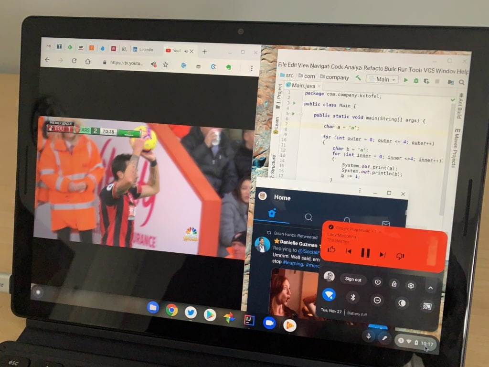

If your only major knock against the Google Pixel Slate was the high price, you just ran out of excuses to buy one. Amazon is selling all three Pixel Slate models at a discount and including a free Google Pixel Slate keyboard.

The largest bang for the buck is on the Intel Core m3 model with 8 GB of memory and 64 GB of storage. Its normal price is $799 without the keyboard. This deal gets you both [the Pixel Slate and $199 keyboard for $549](https://www.amazon.com/gp/product/B07KB3M5DR/ref=as_li_qf_asin_il_tl?ie=UTF8&tag=aboutchromebo-20&creative=9325&linkCode=as2&creativeASIN=B07KB3M5DR&linkId=0f8acc93dfd709db8f8abe09401a6dd2).

The higher-performing models are also discounted by $250. For example, the $999 Core i5 model with 8 GB of memory and 128 GB of storage - the same one I bought at that price last year - [is down to $749 with the included keyboard](https://www.amazon.com/gp/product/B07KB33C9H/ref=as_li_tl?ie=UTF8&camp=1789&creative=9325&creativeASIN=B07KB33C9H&linkCode=as2&tag=aboutchromebo-20&linkId=a3e9c802d9beac27ae28c10f4a244128); an extra $199 value.

And for those who want the best of the best, the normal $1,599 [Core i7 option doubles up on memory and storage from the Core i5 and includes the Google Pixel Slate keyboard for $1,349](https://www.amazon.com/gp/product/B07KBDDBP5/ref=as_li_qf_asin_il_tl?ie=UTF8&tag=aboutchromebo-20&creative=9325&linkCode=as2&creativeASIN=B07KBDDBP5&linkId=4551178a9f5e3f565c45349d0e59d38a). Note that Google is also selling these bundles at the same price and give you the option of including the Brydge G-Type keyboard.

[Should you buy one](https://www.aboutchromebooks.com/opinion/google-pixel-slate-vs-chromebook-should-i-buy-chromeos-tablet/)? Only you can answer that, of course, but I think that for some people, this is too good a deal to pass up.

Those people want solid performance for everyday browsing, which all of these devices offer. Android app performance should be fine as well, in my experience. Just keep in mind that if you rely heavily on Android apps, not all of them are well optimized to run on a tablet. That hasn't bothered me since you can use split-screen mode, which can help. And when the keyboard is attached, you can generally resize an Android app.

Multiple Chrome tabs, a PWA, Google Play Music Android app and Linux humming along.

If you want to dabble with Linux and Project Crostini, again any of these will do. But if you're going to use Linux desktop apps on a fairly regular basis, I'd opt for at least the Core i5 model: That will provide more storage space for the Linux container and installed applications. [Until recently](https://www.aboutchromebooks.com/news/acer-chromebook-spin-13-with-16-gb-ram-should-you-buy-one/), I used that model for [my Computer Science and programming classes and it handled everything I needed to do](https://www.aboutchromebooks.com/news/how-to-code-on-a-chromebook-crostini-pixel-slate/).

While [Google is now officially out of the Chrome tablet business](https://www.aboutchromebooks.com/news/made-by-google-exit-tablet-business-pixel-slate-chrome-os-chromebooks/), the Pixel Slate has continued to improve through software updates roughly every six weeks. It still has the best speakers and display, in my opinion, as well as all-day battery life. Put another way: Many of the issues found in [initial reviews](https://www.aboutchromebooks.com/reviews/google-pixel-slate-review/) have been fixed.

Thanks, Derek for the tip!
