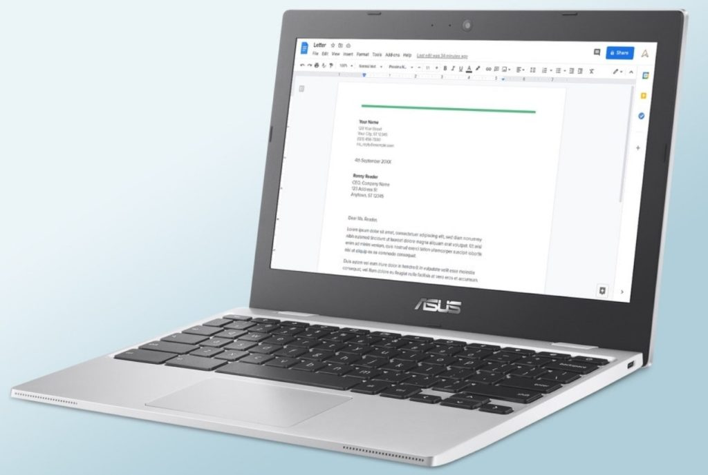
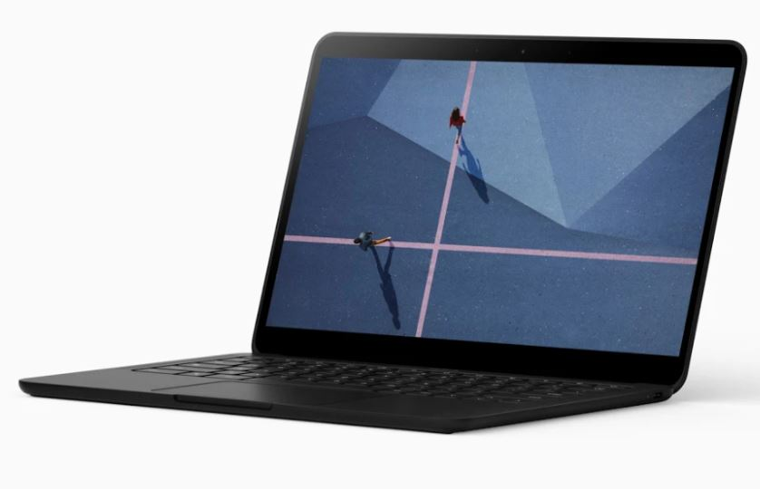
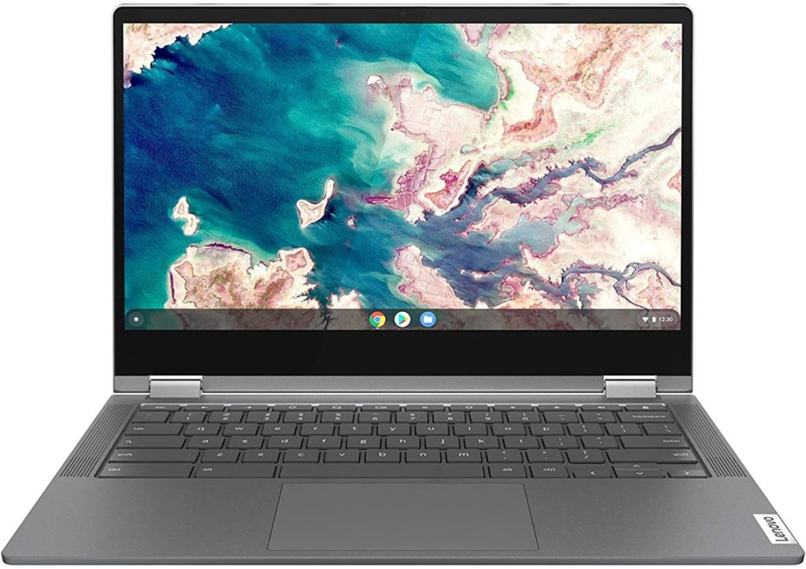

Short of Black Friday, today and tomorrow are the epitome of consumerism, thanks to [Amazon Prime Day](https://amzn.to/3wM4vCA). I'm a minimalist so I'm allowed to be a teensy bit salty. ;) Still, there are some Chromebook sales worth a mention. So here's a roundup of [Amazon Prime Day Chromebook deals](https://amzn.to/3wM4vCA) to consider and pass on.

Let me first share the deals that I don't think are great and why.

## Amazon Prime Day Chromebook deals that aren’t the best

That Asus Chromebook CX1 available in 11.6-inches is [on sale for $199.99](https://amzn.to/2TOZVVt). That's a $30 discount. While that price sounds good, [I'm not a fan of Asus choosing to use an Intel Celeron from 2016 inside a 2021 Chromebook](https://www.aboutchromebooks.com/news/help-me-understand-these-unannounced-new-asus-chromebook-cx1-laptops/). Others may disagree and I get that: This entry-level device will certainly do everything any other entry-level Chromebook can.

I'm more concerned that Chrome OS software updates may run out on this Chromebook sooner than a more recent model. And, to be honest, you can get a more recent model with similar or better specs for a similar investment.

The [Samsung Chromebook Plus v2 is heavily discounted from $499 to $299 right now](https://amzn.to/3gQWQMv). And truth be told, it's a great little convertible Chromebook with a high-resolution screen. Inside is a dual-core [Intel Celeron 3965y processor that arrived in early 2017](https://ark.intel.com/content/www/us/en/ark/products/122698/intel-celeron-processor-3965y-2m-cache-1-50-ghz.html), so I share the same concerns about it as the previously mentioned Asus model.

It's not a hard pass for me, but again, I think you can do better for the money right now. Note that you're getting a scant 32 GB of local storage on this deal. The same model with 64 GB of memory is $422 right now on Prime Day.

This may surprise many since [I called the Pixelbook Go my "Chromebook of the year" in 2019](https://www.aboutchromebooks.com/news/my-pick-for-2019-chromebook-of-the-year/), but I'd pass on the top-end model. Normally $1,399, you can [get the Core i7 Pixelbook Go with 16 GB of memory and a 256 GB SSD for $1,149 on Prime Day](https://amzn.to/3iYWZjF).

Yes, you'll save $250. But there are high-end Chromebooks with newer Core i7 processors available for less, even when not on sale. And to be honest, unless you're a developer, a Chromebook with these specs is more than you need for typical use. I say shop around and find a nice deal on a different high-end Chromebook.

## Better Amazon Prime Day Chromebook deals

That leads me into Amazon Prime Day Chromebook deals that I'd consider pulling the trigger on.

Since I just mentioned a high-end option, let's start with one of those. I'd strongly look at the [2020 Samsung Galaxy Chromebook at $699](https://amzn.to/3cZez33), down from its $999 MSRP. This is the least expensive I've ever seen this device. You're getting [a slim device with a gorgeous 4K AMOLED display](https://www.aboutchromebooks.com/news/samsung-galaxy-chromebook-hands-on-yes-its-as-nice-as-it-looks/), a 10th-generation Intel Core i5 processor, 8 GB of memory, and 256 GB of speedy NVMe local storage.

Oh and the included stylus tucks away into the chassis, which is convenient. The Achilles heel here is the meager battery life so keep that in mind.

On the mid-range side, you just [can't beat the Lenovo Chromebook Flex 5](https://www.aboutchromebooks.com/news/lenovo-flex-5-chromebook-hands-on-and-first-impressions/), even at its $429 regular price.

Thanks to Amazon Prime Day Chromebook deals, you can [grab this 13-inch convertible Chromebook for $309](https://amzn.to/2TTXMHX). The value is off the charts at that cost. Aside from the 1080p touchscreen, there's a solid 10th-generation Intel Core i3 processor paired with 4 GB of memory, 64 GB of storage, and support for fast WiFi 6.

[Lenovo does have a model with double the memory](https://www.aboutchromebooks.com/news/lenovo-flex-5-chromebook-with-8-gb-ram-for-449-99/), which would allow for more open tabs and apps at one time, but 4 GB will do for most average Chromebook users.

And if I was searching for an entry-level Chromebook on a budget of around $200, I think the HP Chromebook 11a is where I'd look.

This device has an 11.6-inch display and runs on a very capable MediaTek 8183 processor with 4 GB of memory and 32 GB of storage. That ARM-based 8-core CPU is the same one that powers the very popular [Lenovo Chromebook Duet tablet](https://www.aboutchromebooks.com/news/my-pick-for-2020-chromebook-of-the-year/) (my 2020 Chromebook of the year) and gets you some nice bang for buck performance.

The display is only 1366 x 768 and the local storage is a little stingy but can be complemented with a microSD card; something you can't do on the Duet. You'll get gobs of battery life too if 12 or so hours meets your definition of "gobs".

If that sounds good to you, [save $70 on the HP Chromebook 11a and grab one here at $189.99](https://amzn.to/2Uooxop).

This is only day one of Amazon Prime Day, so if I see other Chromebooks worth buying, or possibly avoiding, I'll add them to this post.
