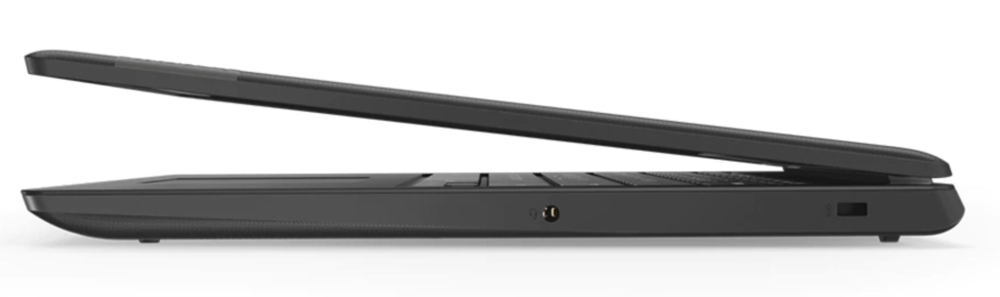

If the discounted [Acer Chromebook Spin 13 for $599.99](https://www.aboutchromebooks.com/news/amazon-prime-day-deal-acer-chromebook-spin-13-300-discount/) or [Samsung Chromebook Plus V2 at $379.99](https://www.aboutchromebooks.com/news/amazon-prime-day-deals-samsung-chromebook-plus-v2-discount/) is too much for your budget, check out the [Lenovo Chromebook S330 at $144.99](https://www.amazon.com/Lenovo-81JW0001US-Chromebook-S330/dp/B07KF1TC9T?ref_=Oct_DLandingS_PC_3607b8ae_8&smid=ATVPDKIKX0DER). That's a steep discount from the $249.99 for this entry-level device directly from Lenovo.

Just keep in mind the key part of that phrase: This is an entry-level Chromebook. You can tell that by some of these specifications as well as Lenovo's tagline of "Fast and simple, for daily computing":

- MediaTek MTK8173C Processor
- 14-inch 1366 x 768 anti-glare display
- 4 GB of RAM
- 32 GB of eMMC storage with SD card expansion
- 720p front webcam
- A USB Type-C port for power and Display Port out
- A USB Type-A port
- Full-sized HDMI jack
- Expected 10-hour battery life
- Weight of 3.5 pounds

Compared to most mid-level Chromebooks costing $300 to $400, you can see some corners are cut here. Another USB port would be nice to have, as would a backlit keyboard. And 1366 x 768 resolution isn't the sharpest, particularly on a large display like this.

Lenovo does address the relatively low-resolution screen with a 279.99, but that's not part of Amazon's Prime Day deal. The hinge on the Lenovo Chromebook S330 only folds 180-degrees as well; a 2-in-1 this isn't due to the hinge and a lack of touch support on the screen.

And unlike most of the Chromebooks available today, the Chromebook S330 doesn't use an Intel processor as Lenovo opted for an ARM-based chip from MediaTek. From a performance standpoint, I'd expect this chip to be roughly in line with a current Intel Celeron processor. Again, entry-level is the key here.

**_But sometimes that's all people need_**: A device that boots quickly, runs all day on a charge, has a basic display and can handle browsing or web apps. The [Lenovo Chromebook S330](https://www.lenovo.com/us/en/laptops/lenovo/lenovo-n-series/Lenovo-Chromebook-S330/p/88LGCS31095) meets those requirements and at $145, won't bust your budget.
