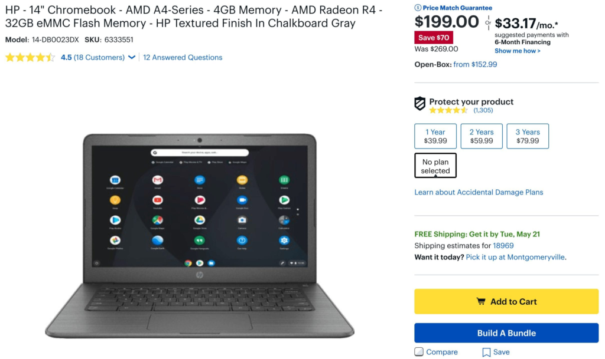
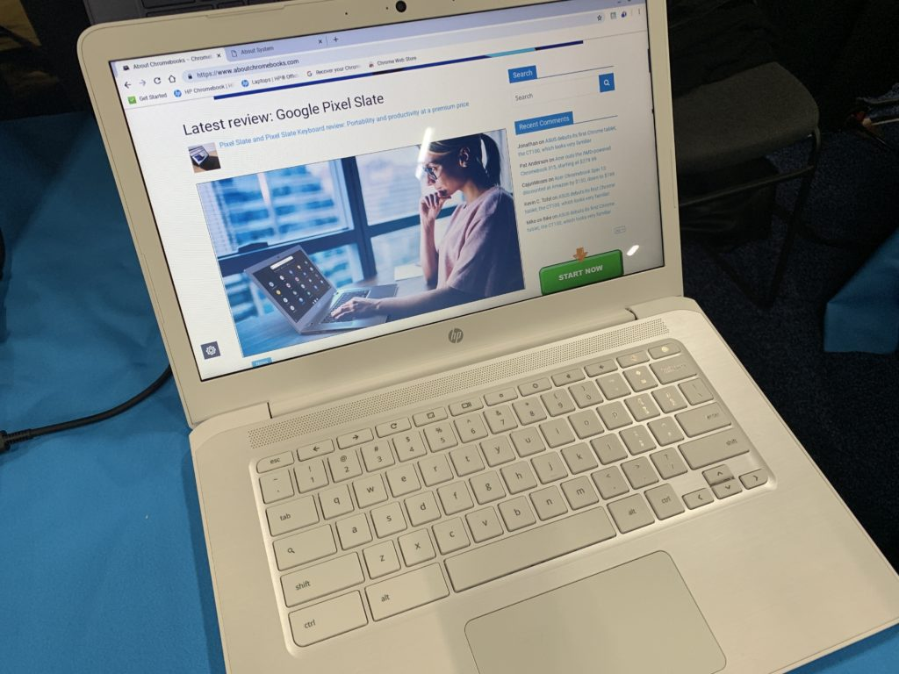

Although I typically scan weekly ads for discounts on high-end Chromebooks since I tend to use those, this week I'm focusing on the low-end. [Best Buy is selling the HP Chromebook 14 with AMD processor for $199](https://www.bestbuy.com/site/hp-14-chromebook-amd-a4-series-4gb-memory-amd-radeon-r4-32gb-emmc-flash-memory-hp-textured-finish-in-chalkboard-gray/6333551.p?skuId=6333551), which is a $70 savings from the entry-level model price of $269.

Note that the weekly online ad required me to add the HP Chromebook 14 to my cart before showing the price.

My [hands-on look at the HP Chromebook 14 at CES in January](https://www.aboutchromebooks.com/news/hp-chromebook-14-amd-specs-price-availability-benchmark/) suggested that the plastic-chassis device provides roughly the performance of an Intel Celeron Chromebook. Don't expect high end performance at a low end price is the best way I can set your expectations.

Here's a rundown on the HP Chromebook 14 specifications:

- AMD 2.2 GHz Dual-Core A4-9120C with Radeon R4 graphics (fanless)
- 4 GB of memory
- 32 GB of eMMC storage
- 802.11ac Wi-Fi and Bluetooth 4.2
- Front-facing HD webcam
- 180-degree hinge
- Multi-gesture trackpad, no keyboard backlighting
- microSD card reader
- Dual speakers tuned by B&O
- 2 USB Type-C 3.1 ports, 2 USB Type-A ports
- Battery life expected around 9 hours
- A weight of 3.4 pounds
- Support for Android apps in the Google Play Store

I suspect that the AMD CPU and GPU are held back a little by slow memory modules: The 4 GB of DDR4 RAM runs at a relatively sluggish 1.6MHz. That choice, the lack of a backlit keyboard and the 720p panel help keep the price down though, making this an affordable Chrome OS laptop.

I'd say it's worth a look as a secondary device for those who already have a decent laptop or Chromebook already. I'm considering it as our shared "family room" Chromebook since we all tend to browse the web or check email in front of the TV during commercials.

The HP Chromebook 14 might also be a good starter laptop for the younger crowd: It's surely capable of what kids might do for school or online entertainment and if it breaks for any reason, you won't feel like a huge investment went down the drain.
