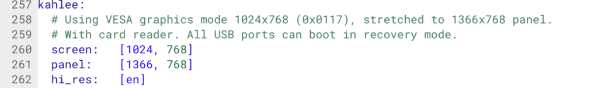

Aside from ARM chips inside Chromebooks, Intel has had a lock on the devices when it comes to x86 processors. That's going to change, possibly this year, thanks to AMD getting in on the market. [XDA-Developers found Chromium OS code referencing a device called "Kahlee"](https://www.xda-developers.com/raven-ridge-chromebook-kahlee/), which will run on an AMD Ridge Raven processor. Two additional AMD-powered devices are also in the works.

I've seen the Kahlee reference before but held off on mentioning it until I could gather more information. Today I found some, but it's just a little more.

I anticipate the Kahlee Chromebook to be a low-cost device, not because of the AMD processor but due to the screen resolution which I found in the Chromium OS code: Kahlee will support a 1366 x 768 display. That screen resolution isn't typically found in high- or even mid-range Chromebooks which tend to have 1920 x 1080 displays in the $400 and up price range. As a result, I'm taking an educated guess that Kahlee is meant for the sub-$400 market.

As far as the processor, AMD's Raven Ridge mobile chips were announced and [became available in January of this year](https://www.amd.com/en-us/press-releases/Pages/ces-2018-2018jan07.aspx). The lowest model -- dubbed the RYZEN 3 2200U with Radeon Vega3 Graphics -- is still pretty capable: 2 cores with a max clockspeed of 3.4GHz (as needed), 3 graphics compute units with a GPU clockspeed of 1.0GHz, and nominal TDP of 15W. Dell currently uses a variant of this chip to power its 17-inch Dell Inspiron 5000 series of laptops.

Note that at least one code commit as recently as April 19th [swaps Kahlee out with the code name of Grunt](https://chromium-review.googlesource.com/c/chromiumos/third_party/toolchain-utils/+/1017819). It's possible that Grunt, which also supports a 1366 x 768 display resolution, is a separate board that will be used for the basis of a Chromebook or could be the same. My guess is that it's separate.
