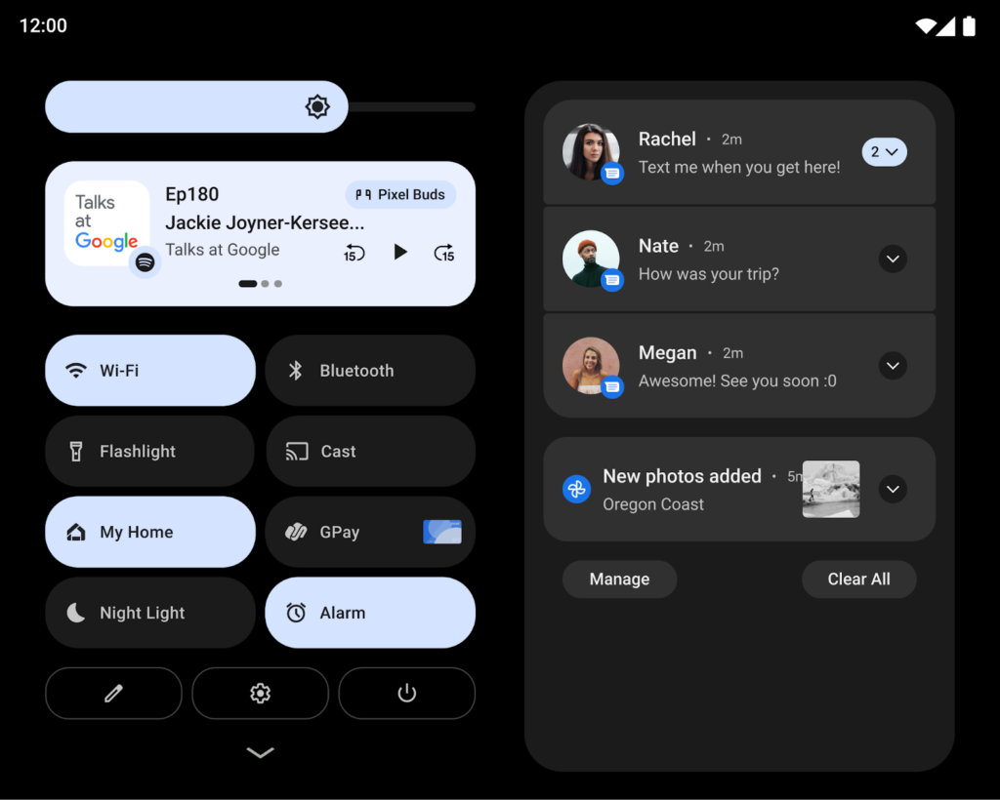
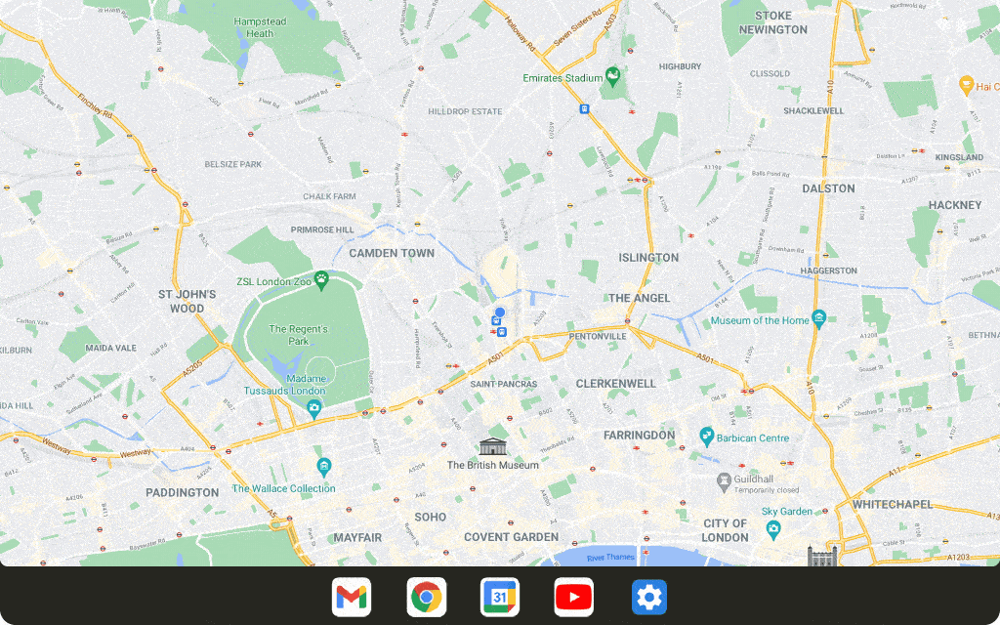

In a surprise announcement on Wednesday, Google announced a new version of Android. Yes, just one week after [Android 12 was made available for recent Pixel devices](https://blog.google/products/android/android-12/), Google introduced [Android 12L](https://android-developers.googleblog.com/2021/10/12L-preview-large-screens.html). The "L" stands for "Large". That's because this version of Android has full support for folding phones and larger displays. And yes, that includes support for [mobile apps on Chromebooks](https://www.aboutchromebooks.com/tag/android-apps/) too.

Indeed, in its blog post about Android 12L, Chrome OS got a nice mention:

> There are over a quarter billion large screen devices running Android across tablets, foldables, and ChromeOS devices. In just the last 12 months we’ve seen nearly 100 million new Android tablet activations–a 20% year-over-year growth, while ChromeOS, now the fastest growing desktop platform, grew by 92%. We’ve also seen Foldable devices on the rise, with year on year growth of over 265%! All told, there are over 250 million active large screen devices running Android. With all of the momentum, we’re continuing to invest in making Android an even better OS on these devices, for users and developers.

Even so, I suspect this feature drop is really intended for folding phones and Android tablets more so than for Chromebooks. But we'll get to that in a bit. For now, here are some of the features in Android 12L:

A nice two-column layout for applications, notifications, and settings will be made available for developers targeting larger devices and folding phones. Interestingly, the right column looks an awful lot like the notification area of a Chromebook:

There's a new taskbar in Android 12L to assist with split-screen multitasking, as well as native app resizing in this mode. Google is adding that even if the Android app itself isn't designed to be resized.

Neither of these features is likely to help improve mobile apps on Chromebooks, though. For that, Google is working on Adaptive Design functionality so Android apps can adapt to different devices, users, and screen elements.

And to that end, Google is illustrating how this Material Design element will work on phones, tablets and desktops, such as a Chromebook:

I'll be honest. The demo looks great on every device size and form factor shown. And I'd love for Android apps on Chromebooks to behave this way. That would rid us of the functional but "meh" experience of using mobile apps on Chromebooks.

I'm just not sure it's going to happen.

Most of what I see here, aside from the foldable phone aspect, appears to be a repackaged version of the Android developer features that have been around for years to scale Android apps to tablets. And if you've used an Android tablet recently, you'll know that most developers don't seem interested in using those features. There's still a ton of wasted space and a lack of visual optimization in Android apps as a whole on tablets. And on Chromebooks for that matter.

So what's going to be different this time around?

Perhaps folding phone buyers will want a similar Android experience on their Chromebooks. But the folding phone market is miniscule compared to the overall phone market. And there's no guarantee those users will use Chromebooks, regardless of their phone choice.

Even Google knows this is an issue. Unlike with iOS and iPadOS where apps are generally optimized for their respective display sizes, Google has to highlight such apps.

From its announcement today:

> To make it easier for people to find the best app experiences on their tablets, foldables, and ChromeOS devices, we're making changes in Play to highlight apps that are optimized for their devices.

I can definitely appreciate this gesture because I'd want to use Android apps that are optimized for my Chromebook. But the fact that such apps have to be elevated in the store to get my attention tells me all I need to know.

I would love to be wrong. Really, I would. But all Google can do to improve mobile apps on Chromebooks is provide the tools to developers. And it's doing that. [Again](https://www.aboutchromebooks.com/news/android-apps-chromebooks-chrome-os-vs-ios-apple-macbooks-m1/).

Ultimately, it's up to the app makers to invest time in the new Android 12L framework to make this a reality. History suggests the odds are against it.
