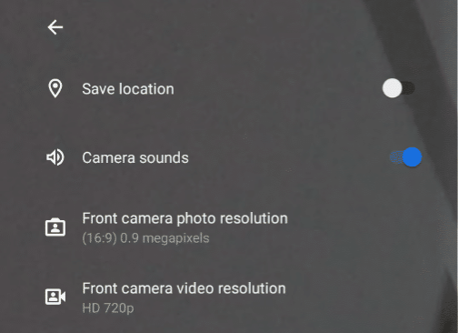
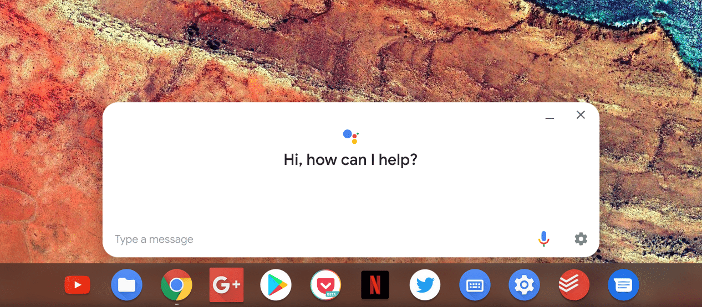

If you're waiting for Android 8 to arrive on your Chromebook, you can stop waiting. No, you didn't get it and in fact, you probably aren't. That's OK though: Google appears to be skipping Android 8.0 for Chrome OS and going directly to Android 9.0, aka, Android Pie. The news comes by way of Chrome Story, which [shows the Android 9.0 upgrade in the latest Chrome OS Canary Channel](https://www.chromestory.com/2018/10/chromebook-android-pie/), which I presume to be Chrome OS 72.

This actually shouldn't be _totally_ unexpected: The [Chrome OS system tray and started mimicking those in Android 9](https://www.aboutchromebooks.com/news/dark-themed-android-p-like-system-tray-settings-menu-available-for-chromebooks/), not Android 8, back in May. And frankly, Android 8 was introduced roughly a year ago. Why not bring the Android functionality up to a more current level at this point for Chromebooks?

Aside from supporting Android apps with the higher API level that adds new functionality to them, this also adds some interesting features. First is a change from using the Chrome OS camera app to the Android Camera software by default. That move should bring much higher image quality to Chromebooks and Chrome tablets -- [I'm looking at you Pixel Slate](https://www.aboutchromebooks.com/opinion/google-pixel-slate-vs-chromebook-should-i-buy-chromeos-tablet/) -- when using the cameras for images, videos and video conferencing.

\[caption id="attachment\_2037" align="aligncenter" width="504"\] Image Credit: Chrome Story\[/caption\]

Also updated in Chrome OS Canary is the Google Assistant interface. Instead of being put off the side, the Assistant moves front and center, getting a more modern look. Google has been making a big push lately with its Home and Pixel product lines; bringing more prominence to the Assistant on Chrome OS is right in line to continue that strategy. I actually don't use the Assistant that much on my Pixelbook -- I generally forget it's there -- so I'll be curious if the change causes me to engage more with it.

\[caption id="attachment\_2038" align="aligncenter" width="1266"\] Image Credit: Chrome Story\[/caption\]

Hopefully, some additional features are added through the Android 9 upgrade. One in particular that I know folks are looking for is improved usage of micro SD and SD cards with Android apps. It could be that this is really on developers to add the functionality since some apps do work well with removable storage on Chromebooks, but if there are any tweaks that Google needs to make for this, I hope they're in the next major Chrome OS version update.
