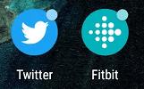

In an effort to make Chrome OS and web apps behave more like native apps, the Chromium team has proposed a new [API that would add notification badges to Android and web apps on Chrome OS devices](https://www.chromestatus.com/feature/6068482055602176). This would be similar to how notifications work today for mobile apps, providing a key bit of information without annoying notification pop-ups.

The [badging API will actually apply to all web apps across many platforms](https://github.com/mgiuca/badging/blob/master/explainer.md), not just Chrome OS: That includes apps on Apple's macOS, Microsoft's Universal Windows Platform (UWP) and Windows 7+, Android 8.0 or better, iOS and the Ubuntu distro of Linux. And if the effort goes as proposed, it would actually be these systems that get the feature first as the mechanism will eventually come to Chrome OS via installed Android and web apps.

All supported systems, save for Chrome OS, will display the number of notifications in a small badged area on the app icon.

Due to how the API will be implemented for Chrome OS, a small dot will take the place of the number, indicating that there is at least one notification for the app, which is likely a Progressive Web App (PWA).

I like the idea here. Yes, on Chrome OS we do get system notifications in the tray, along with a small, numeric indicator to show how many unread notifications there are. But that number is the sum total of all notifications, not how many you have for a specific app, which is much more useful. Agree or disagree?
