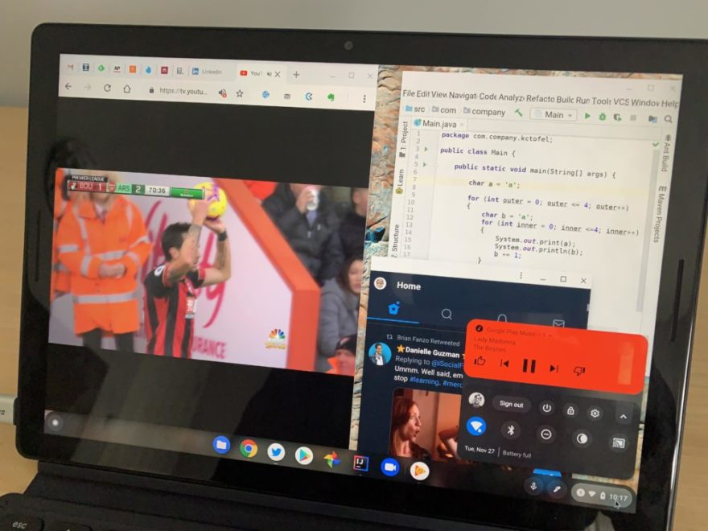
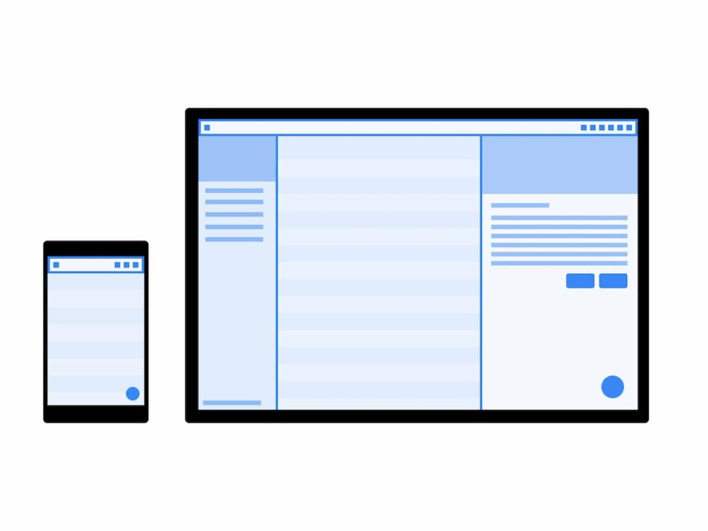

I've really enjoyed reading about the new Apple M1-powered MacBook Air and MacBook Pro this past week. I'm impressed by Apple's silicon design chops to bring a 3.9 GHz ARM system-on-a-chip to what's traditionally been an x86 world. So much so that [I wish Google would design a Chrome OS optimized ARM chip of its own](https://www.aboutchromebooks.com/news/all-the-great-apple-silicon-m1-device-reviews-make-me-wish-for-chromebooks-with-google-made-chips/). That's a potential future development though. Now, I'm looking to see how the iOS app experience on the new Macs compares to that of the Android app experience on Chromebooks.

Although there are some benefits that Apple iOS and iPad OS developers have compared to Android developers, by and large, using mobile apps on the Mac doesn't seem that much better than using mobile apps on a Chromebook.

I've seen a number of video examples, but here are a few written ones from various reviews I've read.

[Chance Miller, 9to5 Mac](https://9to5mac.com/2020/11/18/iphone-ipad-apps-m1-mac/):

> Almost all of the streaming video services have chosen not to allow their apps to be run on the Mac, including Hulu, Netflix, Plex, and Amazon Prime Video. The one surprise here, however, is that HBO Max is available on the Mac… but it’s not very good. For instance, the HBO Max application can’t be resized and there’s no way to enter full-screen for video playback. It really is the worst possible way to watch video on a Mac, but at least it’s available as an option, I guess.

[Matthew Panzarino, TechCrunch](https://techcrunch.com/2020/11/17/yeah-apples-m1-macbook-pro-is-powerful-but-its-the-battery-life-that-will-blow-you-away/):

> The current iOS app experience on an M1 machine running Big Sur is almost comical; it’s so silly. There is no default tool-tip that explains how to replicate common iOS interactions like swipe-from-edge — instead a badly formatted cheat sheet is buried in a menu. The apps launch and run in windows only. Yes, that’s right, no full-screen iOS or iPad apps at all. It’s super cool for a second to have instant native support for iOS on the Mac, but at the end of the day this is a _marketing_ win, not a _user experience_ win. 

[Samuel Axon, ArsTechnica](https://arstechnica.com/gadgets/2020/11/mac-mini-and-apple-silicon-m1-review-not-so-crazy-after-all/):

> Unfortunately, I must report that this iOS/iPadOS app capability needs a lot more time in the oven. The iPhone and iPad app experience in macOS is simply not good most of the time. The simpler the app, the better it’s likely to work. Some Twitter clients are nice enough to use, alongside some shopping apps, but complex apps are hit and miss at best.

As a Chromebook user, does any of this sound familiar?

Probably. Android app compatibility on Chrome OS has been around since 2015, but I don't think it's a primary use case for buying a Chromebook.

Indeed, I'm often asked by readers if they should buy a Chromebook or an Android tablet when their main purpose will be to run Android apps. Nope, I suggest to them. You're going to get a much better app experience on a native Android tablet in most cases. To me, having mobile apps on a traditional laptop is really a potential benefit with marginal extra value.

Multiple Chrome tabs, a PWA, Google Play Music Android app and Linux humming along.

In the case of iOS apps on a MacBook, that's especially true to due to the lack of a touchscreen and the ability to fold the display over for tent or tablet mode. The few times I do use an Android app on my Chromebooks, for example, is with the touchscreen and the display rotated back. No can do on a MacBook right now.

However, there is a key benefit that Apple users will enjoy and that's the fact that the iOS apps will generally run natively and won't need to be recompiled for the new Apple M1 chip.

That's because it runs the same ARM instruction set as the chips inside iPhones and iPads. Many Chromebooks are powered by chips with an x86 instruction set so there's some recompiling or translation feature involved to run ARM-compiled Android apps. Additionally, I haven't seen the bulk of Android app developers [optimize their mobile apps for Chrome OS using Google's recommendations](https://developer.android.com/topic/arc/optimizing), such as using responsive design techniques.

Regardless, while it was easy to pile on to Google for a mediocre Android app experience on Chromebooks, a consensus of reviewers now know it's not easy to bring a mobile app experience to Macs either.

I suspect that will improve on Apple devices over time, mainly because the potential exists to write both desktop and mobile apps from a single code-base in the world of Macs. But just like Android on Chromebooks, we'll have to wait and see.
