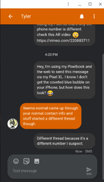

While you can use the [new Android Messages for web](https://blog.google/products/messages/five-new-features-try-messages/) on any supported browser, it obviously works well on a Chromebook too. That's what makes me wonder about the SMS integration of the [upcoming Better Together feature for Chrome OS](https://www.aboutchromebooks.com/news/better-together-bringing-instant-tethering-voice-calls-and-easy-unlock-to-chromebooks/), but that's a different story.

Setup is quick and easy using a browser and the recently updated Android Messages app; sorry iOS users, you're outta luck. Then again you have your blue bubbles; I'm joking as my primary phone is an iPhone X. But to test the new Messages, I fired up my Pixel XL with Project Fi SIM card.

All I had to do was open the Messages app on my phone and find the Messages for Web option in the app settings. On my Pixelbook, I navigated to [https://messages.android.com](https://messages.android.com) which displayed a QR code. Using my Pixel XL and the Messages app, a quick scan of the code paired my phone to my Chromebook. And that's it.

Now I can text from the web with my son and his iPhone; he didn't even make fun of the green bubble! ;) The web interface supports photos, stickers and emoji. And Chrome OS will surface notifications in the system tray when messages are received.

If you notice in my screenshot, I was also able to install this as a PWA.

Sort of.

If this was a true Progressive Web App, there would be an "install" option in the Chrome menu [as of Chrome 67](https://www.aboutchromebooks.com/news/chrome-os-stable-v-67-release-improves-the-tablet-experience-brings-pwas-and-more/). Unfortunately, there isn't, at least not for me. Instead, I used the "Create Shortcut" option and on the icon for the web page, I chose to enable "Open in Window".

It's not quite the same, but close enough for now. I am a bit surprised, however, that this isn't a native PWA by default as Google is reworking all of its web apps to be PWAs. Oh and I chose to enable the dark theme for my Messages as well, but that's just a personal choice.

Regardless, it's working well for me on the Pixelbook. Now if I could just use the Pixel XL full time, this would be even more helpful. My entire family uses iPhones and I use an Apple Watch; the only way to get music on it for my daily runs is through an iPhone. Sigh.
