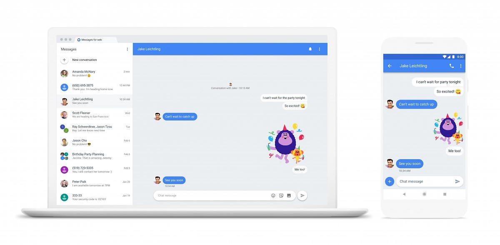

This doesn't quite look like the ["Better Together" service](https://www.aboutchromebooks.com/news/chromebook-android-messages-better-together/) I reported on earlier in the month, however, [Google announced Android Messages support for the web](https://www.blog.google/topics/rcs/five-new-features-try-messages/) today. The feature will allow Chromebook users and those on desktops send, receive, and reply to messages directly in the browser.

While the official site of [https://messages.android.com/](https://messages.android.com/) is live and has a QR code for setup scanning is live, you'll need a new version of Messages on your Android device to use it. At the moment, my Pixel XL doesn't have the updated app to support this, so I can't test it just yet. I'll try it and update this post once I get the newer Messages app version. Google says the feature is rolling out this week and also supports sending emoji, stickers and file attachments from the web.

Other features in the new Messages app for Android include GIF searches, Smart Reply, link previews and a way to copy one-time passwords to reduce input for two-factor authentication. Note that this functionality is solely for Android users since Google doesn't have a version of Messages for iOS devices. It might be time to start using my Pixel XL more since it will integrate texts with my Pixelbook!
