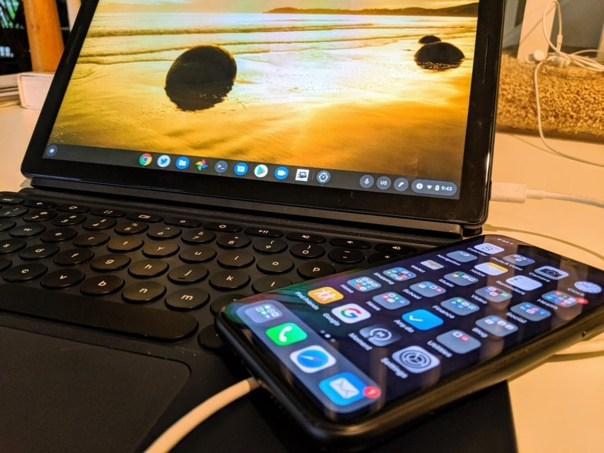

Last year I wrote a post on why [every Chromebook user should carry a USB flash drive with them](https://www.aboutchromebooks.com/news/why-every-chromebook-owner-should-carry-a-usb-key-or-sd-card-with-them/). You'll need one in the rare case of when your Chromebook needs to run through a full recovery. Looks like I may have to adjust that article because [Google is working on a way to use an Android phone for the Chromebook recovery process](https://www.chromestory.com/2019/10/chromebook-recovery-using-android-phone/).

This news is another great find in the Chromium code logs by Chrome Story's Dinsan Francis. And I don't mean that lightly, given that I often spend several _hours_ a day scouring through that haystack looking for needles like this!

The c[ode change description](https://chromium-review.googlesource.com/c/chromiumos/platform/vboot_reference/+/1832460) makes it clear that an Android phone, along with a special key combo on a Chromebook can restore Chrome OS to the device:

> Introduce ctrl+P to enable recovery via Android phone
> 
> Enable a new key combo: Control P. This key is available during dev and recovery screens. If pressed, it explicitly enables recovery via Android devices. This is needed because the Android recovery device enumeration is potentially dangerous to other USB devices, so its use should be keyed off explicit user intent.

This code change started on September 30 and looks to be in the early stages, so don't expect this functionality any time soon. In fact, I tried to see which Chrome OS version the tracking bug is targeted for, but as is the case for some specific features, the bug report isn't open to the public.

I love the idea of this recovery solution for a few reasons.

First, it further ties together Google's laptop and phone ecosystem. Simply put, the company wants to make it clear that Chrome OS and Android work best in tandem, aka: "Better Together. We've seen this with the [Instant Tethering feature of Chrome OS](https://www.aboutchromebooks.com/news/google-expands-instant-tethering-connection-to-15-chromebooks-and-30-android-phone-models/), for example.

Second, requiring a USB stick or SD memory card for system recovery isn't ideal considering either is an extra item to carry around on a regular basis. More than likely, anytime you're using a Chromebook, you presumably have your phone with you. So why not leverage the storage and USB connection on it to take the place of external media that can easily be lost?

Lastly - and this is a stretch on my part - it's a very small step forward towards [what I want to see in a Chrome phone](https://www.aboutchromebooks.com/news/samsung-dex-is-darn-close-to-the-chrome-phone-id-like-to-see/) by having the Chrome OS system files on a handheld device.

My vision for that phone, however would be to have it running Android, possibly in a Chrome OS container, when in the hand. But when docked to a traditional display and keyboard, or a laptop "shell" even, it provides the full Chrome OS experience. Again, this is all wishful thinking on my part but it would provide the best of both worlds between Android and Chrome OS depending on the situation at hand.

Regardless, once Google rolls out this new Chrome OS recovery method, I guess you can trash that USB stick I told you that you should always have with you. ;)
