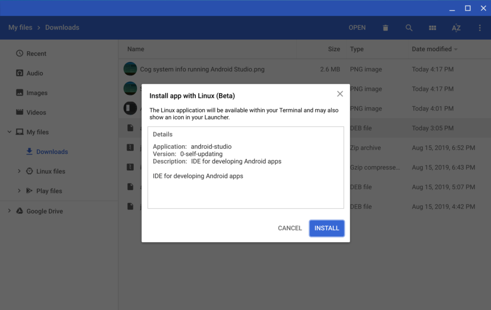

Back in May at the Google I/O 2019 developer event, [Google launched a preview version of Android Studio for Chrome OS](https://www.aboutchromebooks.com/news/android-studio-chrome-os-chromebook-recommendation-google-io-2019/). The preview version is gone and now replaced with the [official Android Studio 3.5](https://developer.android.com/studio), released on Monday, making Chromebooks a "first-class citizen" for Android app development.

Well, _mostly_ first-class, that is.

Yes, it's easy to install Android Studio 3.5 thanks to a downloadable Debian package that you can use the native Chrome OS Files app for installation, but there's still no Android device emulation feature available.

It's possible there may _never_ be one due to the way Crostini is architected: It runs Debian Linux in a container, which itself is running in a virtual machine (VM) and the Android Device emulator needs a VM. Currently, you can't run a VM inside of a VM, i.e.; in a Linux container on a Chromebook.

Regardless of that, I did run through the install on my [new Acer Chromebook Spin 13 with 16 GB of memory](https://www.aboutchromebooks.com/news/acer-chromebook-spin-13-with-16-gb-ram-should-you-buy-one/). Coding is the main reason I've moved my development activities from the Pixel Slate with its lower-powered Intel Core i5 processor and 8 GB of RAM.

I can already see the performance difference when loading up a small project and building an app. And thanks to the [Cog extension](https://chrome.google.com/webstore/detail/cog-system-info-viewer/difcjdggkffcfgcfconafogflmmaadco?utm_source=chrome-app-launcher-info-dialog), I also see all four processor cores and eight threads in action when building an app, as well as that I'm likely using more than 8 GB of memory when doing so.

Since there's no Android device emulator, however, devs will have to take advantage of the [USB device support in Linux that was added to Chrome OS 75](https://www.aboutchromebooks.com/news/chrome-os-75-adds-usb-device-adb-android-support-linux-project-crostini/). With it you can connect an Android device to your Chromebook and Android Studio will use the Android Debug Bridge (ADB) tools to install an in-development app to the phone for testing. It's not an ideal solution, but it works.

There are a ton of fixes, performance enhancements and general improvements [in Android Studio 3.5, which you can read in the release notes here](https://developer.android.com/studio/releases).

The bigger deal, to me anyway, is the official Chrome OS support which adds a broader range of devices that developers can now code Android apps on. Just keep in mind that if you plan to build Android apps on your Chrome OS device, you'll want to stick with the [list of recommended devices](https://developer.android.com/studio#Requirements) for an optimal experience.
