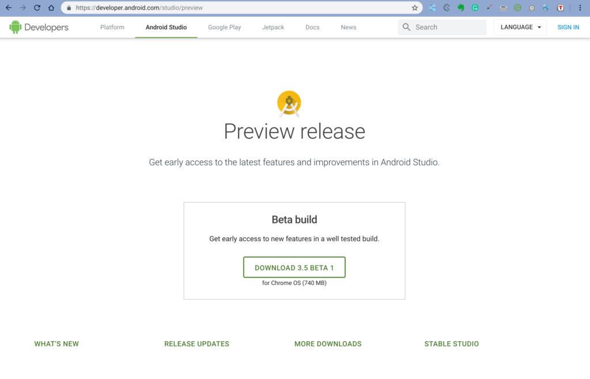
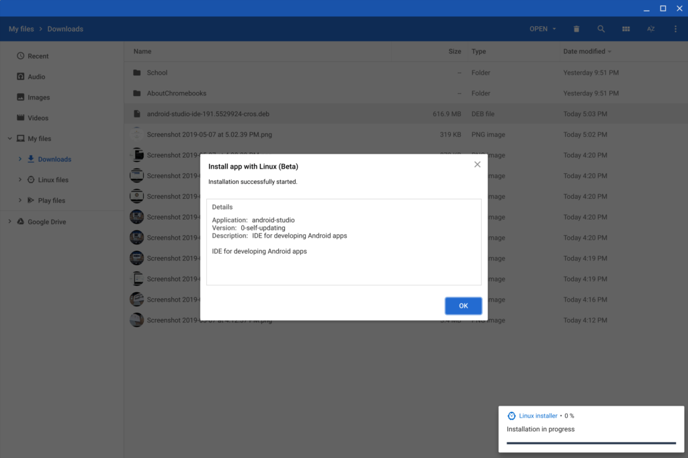

So the main Google I/O 2019 keynote has come and gone with barely a mention of Chrome OS or Chromebooks. After it was over, I tuned in to the Developer keynote to see if there would be any news there.

[As expected, there was no Chromebook hardware news](https://www.aboutchromebooks.com/news/atlas-chromebook-launch-google-i-o-2019/). But even [on the developer side](https://android-developers.googleblog.com/2019/05/google-io-2019-empowering-developers-to-build-experiences-on-Android-Play.html), there wasn't much either. Well, at least not much that hadn't been previously announced.

If you recall last year's I/O event, [Project Crostini](https://www.aboutchromebooks.com/tag/project-crostini) - now known as the Linux (Beta) feature for Chrome OS - was shown off. And Google also said that Android Studio would be fully supported on Chromebooks. To that end, the [latest beta release of the developer toolset has a simpler installation](https://developer.android.com/studio/preview).

Clicking the download link pulls down an Android Studio .deb package specifically for Chrome OS. From there, it's just a quick click or two in the Files app to install the .deb package.

That's the good news. The bad news - if like me, you were hoping for Android Virtual Device (or emulation) support - is that it isn't there. However, with the new [USB device support and Android debugging](https://www.aboutchromebooks.com/news/chrome-os-75-adds-usb-device-adb-android-support-linux-project-crostini/) features coming to the Stable Channel of Chrome OS, you should be able to run an Android app under development via USB from a Chromebook.

And speaking of Chromebooks for Android development, [Google has an official list of recommended hardware requirements](https://developer.android.com/studio/index.html#Requirements):

- 8 GB RAM minimum
- 4 GB of available disk space minimum
- 1280 x 800 minimum screen resolution
- Intel i5 or higher (U series or higher)

This is Google's list of recommended devices:

- [Lenovo Yoga C630 Chromebook](https://www.aboutchromebooks.com/news/lenovo-yoga-chromebook-c630-price-availability-4k/)
- [Acer Chromebook Spin 13](https://www.aboutchromebooks.com/reviews/acer-chromebook-spin-13-review-vs-pixelbook/)
- [HP Chromebook x360](https://www.aboutchromebooks.com/news/hp-chromebook-x360-release-date-price-specs/)
- [HP Chromebox G2](https://www.aboutchromebooks.com/news/hp-chromebox-g2-available-release-date-cost/)
- [Acer Chromebox CXI3](https://www.aboutchromebooks.com/news/new-acer-chromebox-cxi3-models-available-for-pre-order-start-at-298/)

I noticed that [the Pixel Slate I use for coding](https://www.aboutchromebooks.com/news/how-to-code-on-a-chromebook-crostini-pixel-slate/) wasn't on the list which caused me to do a double-take but it has a Y-series processor, not a U-series. Regardless, Android Studio does run on my Core i5 model, albeit with a bit of lag with the preview release.

Note that the Pixelbook also uses a Y-series CPU, which is why it too doesn't appear on the list of recommended devices. That seems strange considering it's still the "flagship" Google-branded Chromebook.

It's possible that more Chrome OS news will arrive over the coming days at specific I/O developer sessions, so stay tuned. Until then, don't feel like you've missed out on anything Chromebook related at Google's annual developer event.
