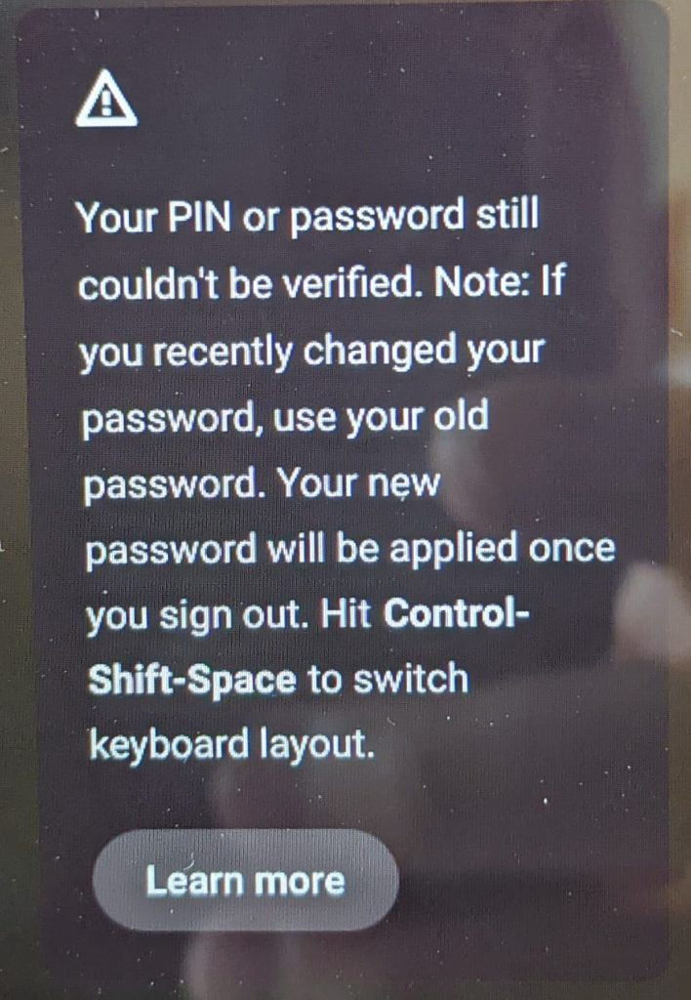

I hope this isn't becoming a trend, but a second Chrome OS 91 Stable Update has caused issues for Chromebook owners. An announced update to version 91.0.4472.165 was pushed out recently and it locked people out of their devices. [Android Central noted the issue earlier today](https://www.androidcentral.com/second-major-chrome-os-update-bug-leaving-users-locked-out-chromebooks) and a kind Redditor [created instructions to work around the problem](https://www.reddit.com/r/chromeos/comments/onlcus/update_it_seems_google_has_pulled_the_165_stable/).

The issue appears related to account verification, which... is pretty important on a Chromebook. If you can't log in with your Google account, you can't access user data. You can log into Guest Mode on the affected device, but that's a very temporary solution.

Google has since pulled the update, [based on the Chrome release matrix here](https://omahaproxy.appspot.com). If you're one of the unlucky few that can't get into your Chromebook, there is an option as noted in the Reddit link.

First, you can powerwash and revert your device, which will restore the prior version of Chrome OS 91 Stable Channel. Of course, that's a factory reset, so any locally stored data will be deleted during this process. Unless you have that data backed up somewhere, it's gone with a powerwash.

(#ProTip: This is why I don't store any data locally on my Chromebook. App installs are one thing but they can easily be replaced.)

I was going to recommend option two, which is to change from Chrome OS 91 Stable to the Chrome OS 92 Beta Channel. That would upgrade the OS but keep your existing data. Unfortunately, if you can't log in to your Chromebook, you can't access Settings to change the channel. So it's either Powerwash or wait and see if Google can find a fix that keeps your local data.

With [another high-impact](https://www.aboutchromebooks.com/news/these-chromebooks-have-a-reported-performance-issue-after-latest-chrome-os-91-update/) bug in a prior Chrome OS 91 Stable release just a few weeks ago, this isn't a good look for Google. Or for Chromebooks, which are supposed to just boot up and work with seamless updates. [Changing the Chrome OS release schedule from 6 to 4 weeks later this year](https://www.aboutchromebooks.com/news/opinion-its-time-to-reconfigure-chrome-os-version-numbers/) is only going to put more pressure on the QA testers to keep issues like this from happening again.
