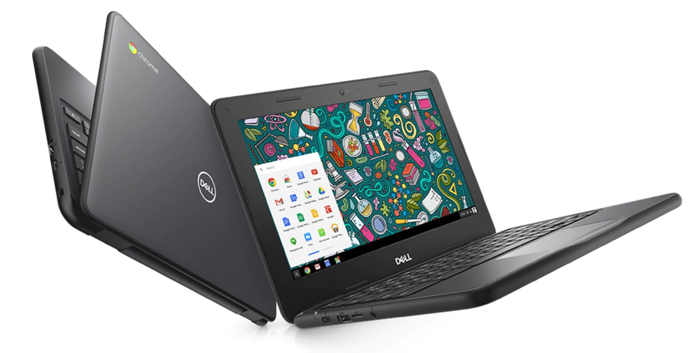
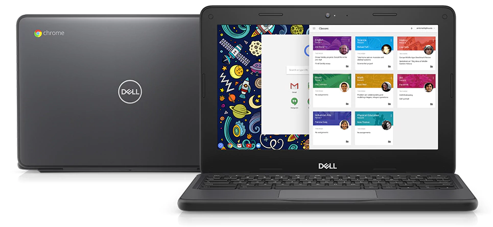

Although [Apple held its education event last month](https://www.apple.com/newsroom/2018/03/apples-chicago-events-highlight-creativity-in-education/) to unveil the newest iPad priced at $299 for schools and students, I really don't see how the effort will move the needle: Chromebooks are likely to continue being the choice for U.S. schools, where roughly 2 in 3 purchases are Chrome OS laptops.

A quick perusal of the news shows the problem. Later this month, [the Lincoln Public Schools (LPS) district in Nebraska](http://journalstar.com/news/local/education/lps-looks-to-buy-new-chromebooks/article_693c3682-033f-5efa-9e5c-f3db536689f6.html) is expected to finalize a $1.9 million purchase of 6,300 Chromebooks, which is an average price of $302. That's roughly the same cost as Apple's new $299, which technically is the same discounted price Apple offered on the last iPad model.

The breakdown of Chromebook units is interesting to note because the district is purchasing a mix of base and premium models of Dell's 5190:

> "Buying 3,000 of the standard model for sixth-graders will cost $746,970 ($249 apiece) and the 3,300 for ninth-graders will cost $1.15 million ($349 apiece)."

That base model has no touchscreen so the upgraded model gains that as well as double the local storage. More importantly, both Chromebooks have something the iPad doesn't: A keyboard. That will cost school districts at least another $50 to $100 per iPad if desired.

And [Dell's 5190 model for education](http://www.dell.com/en-us/work/shop/cty/pdp/spd/chromebook-11-5190-laptop) is actually built _for_ kids as opposed to the iPad, which is a general audience tablet. Yes, it's a great tablet, but it's not ruggedized like the Dell Chromebook that LPS is buying: These have spill-proof keyboards, for example and have been tested for 30-inch drops on steel; something I wouldn't want to try with an iPad from half that distance.

Both products for the classroom offer productivity suites and [device management features](https://support.google.com/chrome/a/answer/1289314?hl=en), so I'd generally consider that a draw. But when it comes to hardware and the cost of that hardware, Apple's $299 without a hardware keyboard doesn't look as good to me.

I realize there are some schools that have successfully deployed iPads in the classroom. The final verdict always comes down to deployment plans, training, device management and mostly, knowledge gained by the students when using technology. So I'm not suggesting every school should shun iPads and buy Chromebooks.

Instead, it's more about the overall appeal to both educators and school boards, as well as the IT resources that manage school technology. But a primary factor in the decision-making process is going to be cost in this time of limited school budgets.

All other things being equal -- and you could argue either way that they're not -- the lower cost options that Chromebooks provide will keep schools buying them by a large margin over the competition for the foreseeable future.
