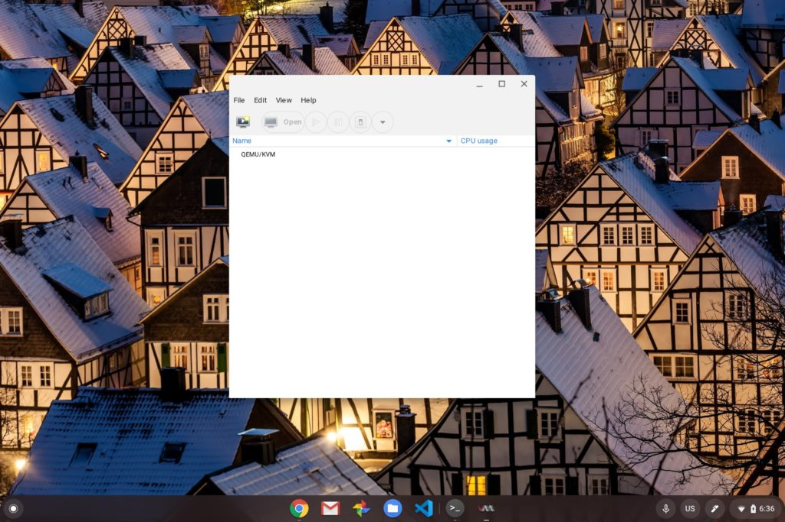
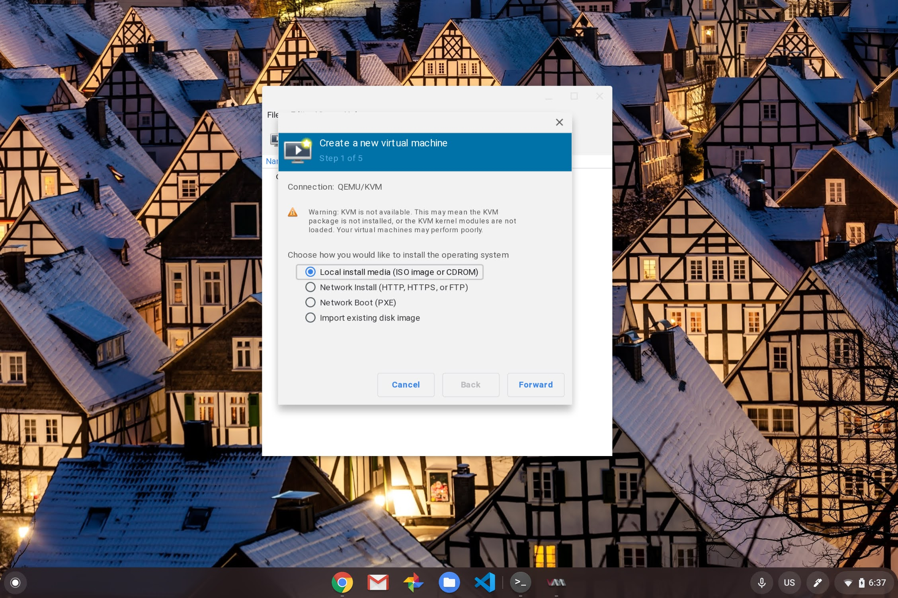
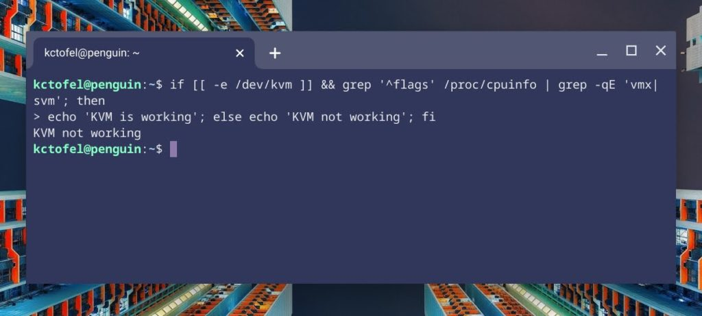

Over the past few weeks, we've heard [Google details plans and a partnership with Parallels to bring Windows 10 support to Chromebooks](https://www.aboutchromebooks.com/news/heres-how-youll-be-able-to-run-windows-apps-on-chromebooks/), at least in the enterprise space. So I was a little surprised to see this tweet from Mace Moneta over the weekend, showing that he's running Windows 10 inside a VM within the Linux container of his Asus Chromebook Flip C436:

https://twitter.com/MaceMoneta/status/1289370308084813826?s=20

Well that's... interesting.

I knew that the Chromium team was working on nested KVM support for untrusted virtual machines but I didn't know how far along it was.

Of course, I tried to get this working on my older Acer Chromebook Spin 13, mainly because with 16 GB of memory, it's the perfect candidate for testing Windows 10 in this scenario. I first switched to the Chrome OS 85 Beta Channel because that's where I've seen the most recent supporting code changes for this support.

I mostly came up empty although installing _virt-manager_ and dependencies worked out just fine. And I was able to get the Virtual Machine Manager running within Linux on my Chromebook.

The first step in creating a new VM is where I hit my first snag though. KVM wasn't enabled on my Chromebook, as indicated in step 1 of the process.

I decided to continue anyway, thinking even a slower experience of Windows 10 in a VM is better than none at all. Unfortunately, I couldn't get my Windows 10 .iso file to ever be read, after various configuration changes and the additional of necessary virtual hardware.

I suspect the key issue on my Chromebook is that [KVM is disabled by default, as it has been on every Chromebook, per this Chromium site.](https://www.chromium.org/chromium-os/developer-information-for-chrome-os-devices/running-virtual-machines-on-your-chromebook#TOC-Enabling-VMX-Support) Running the _kvm-ok_ command in Linux on my Spin 13 returns this message:

`INFO: Your CPU does not support KVM extensions`

`KVM acceleration can NOT be used`

This has to do with the configuration of kernel use and although there are steps on the above site indicating how to re-enable KVM support, it's not something that most Chromebook owners will be able to do. And it requires a CPU that supports Intel's VMX extensions.

Having said that, it appears in code commits that nested KVM and untrusted -- read: Non-Google built -- VMs will be supported in the future. Which Chromebooks will get the feature is the next question. And it based on the limited information I've seen, it may only be newer devices based on chipset and kernel version requirements.

Regardless, I'll keep tinkering with this on my Chromebook Spin 13 and some newer Chromebooks that may have a more recent Linux kernel. If I find out more, I'll be sure to share. And if you've been able to get Windows 10 inside a Linux VM on your Chromebook, let us all know what you're using and how it's going!
