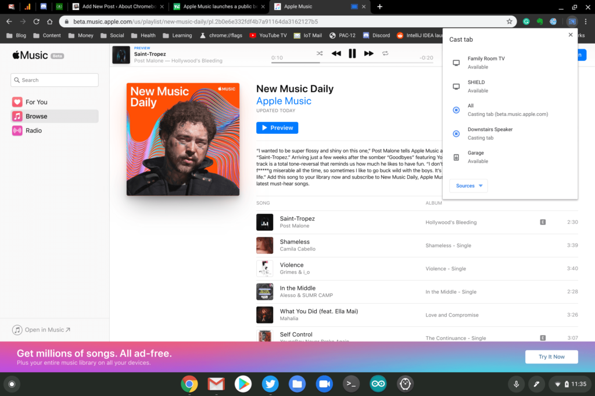

I don't know how many Chromebook users are also Apple Music subscribers, although I used to be one. While I had my subscription, I would just use the Android app on my Chrome OS devices. With its new beta for the web, [you can stream Apple Music all day long on a Chromebook](https://techcrunch.com/2019/09/05/apple-music-launches-a-public-beta-on-the-web/), either within Chrome OS itself or by using a browser in Linux.

Since I no longer subscribe to Apple Music - I moved to a Spotify student plan about a year ago - all I can do is preview songs on the web. But it works as you'd expect.

Unfortunately, at least for now, it doesn't appear that Apple has created a Progressive Web App, so you can't install it. You'll have to hit the beta site link and keep a tab open. However, you can easily break that tab out into its own window. And at this point, the web app is very responsive in terms of size adjustment.

If I were still an Apple Music subscriber, I'd probably go with the web app.

There's just no need to take up precious local storage for Apple Music up with one exception: The ability to download songs for offline playback. I can do that on a phone, which I'd always have with me when using a Chromebook. But other folks may feel differently, in which case, the app solution that's been around for a while is the better choice.

By the way, [Apple recently added beta Chromecast support to Apple Music for you app users](https://lifehacker.com/how-to-stream-apple-music-to-your-chromecast-from-andro-1837710336). I tried to cast the Apple Music tab in the beta web client and it worked just fine, streaming music to all of my Google Home speakers and smart displays throughout the house.

