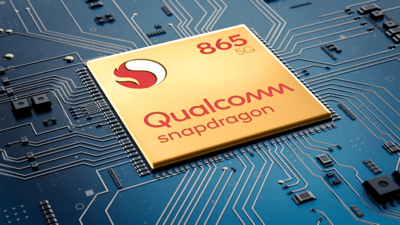
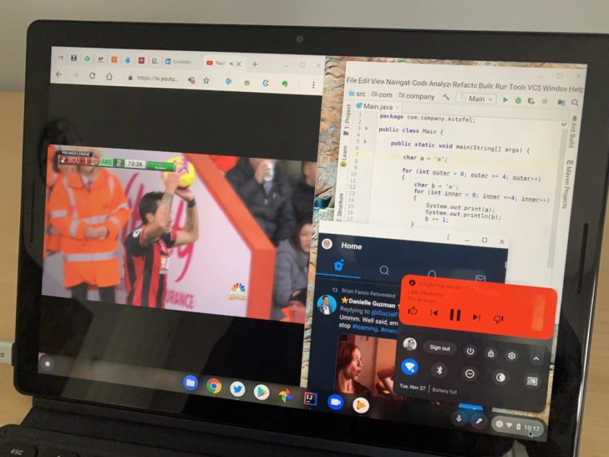

Like many others, I tuned into [Apple's World Wide Developer Conference today](https://www.apple.com/apple-events/june-2020/), which was a virtual event. If you're not familiar with WWDC, it's Apple's version of Google I/O, or vice versa, depending on your perspective. Meaning: This is the event that sets the stage over the upcoming year when it comes to software platforms and hardware evolution to support that software. And this was the even that made it clear to me: Google really needs its own custom chips running inside Chromebooks, even if only for its own hardware line.

Let me backtrack a bit with today's WWDC news to explain why I believe this. Here are the relevant bits that Apple announced today as it pertains to the computing platform:

1. Like it did starting in 2006 when migrating Mac hardware from IBM PowerPC processors to Intel chips, [Apple is going to use its own processors inside future Mac computers](https://www.apple.com/newsroom/2020/06/apple-announces-mac-transition-to-apple-silicon/). These are the A-series processors that Apple builds up from the ARM architecture license it has to create custom silicon inside iPhones, iPads, the Apple Watch, and AppleTV hardware. Apple has quite a bit of real-world experience here, today saying it has sold 2 billion devices with Apple-designed chips.
2. Apple already has macOS running comfortably on Mac hardware in the labs; in fact, the Macs used for the demonstration of macOS "Big Sur" were running on Apple chips. Granted, we watched canned and recorded demonstrations, but from what I saw, macOS running on Apple Silicon didn't miss a beat running desktop apps. But it wasn't just desktop apps on that Mac.
3. Last year, Apple announced "Catalyst", a transitional way for developers to easily bring more powerful iOS apps to Mac. Apple is continuing with Catalyst this year by improving it so that developers essentially have a single code base for apps to run on iPhones, iPads, and Macs. Indeed, all of Apple's native apps for Mac look nearly, if not fully, identical to their iOS counterparts. And again, these ran superbly on the demo Mac with an Apple chip inside.
4. Although it doesn't pertain to the Apple app ecosystem, a related news bit is that macOS Big Sur also supports virtual machines so that users can run Linux or another operating system if they want, including support for Docker containers.

Does any of this from a software and app platform sound similar to what Google has done with Chromebooks over the past five years? It should because in 2015, Google announced Android app support for Chrome OS devices. In 2018, we heard about [Project Crostini](https://www.aboutchromebooks.com/tag/project-crostini/) which eventually brought Linux containers to Chrome OS.

But there are two key differences.

> "Native Mac apps built with Mac Catalyst can share code with your iPad apps, and you can add more features just for Mac. In macOS Big Sur, you can create even more powerful versions of your apps and take advantage of every pixel on the screen by running them at native Mac resolution. Apps built with Mac Catalyst can now be fully controlled using just the keyboard, access more iOS frameworks, and take advantage of the all-new look of macOS Big Sur. There’s never been a better time to turn your iPad app into a powerful Mac app." -- Apple

First, the iOS app experience on Mac hardware I saw demonstrated looked excellent. Microsoft and Adobe have already started porting their apps to the ARM-powered Mac and I can't deny it: Office for the Mac on this new unified platform was impressive. Compared to the Android experience on Chromebooks, whether it's Office apps or some other title, it appeared that Apple had been doing this for years, not Google.

Full Office on Mac ARM processor

Is this Apple Mail for the iPad, iPhone or Mac? Yes.

Second, Apple is moving from supporting two chip architectures to a single one. Google has gone the opposite route: Early consumer Chromebooks, and even some current ones like the [Lenovo Duet Chromebook](https://www.aboutchromebooks.com/news/lenovo-ideapad-duet-chromebook-review-2020/), run on ARM chips while most available Chrome OS devices today use Intel x86 processors.

I get why Google has embraced Intel chips for Chromebooks, in fact, I welcome it from an end-user and coding perspective. I know I'm getting more processing power and more compatibility with desktop apps for Linux, with Intel inside, for example. But that's partially because nobody with an ARM architecture license is doing as much to advance customization and efficiency than Apple.

Qualcomm, Samsung, Huewei, MediaTek, and others tweak their chips to make them available for a range of consumer devices from many hardware makers. So instead of tightly focused improvements for just a few devices, like the Apple lineup, these chip designers marginally improve a range of features. And that's why Apple's A-series processors are top-notch. Well, that and because those chips are designed to be fully integrated with Apple's system software. Only Google can fully integrate Chrome OS software with a highly optimized ARM processor because it's the only one with full control over the software platform.

Without a custom chip though? Google has to rely on mostly off-the-shelf processors that are commodities. It's hard to optimize fully in that case. And Apple's advantage here isn't just a single CPU architecture, but soon a unified application ecosystem, something that Google doesn't have.

Closing the loop then, a customized ARM architecture processor combined with Chrome OS fully optimized for that custom processor is clearly lacking right now in the Chromebook space. Back in April there were [reports of a Samsung-Google venture for such a chip](https://www.aboutchromebooks.com/news/here-are-the-reported-specs-of-the-google-samsung-exynos-chips-for-phones-and-chromebooks/). But even if that pans out, I don't think it's the answer here to get Android apps running as cleanly on Chromebooks as the iOS-macOS titles I saw today. There's a developer willingness component that appears lacking in Google's world as compared to devs who support Apple. Just look at mobile apps on the iPad as compared to Android on the few tablets that support that platform or on Chromebooks.

Multiple Chrome tabs, a PWA, Google Play Music Android app and Linux humming along.

Google has to be careful here because it treads a thin line between competing with and embracing its hardware partners. I suspect that's why Google is getting Samsung's reported help here.

If Google created its own ChromeOS-optimized processor for MadeByGoogle devices, for example, hardware partners would be rightfully annoyed. But if Google creates the processor and mandates that all Chromebooks have to use it, that may not keep partners happy either.

If you use a Chromebook today and you're happy, I'm not suggesting you're going to switch over to an ARM-based Mac any time soon. I have no intention to do that either. But if you're someone that just isn't satisfied with the Android experience on Chrome OS, I could understand why you just might be tempted to visit an Apple Store later this year.
