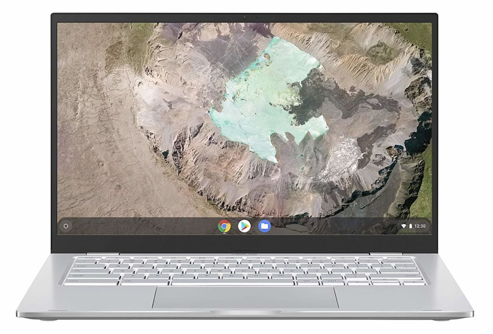
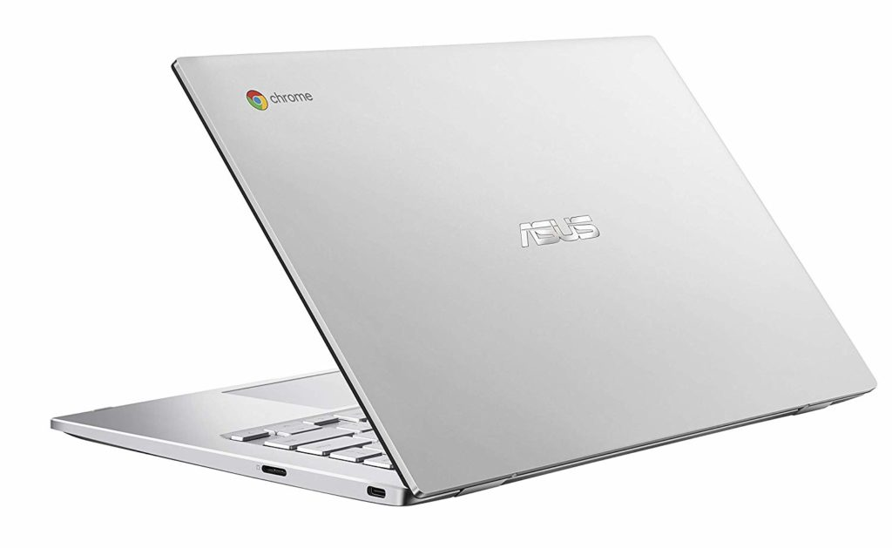
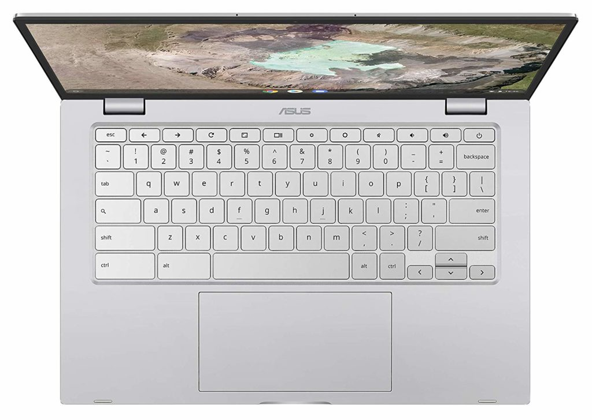
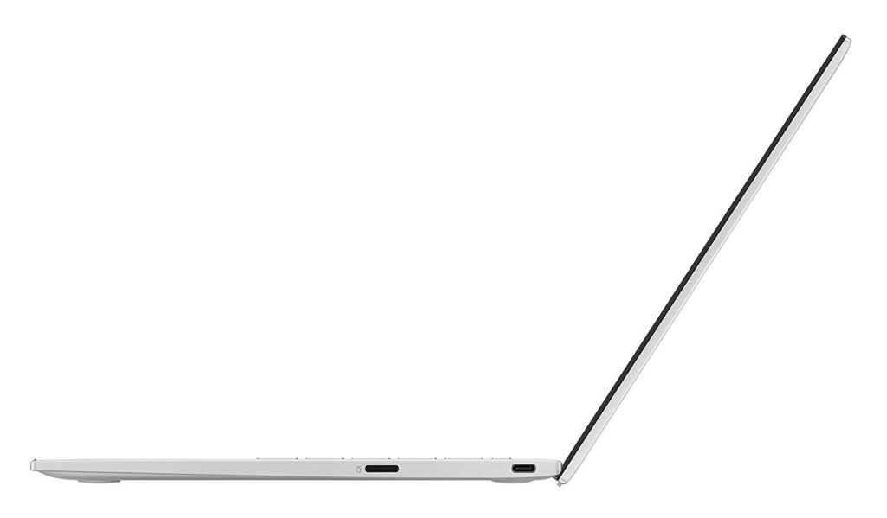

<iframe style="width:120px;height:240px;" align="right" marginwidth="0" marginheight="0" scrolling="no" frameborder="0" src="//ws-na.amazon-adsystem.com/widgets/q?ServiceVersion=20070822&amp;OneJS=1&amp;Operation=GetAdHtml&amp;MarketPlace=US&amp;source=ac&amp;ref=qf_sp_asin_til&amp;ad_type=product_link&amp;tracking_id=aboutchromebo-20&amp;marketplace=amazon&amp;region=US&amp;placement=B07VT254P6&amp;asins=B07VT254P6&amp;linkId=fa9071ebebdac17e2788f95a9d0a0c4a&amp;show_border=true&amp;link_opens_in_new_window=true&amp;price_color=333333&amp;title_color=0066c0&amp;bg_color=ffffff"></iframe>

I assume Amazon has spoiled any launch plans Asus may have planned for the upcoming IFA show by spilling the beans of the new [Asus Chromebook C425](https://amzn.to/34iOg2a). This clamshell Chromebook shares many similarities with the Asus Chromebook Flip C434, yet has some limitations by comparison and is available now for $499.99 as [noted by Chrome Unboxed](https://chromeunboxed.com/new-asus-chromebook-c425-core-m3-c434/).

If you quickly glanced at the C425, you might think it actually is the Flip C434. That's how similar these look. However, this isn't a 2-in-1 since the hinge doesn't fold 360-degrees nor is the 14-inch 1080p NanoEdge display with 178-degree viewing angle touch-capable.

I find that an odd decision to a point, due to Android app compatibility. Then again, reaching out to touch a laptop display, even for touch-centric apps, isn't ideal. The C425 can fold flat if that's your jam.

Inside, there are plenty more similarities between the new C425 and the Flip C434:

- Intel Core m3-8100Y processor with Intel HD 615 graphics
- 8 GB of RAM (double that the of base Flip model)
- 64 GB of eMMC storage and microSD card slot
- Backlit keyboard and 6-inch trackpad
- 2 USB-C ports, one on each side
- 1 USB Type-A port
- 1 audio jack
- Weight of 2.8 pounds

- 
    
- 
    
- 
    
- 
    
- 
    
- 
    

I'm a bit surprised Asus didn't debut this model alongside the Flip C434 at the beginning of this year as it would have given folks a choice between 2-in-1 and convertible options. Perhaps Asus didn't want to cannibalize sales of the Flip?

I'm also hoping the device sees some discounts early on as well. You're giving up a touch display and 2-in-1 mode as compared to the Flip, but you're only saving $60 over the 8 GB memory configuration of the Flip 434. And at this price or less, you can get a higher-performing option in the HP Chromebook X360 14 or Dell Inspiron Chromebook 14, which are often found on sale for around $400.

Regardless, I'd expect Asus to officially announce the Chromebook C425 within the next week; it's not yet appearing on the company's site. And who knows, maybe Asus has _another_ Chromebook surprise waiting in the wings at the IFA show, which runs from September 6 through the 11th.
