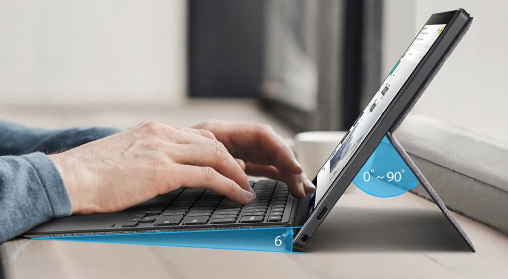
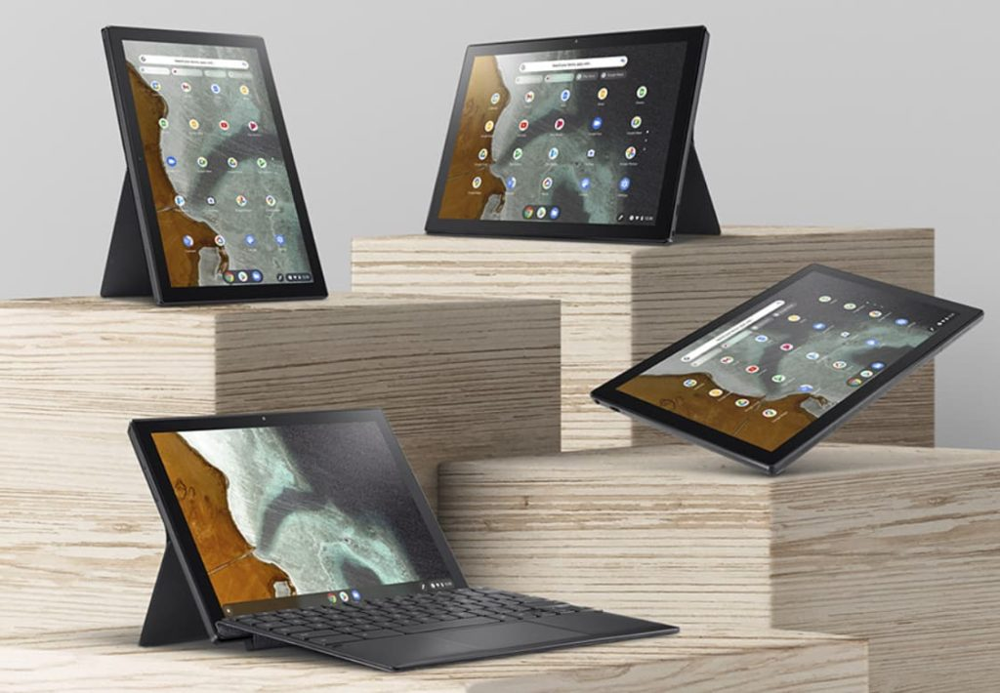

Earlier this week, [Android Police reported the Asus online store showed its Asus Chromebook CM3 detachable would be available soon](https://www.androidpolice.com/2021/06/02/asus-makes-its-own-version-of-the-lenovo-chromebook-duet-and-calls-it-the-cm3-detachable/) in two configurations. The 64 GB storage version is "coming soon" at $369.99 while a model with 128 GB will cost just $20 more. If you can't wait for your own Asus Chromebook CM3 detachable, you can [order one now at Amazon and have it this week](https://amzn.to/3g7yjlY).

Even better: You'll save $40 over the Asus Store price. Amazon is selling this device for $329.99.

Note that as of the time of this post, Amazon is only offering the 64 GB version. I expect that will change in the near future but will Amazon discount the 128 GB model? That remains to be seen.

Personally, I'd opt for the 128 GB version, given the small premium to double the amount of local storage. Keep that in mind before [hitting Amazon to](https://amzn.to/3vV9W1r) [order](https://amzn.to/3g7yjlY) [this tablet](https://amzn.to/3vV9W1r). There's no memory card slot on this device.

It's also worth mentioning that there are very few differences between the new Asus Chromebook CM3 detachable and the [Lenovo Duet Chromebook](https://www.aboutchromebooks.com/tag/lenovo-duet-chromebook/) from last year. They share the same basic CPU and GPU, for example, and both have a 1920 x 1200 resolution touchscreen. Each also comes with 4 GB of memory, a single USB Type-C port, and USI stylus support.

These two Chrome OS tablets are more similar than different, in other words. And the Lenovo Duet Chromebook with the same 4 GB of RAM and 128 GB of storage is often on sale for $249.99. That's a $50 discount from its MSRP.

However, there are a few unique aspects to the Asus Chromebook CM3 detachable.

It has a slightly larger 10.5-inch screen, compared to the 10.1-inch Duet display. That extra screen space allows for a slightly wider detachable keyboard, which based on the below video comparison, looks less cramped than the Duet's similar keyboard.

https://youtu.be/KaSrvKrUGn0

More importantly, the Asus keyboard attaches both with POGO pins and magnets at the bottom of the screen. That's important if you plan to use this diminutive device on your lap. You'll have more typing stability with the CM3.

Asus also includes a garaged USI stylus with the CM3. You'll have to bring your own digital pen to the Duet. And there's no place to store it, either.

The Asus Chromebook CM3 has a nifty trick that the Duet doesn't: Its kickstand can be used in either landscape or portrait mode. That's a clever design and well worth a bit of a premium. I'd use it for reading ebooks or scrolling around in portrait mode, for example.

Given that Amazon has the CM3 in stock, I would assume that the Asus Store will start taking orders in the next week or so.

However, if you want to save a few bucks and don't mind the 64 GB model, you [can grab one now from Amazon right here](https://amzn.to/3g7yjlY).
