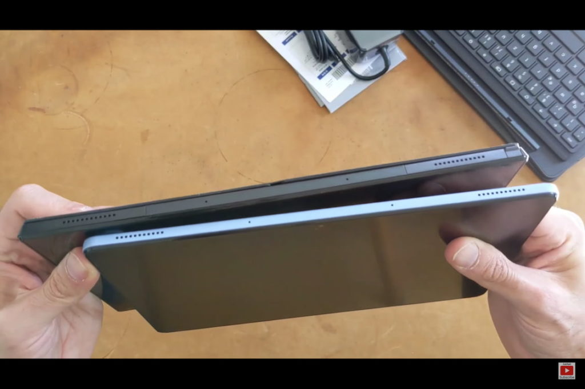
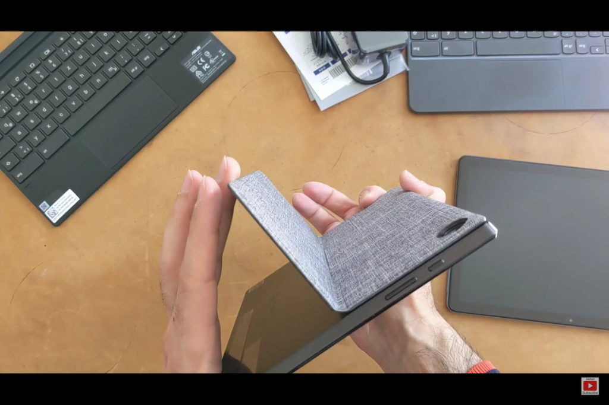

The newest Chrome OS tablet from Asus is available in some countries and this morning I found [a great overview of it compared to the Lenovo Chromebook Duet](https://www.reddit.com/r/chromeos/comments/n8y7io/asus_cm3/). The video shows comparisons of the size, keyboard, and digital writing experience. If you're interested in this device, you'll want to watch this [Asus Chromebook CM3 (CM3000)](https://www.aboutchromebooks.com/tag/asus-chromebook-flip-cm3/) vs [Lenovo Chromebook Duet](https://www.aboutchromebooks.com/tag/lenovo-duet-chromebook/) video.

https://youtu.be/KaSrvKrUGn0

I immediately noticed is how much thicker the Asus Chromebook CM3 is by comparison.

Perhaps that's because of the larger battery Asus is using, or maybe to add more structural integrity. Then again, the purchaser said the tablet flexes a little more than expected.

Note that the Asus expects its tablet to run for 12 hours while Lenovo claims a 10-hour runtime.

I know I keep bringing up the dual-hinging kickstand cover of the Asus Chromebook CM3, but it's rather unique. And you get a peek at the device standing up in both landscape and portrait mode. That feature alone is a big differentiation, in my opinion.

Also of interest: The CM3 has a magnet that holds the device cover in place when fully closed while the Duet does not. There's a nice look at how much the Duet cover slides around on the front of the device.

The last big takeaway for me was the inking experience on both devices.

The CM3 has a garaged stylus, which is definitely handy as compared to the Duet pen, which can't be stored inside the device. However, this particular user preferred the feel and sound (or less of it) with the Duet. He does have a matte screen protector on the Duet while the CM3's screen isn't covered. So that may be impacting the experience.

Also worthy of mention is that the Duet has a brighter screen that tops out at 400 nits of brightness. The panel of the CM3 maxes out at 350 nits.

These are the main things I noticed but the whole video is worth a watch. Well, maybe skip the first few minutes of the unboxing if that's not your thing.

Remember this MediaTek-powered [Asus Chromebook CM3 is expected to launch here in the U.S. at around $369](https://www.aboutchromebooks.com/news/asus-chromebook-flip-cm3-price-vs-lenovo-chromebook-duet/). That's a bit of a premium over the slightly smaller and older Lenovo Chromebook Duet. But I can already see a few key reasons to consider dropping the extra cash.
