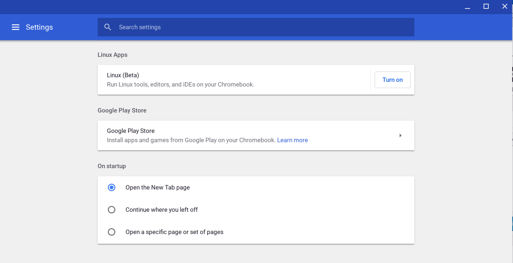

Great news if you have an [Asus Chromebook Flip 101](https://www.asus.com/us/2-in-1-PCs/ASUS-Chromebook-Flip-C101PA/) and want to run full Linux apps: [A code commit](https://chromium-review.googlesource.com/c/chromiumos/overlays/board-overlays/+/1102491) shows that the 10.1-inch convertible Chromebook should be getting that feature soon. XDA Developers spotted the news that the Chromium team is [readying the device for Project Crostini support,](https://www.xda-developers.com/asus-chromebook-flip-c101-linux-apps/) which is the effort [Google announced at its I/O developer event in May](https://www.aboutchromebooks.com/news/google-officially-unveils-project-crostini-linux-apps-on-chrome-os/). This would make the Chromebook Flip 101 to be the third older device to gain Linux app support, following the Google Pixelbook and the Samsung Chromebook Plus.

In fact, it's the latter device that should have tipped us off on this news even earlier. Both the Samsung Chromebook Plus and the Asus Chromebook Flip 101 run on the OP1 chip -- which is a rebrand of the [Rockchip RK3399 processor](http://rockchip.wikidot.com/rk3399). And both share the same internal board that Google certified for Chrome OS: It's called "gru" as you can see from the [Developer Information for Chrome OS Devices](https://www.chromium.org/chromium-os/developer-information-for-chrome-os-devices) site.

[Both devices also run on the same Linux 4.4 kernel](https://www.aboutchromebooks.com/news/these-are-the-chromebooks-and-chromeboxes-that-can-support-linux-apps/), which was Google's initial target for Crostini, although the company is trying to [backport some required modules to older versions of kernel](https://www.aboutchromebooks.com/news/theres-hope-that-older-chromebooks-will-run-linux-apps-with-crostini/).

That being said, it _might_ be a bit challenging to run modern Linux apps on the Chromebook Flip 101: You'll be limited by the 1280 x 800 resolution on the 10.1-inch touchscreen, of course. That doesn't mean you shouldn't try your fave Linux apps once official support rolls out -- likely on the Dev Channel first -- it's just something to keep in mind. I use IntelliJ IDEA for development, for example, and I'd be hard pressed to squeeze it on a lower resolution small screen.

You'll know when you have support on your Flip when you go into Settings and [see the option to enable Linux Apps](https://www.aboutchromebooks.com/news/linux-apps-project-crostini-option-appears-in-chrome-os-settings-on-dev-channel/) shown above. You shouldn't have to enable this feature in a Chrome OS flag once it lands.
