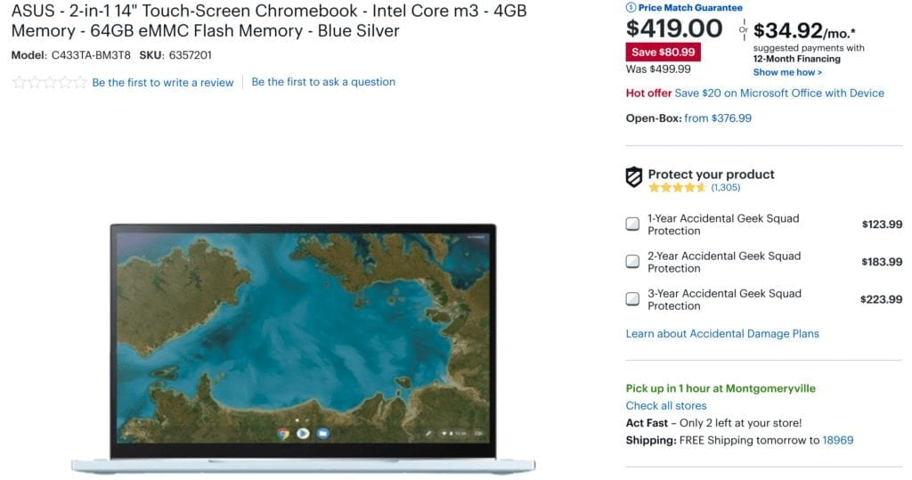
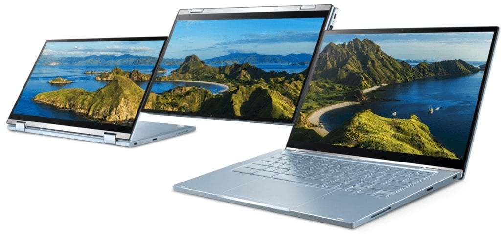

If you've been holding out for the [Asus Chromebook Flip C433 that I found parading around the FCC cameras last month](https://www.aboutchromebooks.com/news/asus-chromebook-flip-c433-in-pictures-specifications/), your wait is over. [As noted by Chrome Unboxed](https://chromeunboxed.com/asus-chromebook-flip-c433-available-on-sale-best-buy/), Best Buy has inventory of this 2-in-1 Chromebook that competes [squarely against the new Google Pixelbook Go](https://www.aboutchromebooks.com/news/pixelbook-go-launch-pricing-specifications-pixel-slate-laptop/) at a much lower price. Even better, [Best Buy is already discounting the Asus Chromebook Flip C433 from its $499 MSRP down to $419](https://www.bestbuy.com/site/asus-2-in-1-14-touch-screen-chromebook-intel-core-m3-4gb-memory-64gb-emmc-flash-memory-blue-silver/6357201.p?skuId=6357201).

Chromebook competition in the $400 to $500 price range has really heated up lately, with the Asus Chromebook Flip C433 being just the most recent product in this space.

Asus also also makes the similar [Chromebook Flip C425, although it's not a 2-in-1 device, which can be had for $399.99 at Walmart](https://www.walmart.com/ip/FHD-Storage-4-Way-Processor-RAM-OS-C425-ASUS-Intel-4GB-128GB-Chrome-Chromebook-14-Core-Silver-NanoEdge-m3-8100Y-Clamshell-eMMC-Laptop-KB-Backlit-C425/584873797?wmlspartner=wlpa&selectedSellerId=0&adid=22222222227000000000&wl0=&wl1=g&wl2=c&wl3=42423897272&wl4=pla-51320962143&wl5=9007382&wl6=&wl7=&wl8=&wl9=pla&wl10=8175035&wl11=online&wl12=584873797&veh=sem&gclid=Cj0KCQjwrrXtBRCKARIsAMbU6bFshjru0ODvdYFfW0YMoJx-KR622UVGalkHVHufDfbBAF4igtK9mr4aAqGHEALw_wcB). And Amazon currently has the [Dell Inspiron Chromebook 14 with higher-performing Intel Core i3 U-Series processor priced at $428](https://www.amazon.com/Dell-Inspiron-Chromebook-C7486-14-Touch/dp/B07LDF5YX3/). So you have several good choices in this price range.

Keep in mind that although the new Asus Chromebook Flip C433 is brand new and uses an 8-th generation Intel m3 processor like so many others in this segment, it is limited to 4 GB of memory. That's typically enough for basic or average use but power users who want to run Linux, Android apps and dozens of tabs simultenously will want to look elsewhere.

Here's a rundown of the Asus Chromebook Flip C433 specs, which offer a solid package at this price:

<table class="wp-block-table"><tbody><tr><td>CPU</td><td>Intel Core m3-8100Y with 1.1 GHz clock speed</td></tr><tr><td>GPU</td><td>Intel UHD Graphics 615</td></tr><tr><td>Memory</td><td>4 GB of LPDDR3 memory at 1886 MHz</td></tr><tr><td>Storage</td><td>64 GB with memory card expansion</td></tr><tr><td>Display</td><td>14-inch 16:9 1920 x 1080 60Hz panel with 45% NTSC and touch</td></tr><tr><td>Ports</td><td>2 USB Type-C, 1 USB Type-A, 3.5mm audio</td></tr><tr><td>Dimensions</td><td>12.7 in x 8.1 in x 0.6 in</td></tr><tr><td>Weight</td><td>3.31 pounds</td></tr><tr><td>Battery</td><td>48 WHr with expected 10 hours of run-time</td></tr><tr><td>Other</td><td>Backlit keyboard, webcam, 2-in-1 form factor</td></tr></tbody></table>

Keep in mind that the [Asus Chromebook Flip C433 product page](https://www.asus.com/us/2-in-1-PCs/ASUS-Chromebook-Flip-C433TA/specifications/) says that this Chromebook can be had with a Core i5 processor, up to 8 GB of memory and 128 GB of storage. However, Asus said that same earlier this year, along with a Core i7 option, for Chromebook Flip C434 but that never happened.

It's worth noting that aside from the slightly smaller 13.3-inch display of the Pixelbook Go, which also has double the memory, these two Chromebooks are exteremely similar in terms of hardware. The Pixelbook Go, however, starts at $649, comparably equipped.

Pixelbook Go

Based on my [recent chat with a Google product manager](https://www.aboutchromebooks.com/news/why-pixelbook-go-isnt-the-pixelbook-2-according-to-google/), the company is betting on buyers who want a lighter (2.3 pounds) clamshell-only Chromebook with premium build quality and materials, 12 hours of battery life with support for quick charging and Google's own Pixelbook-only features such as a dedicated Google Assistant key and other goodies.
