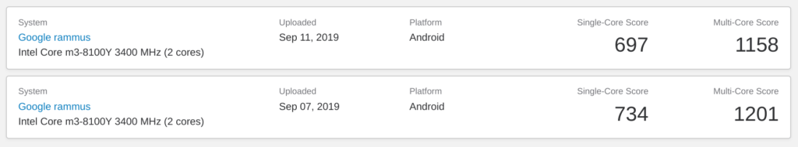
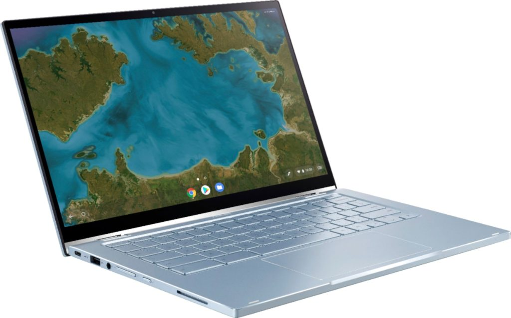

Since finding [internal](https://www.aboutchromebooks.com/news/asus-chromebook-flip-c433-in-pictures-specifications/) and [external photos of the upcoming Asus Chromebook Flip C433](https://www.aboutchromebooks.com/news/asus-chromebook-flip-c433-images-pixelbook-design/), I've been scouring the web to determine what processor, or processors may be powering this 2-in-1.

I've come up nearly empty save for one source: Geekbench. There were [two Geekbench runs in the past week for a device called Google Rammus with a name of Shyvana](https://browser.geekbench.com/v5/cpu/search?utf8=%E2%9C%93&q=rammus).

This naming combination is the same board and code name as the [Asus Chromebook Flip C434, which launched earlier this year](https://www.aboutchromebooks.com/news/asus-chromebook-flip-c434-orders-begin-release-date-price-specs/). That device is currently sold with a Core m3 processor with either 4 or 8 GB of memory.

Now the Geekbench test runs don't mean with 100 percent certainty that the Flip C433 will have an Intel Core m3-8100Y processor inside, but that configuration is making more sense to me as more information is pieced together.

For one thing, I don't see any heat vents in any of the Asus Chromebook Flip C433 images to date. That indicates with a very high degree of confidence that Core i3, i5, or i7 U-Series processors will not be used because they all require a fan.

And given that Intel only just announced next-generation Y-Series chips, it seems unlikely that any new Chromebooks will see them for several months; possibly not until 2020. We've only recently seen development on the new [Drallion baseboard, which is expected to use Intel Comet Lake chips](https://www.aboutchromebooks.com/news/confirmed-drallion-baseboard-to-use-just-announced-intel-comet-lake-for-chromebooks/). There's likely at least six months of development time until Drallion becomes an available Chromebook.

The idea that an 8th-gen Core m3 processor will power the Asus Chromebook Flip C433 _may_ be a disappointment for some. However, until we see an official spec page or product launch, there is still hope that Asus will bundle a little more horsepower in this great looking Chromebook.
