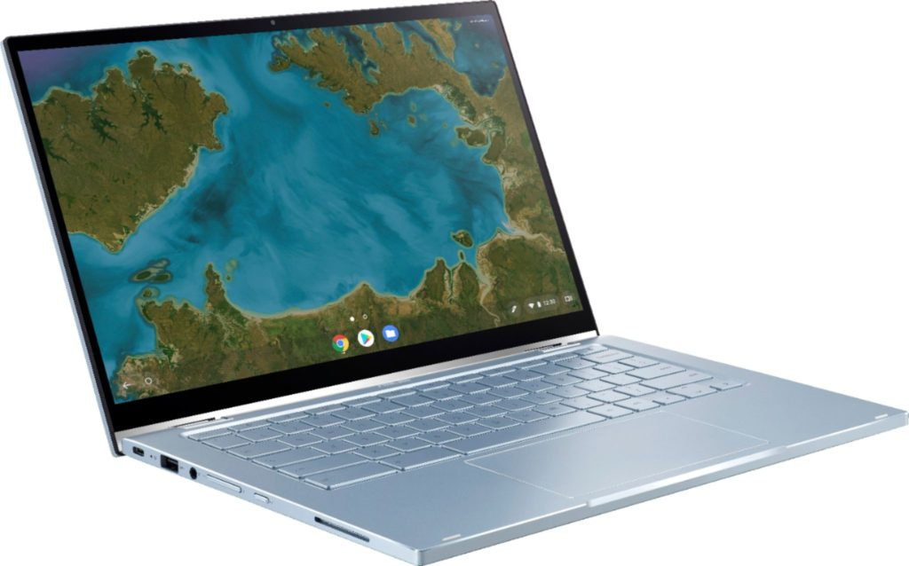
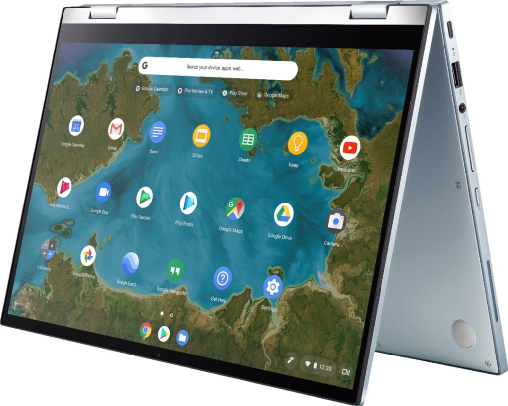

Earlier this week, I stumbled on to both [internal and external images of the upcoming Asus Chromebook Flip C433](https://www.aboutchromebooks.com/news/asus-chromebook-flip-c433-in-pictures-specifications/) in the FCC's database. But those pictures really don't do this unannounced Chromebook justice.

Thanks to a trusted retail source, I have a few new pictures of this 2-in-1 Chromebook that are a much better representation of what to expect. And as many folks said earlier this week, the Asus Chromebook Flip C433 looks very much like the Google Pixelbook in terms of design.

As you can see by the above image, Asus took a squared edge approach on the device chassis, making it look Pixelbook-esqe. There is a key difference though and it's a good one: There's just enough thickness for that full-sized USB Type-A port, which the Pixelbook doesn't have.

Rounding out the left side is a USB Type-C port, headphone jack, volume rocker, and power button. There's also that ginormous trackpad to complement the keyboard as well as an expected webcam in the top screen bezel.

You can also see the left speaker grille near the front of the base; the Pixelbook channels sound supremely well through the actual keyboard area. Obviously, I'm not sure how the speakers will sound on the Chromebook Flip C433, and I don't see the bottom speaker grille previously shown in the chassis pictures.

If you look at the top picture again, you'll notice that the bottom display bezel appears much smaller than what we typically see on 2-in-1 Chromebooks. The hinge design doesn't hide any of it and it's definitely more svelte than what we typically see these days. The hinge should prop up the keyboard a smidgeon on a flat surface as well.

The right side has the other speaker, of course, along with a micro SD card slot and USB-C port. Without any other input for power, the Asus Chromebook Flip C433 will be charged through USB-C; hopefully on either side of the device.

The Asus Chromebook Flip C433 in tent mode looks like.... a Chromebook in tent mode.

Not much to say here other than we really get a good look at that slimmer bezel of the display bottom, shown at the top in tent mode. As I noted earlier in the week, there's no garage to hold a stylus. Of course, Asus could have a large digital pen accessory like Google does with the Pixelbook and Pixel Slate.

After seeing these final design images of the Asus Chromebook Flip C433, my initial thought was that it could have higher-end processors than the Core m3 you find in the C425 and C434 models.

Asus Chromebook Flip C433 internal photo

There might be enough room in the chassis for a fan, which would be required for a Core i3, i5 and i7 U-Series chipset from Intel. However, I haven't seen any images that show a chassis cutout for airflow.

If there is a way to vent hot air from the Asus Chromebook Flip C433 and U-series chips are supported, it will be a powerful, high-end 2-in-1 to rival or exceed the capabilities in the top models from Acer, Dell, HP and Lenovo that are currently available. I'm still digging for internal specifications though, so we'll have to wait and see.
