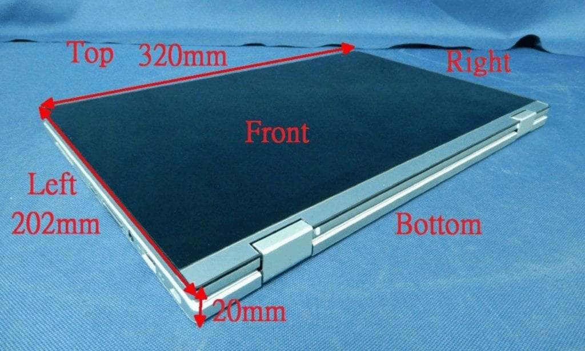

Earlier this week, [Chrome Unboxed spotted a mention of the Asus Chromebook Flip C433](https://chromeunboxed.com/asus-may-reveal-a-new-chromebook-flip-this-week-at-ifa-berlin/). However, this is no such model yet available from Asus. Nor did the company introduce it this week at the IFA show, although the [new Asus Chromebook 425 is available](https://www.aboutchromebooks.com/news/asus-chromebook-c425-price-specifications-availability/).

However, I spied quite the display of information on the FCC's website, including internal and external photos. Yes, the Asus Chromebook Flip C433 is real, and since it was tested by the FCC, should be coming to the US.

Here's what I gleaned so far from the images:

This looks like very much like a hybrid of the existing Asus Chromebook Flip 434 and the just-released Asus Chromebook C425. Being a "flip" model, it's a 2-in-1 like the former device but it appears to have the massive trackpad found on the latter.

Like both the C425 and Flip C434, the Asus Chromebook Flip C433 has a 48 W/hr battery, USB-C ports on the left and right, USB Type-A and card reader on the right, and a headphone jack on the left. At least one of those USB-C ports will be capable of Display Port video out and USB-PD for device charging, based on the presence of an [Analogix ANX7447 chip](https://www.analogix.com/en/products/switchesmultiplexers/anx7447). Intel is providing the 802.11ac Wi-Fi and Bluetooth wireless capabilities.

Interestingly, the device under test by the FCC has 128 GB of Sandisk eMMC storage based on this image below; we'll see if Asus offers that as a configuration option with a 64 GB storage capacity for a base model.

In terms of the processor and RAM, I'm not able to determine that from the internal images. I'll take an educated guess and think this will have the same Intel Core M3-8100Y Processor found in the C425 and C434, possibly with 8 GB of memory like the former device as opposed to the 4 GB found in the older C434.

Being a Flip model, I expect a touchscreen although I found no evidence of that. However, I've pored over all of the internal and external photos and see no sign of storage for a stylus; I anticipate no digital inking on the Asus Chromebook Flip C433 as a result.

The display looks like a 14-inch widescreen panel, just like the C425 and Flip C434. Just a guess but I expect the same 1080p resolution as those models.

Nothing else jumped out at me from the images, but it's always possible I've overlooked a detail. If you want to continue the specification scavenger hunt, you can find [all of the internal and external photos of the Asus Chromebook Flip C433 right here](https://apps.fcc.gov/oetcf/eas/reports/ViewExhibitReport.cfm?mode=Exhibits&RequestTimeout=500&calledFromFrame=N&application_id=3d6zeAYFaEV2DmkaiSQjyg%3D%3D&fcc_id=MSQ7265D2).
