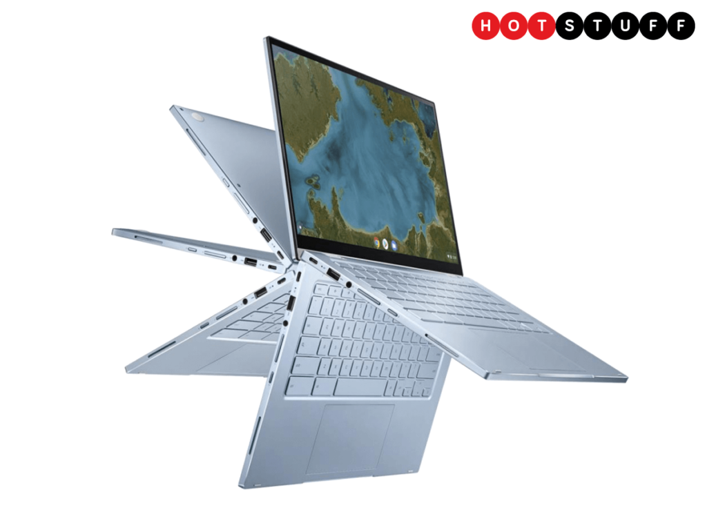
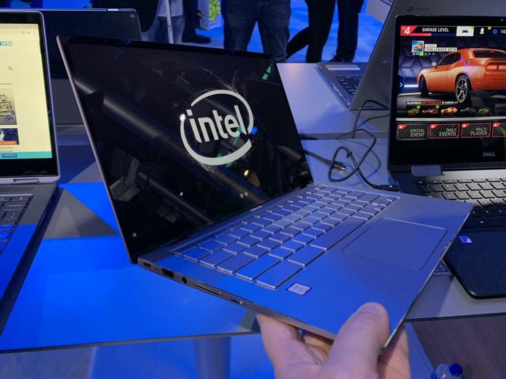
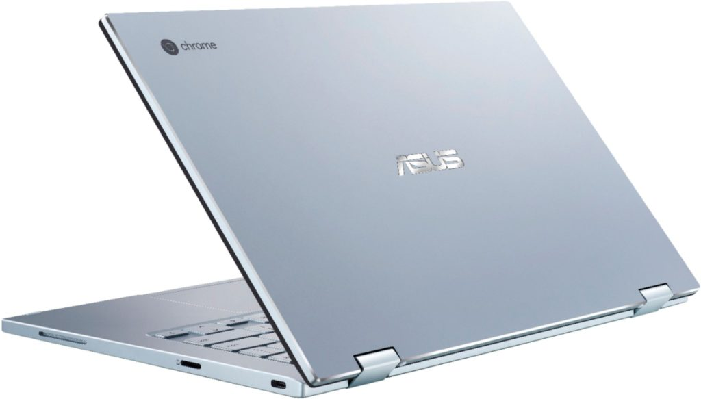
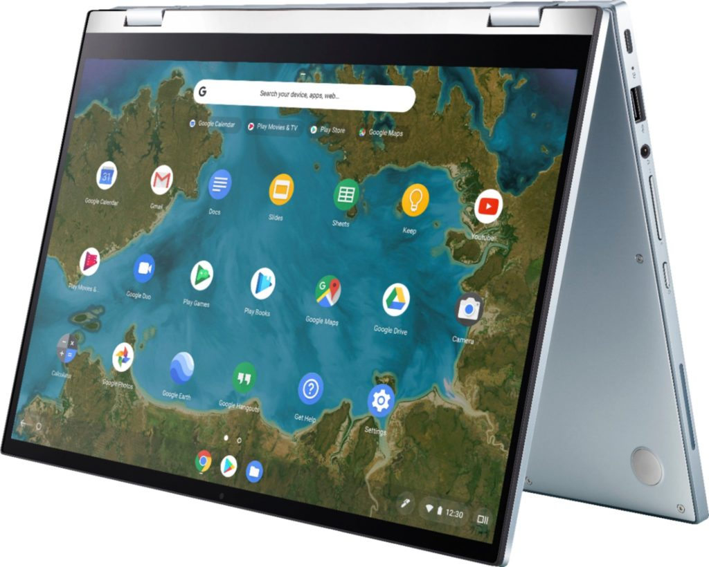

We knew it was coming. After seeing the [FCC certify the Asus Chromebook Flip C433](https://www.aboutchromebooks.com/news/asus-chromebook-flip-c433-in-pictures-specifications/) for the US and then [viewing official press photos](https://www.aboutchromebooks.com/news/asus-chromebook-flip-c433-images-pixelbook-design/), the new 2-in-1 Chromebook is officially official. At least [it is in the UK, according to Stuff](https://www.stuff.tv/hot-stuff/tablets-computers/asus-chromebook-flip-c433-ultracompact-convertible-laptop-tasty-price).

Credit: Stuff

Since we already knew most of the internal specs and ports, the only real questions left were the price and processor. And this is where it gets dicey, at least for us in the US.

The £499 price is for the base model with 14-inch 1080p display when the device lands in mid-October and if traditions hold that will equate to a $499 cost here in the states. But there isn't any information on the base model specs.

Instead, the Asus Chromebook Flip C433 can be configured with _up to_ 8 GB of memory, 128 GB of storage and an Intel Core i7 processor. So the base model likely has half the memory and storage and [a much less capable CPU such as Intel's Core m3](https://www.aboutchromebooks.com/news/asus-chromebook-flip-c433-core-m3-processor-benchmark/) or perhaps a Core i3. I still don't see fan vents on the current model pictures, which you'd need for an i3 or above.

Asus Chromebook Flip C434

What concerns me is what happened to the [Asus Chromebook Flip C434 that I got some hands-on time with in January](https://www.aboutchromebooks.com/news/asus-chromebook-c434-vs-flip-c302-acer-chromebook-spin-13/). That device had the latest Core i7 processor in it and Asus said options would be available with a full range of CPUs. Only that never happened. Instead, only a Core m3 version made it to market. I would hate to see that happen again.

Regardless, time will tell. In the meantime, we know nearly all of the specs and capabilities from the official product images I shared last week: Two USB Type-C ports, one USB Type-A, a microSD card reader, headphone/microphone port, 14-inch display and big ol' trackpad.

**_Update: 9/16/2019, 4:15pm ET_**

[Android Police has the official press release from Asus](https://www.androidpolice.com/2019/09/16/asus-chromebook-flip-c433-announced/) and, [as I suspected](https://www.aboutchromebooks.com/news/asus-chromebook-flip-c433-core-m3-processor-benchmark/), the base model comes with an Intel Core m3-8100Y CPU, 4 GB of memory and 64 GB of storage, just like the base Asus Chromebook Flip C434.
