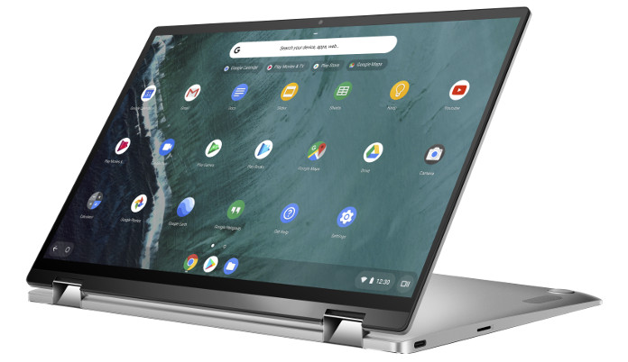

<iframe style="width:120px;height:240px;" marginwidth="0" align="right" marginheight="0" scrolling="no" frameborder="0" src="//ws-na.amazon-adsystem.com/widgets/q?ServiceVersion=20070822&amp;OneJS=1&amp;Operation=GetAdHtml&amp;MarketPlace=US&amp;source=ac&amp;ref=qf_sp_asin_til&amp;ad_type=product_link&amp;tracking_id=aboutchromebo-20&amp;marketplace=amazon&amp;region=US&amp;placement=B07QY4RN79&amp;asins=B07QY4RN79&amp;linkId=12913a24548b6f19fda090f197f337d5&amp;show_border=true&amp;link_opens_in_new_window=true&amp;price_color=333333&amp;title_color=0066c0&amp;bg_color=ffffff"></iframe>

The base model [Asus Chromebook Flip C434 has already been available for sale](https://www.aboutchromebooks.com/news/asus-chromebook-flip-c434-orders-begin-release-date-price-specs/) and we knew an upgraded model would be following. Now Amazon shows both the base configuration with 4 GB of memory and the upgraded version that doubles the RAM.

When the 4 GB unit went on sale for $569, I suggested that interested buyers consider waiting since the 8 GB configuration was expected to cost just $30 more. That extra memory would be a huge benefit for allowing more open tabs and/or using Linux apps. And the 8 GB option from Amazon is indeed $599; that extra cost is well worth the investment, even though you can now [purchase the 4 GB configuration for $529.99](https://amzn.to/2DVeDiM) (_affiliate link_).

Aside from the extra RAM all of the specs on the $599 model are the same as the lower-priced one:

- Intel Core m3-8100Y, 2C/4T, 1.1GHz (4MB cache, up to 3.4GHz)
- 14” LED-backlit IPS NanoEdge display, 100% sRGB, 1920 x 1080 with 5mm bezels and a 360-degree hinge
- 4 or 8 GB LPDDR3 memory depending on the model you buy
- 64 GB eMMC storage
- MicroSD card reader, 802.11ac Wi-Fi, Bluetooth 4.0
- Two USB Type-C ports, one USB Type-A port (all ports are USB 3.1)
- Backlit keyboard and multi-touch trackpad
- HD webcam, presumably 720p based on the lack of a “FullHD” mention
- 48 WHr battery with an estimated 10 hours of runtime
- 3.2 pounds

Note that if you plan to use Android Studio to build Android apps, the [Asus Chromebook Flip C434 isn't on Google's list of recommended Chromebooks](https://www.aboutchromebooks.com/news/android-studio-chrome-os-chromebook-recommendation-google-io-2019/). That's because it uses the lower-powered Intel Y-series chips, not the company's U-Series processors.

Additionally, Amazon doesn't appear to have inventory of the 8 GB model in stock currently. Delivery dates for Prime members are quoted to be between May 28 and June 12, although that can change at any time.
