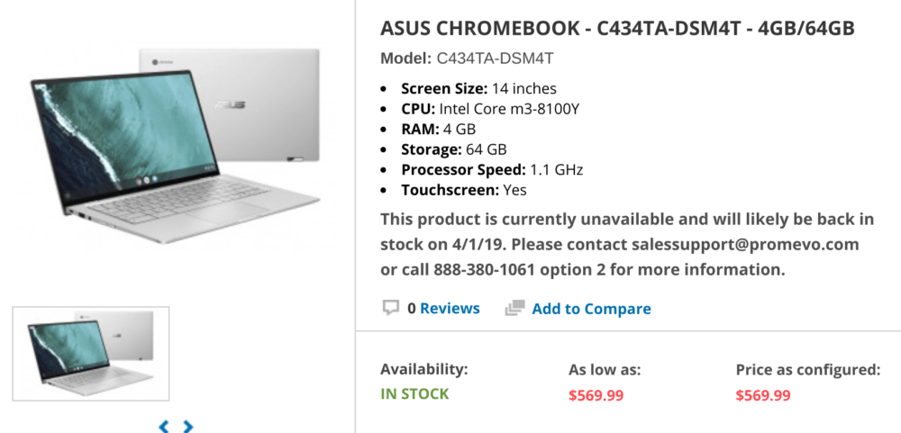

We knew that the [Asus Chromebook Flip C434 was planned for a March release](https://www.aboutchromebooks.com/news/asus-chromebook-flip-c434-certified-by-fcc-right-on-time-for-march-release/) with an expected base price of $569.99. And now, [Promevo seems to have confirmed the price](https://shop.promevo.com/index.php/asus-chromebook-c434ta-dsm4t-14-inches.html) as this replacement for Asus Chromebook Flip C302 is appearing on its site.

Don't get too excited, you can't order the [Flip C434](https://www.asus.com/us/Commercial-Laptops/ASUS-Chromebook-Flip-C434TA/) just yet: Although the device shows as "in stock", Promevo notes that "This product is currently unavailable and will likely be back in stock on 4/1/19."

The price is for the base configuration, not the [Intel Core i7 model I spent a few minutes](https://www.aboutchromebooks.com/news/asus-chromebook-flip-c434-release-date-price-specs-availability/) with at CES in January.

Included in this device is an 8th-generation Intel Core m3-8100Y -- the same processor in the $799 Google Pixel Slate -- 4 GB of memory and 64 GB of storage, along with the 14-inch 1080p touchscreen display.

As a refresher, here is the range of specs, per Asus:

- Intel Core M3-8100Y, 2C/4T, 1.1GHz (4MB cache, up to 3.4GHz)
- Intel Core i5-8200Y, 2C/4T, 1.3GHz (4MB cache, up to 3.9GHz)
- Intel Core i7-8500Y, 2C/4T, 1.5GHz (4MB cache, up to 4.2GHz)
- 14” LED-backlit IPS NanoEdge display, 100% sRGB, 1920 x 1080 with 5mm bezels and a 360-degree hinge
- Up to 8GB LPDDR3
- Up to 128GB eMMC
- MicroSD card reader, 802.11ac Wi-Fi, Bluetooth 4.0
- Two USB Type-C ports, one USB Type-A port (all ports are USB 3.1)
- Backlit keyboard and multi-touch trackpad
- HD webcam, presumably 720p based on the lack of a “FullHD” mention
- 48 WHr battery, no estimated run-time yet
- 3.2 pounds

Based on the similarities to the Pixel Slate specs, I'm guessing that costs for the higher end Chromebook Flip C434 models will increase above the base version by similar amounts to the Slate, although it would be great to see smaller price boosts.

If that holds though -- and it's just an educated guess on my part at this point -- a Core i5 version with more memory and storage would be around $769 while a Core i7 would be priced at approximately $1,369.

But don't get too hung up on that because the high-end [Pixel Slate](https://www.aboutchromebooks.com/reviews/google-pixel-slate-review/) has 16 GB of memory and 256 GB of storage. Asus has already said its devices would have "up to" half of those amounts, which could get the Core i7 Flip 434C to a far more aggressive $999.

That would be a solid price for those who need a powerhouse of a Chromebook in a portable package, although you can get more powerful Core i5 models [from Lenovo](https://www.aboutchromebooks.com/news/lenovo-yoga-chromebook-c630-price-availability-4k/) and [Acer](https://www.aboutchromebooks.com/reviews/acer-chromebook-spin-13-review-vs-pixelbook/) for less. Maybe that will influence Asus to keep the costs down for the higher configurations.
