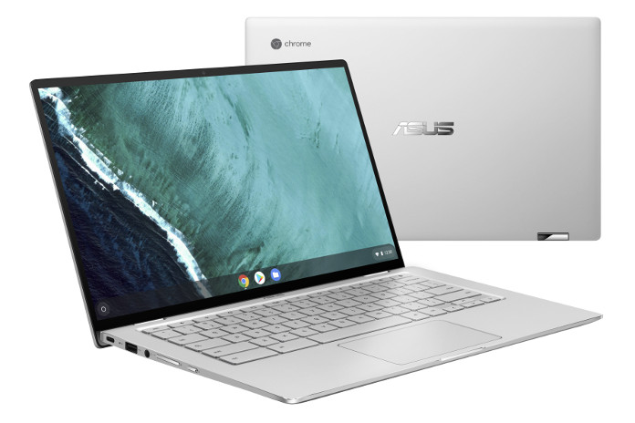

<iframe style="width:120px;height:240px;" align="right" marginwidth="0" marginheight="0" scrolling="no" frameborder="0" src="//ws-na.amazon-adsystem.com/widgets/q?ServiceVersion=20070822&amp;OneJS=1&amp;Operation=GetAdHtml&amp;MarketPlace=US&amp;source=ac&amp;ref=qf_sp_asin_til&amp;ad_type=product_link&amp;tracking_id=aboutchromebo-20&amp;marketplace=amazon&amp;region=US&amp;placement=B07Q2RB6BY&amp;asins=B07Q2RB6BY&amp;linkId=aaf8fa9e6a7e82edbbe1b121e9f3ea4c&amp;show_border=true&amp;link_opens_in_new_window=true&amp;price_color=333333&amp;title_color=0066c0&amp;bg_color=ffffff"></iframe>

Last week, the [Asus Chromebook Flip C434 debuted on the Asus store for $569.99](https://www.aboutchromebooks.com/news/asus-chromebook-flip-c434-orders-begin-release-date-price-specs/). If you didn't jump on that right away, new orders are currently showing delivery on April 26. But [Amazon is taking pre-orders for the base model of this 2-in-1 Chromebook and says it will have inventory on April 5](https://amzn.to/2FOkcBa).

Keep in mind that this is the base model with an eighth-generation Intel Core m3 processor, 4 GB of memory and 128 GB of eMMC storage.

Asus has suggested that there will be a range of configurations, including the Core i7 model that I used briefly in January at the Consumer Electronics Show.

Promevo, a device reseller to schools and businesses, has already shown the [base model with 8 GB of memory for $30 more](https://shop.promevo.com/index.php/asus-chromebook-c434-c434ta-ds384-8gb-64gb.html), as well as a $759.99 option with Core i5 processor, although neither are currently in stock.

Folks that are looking for well built, full HD 2-in-1 and plan to mainly browse the web and run a few Android apps will likely be fine with the base model of the Asus Chromebook Flip C434, but it never hurts to have more memory on a Chromebook.

That will allow you to run more apps or have a greater number of tabs open at the same. And since you can't upgrade the memory of a Chromebook after you've purchased it, waiting to see if the 8 GB configuration becomes available may make sense.

If you just can't wait though, Amazon is likely to be your best bet to get this new Chromebook sooner rather than later.
