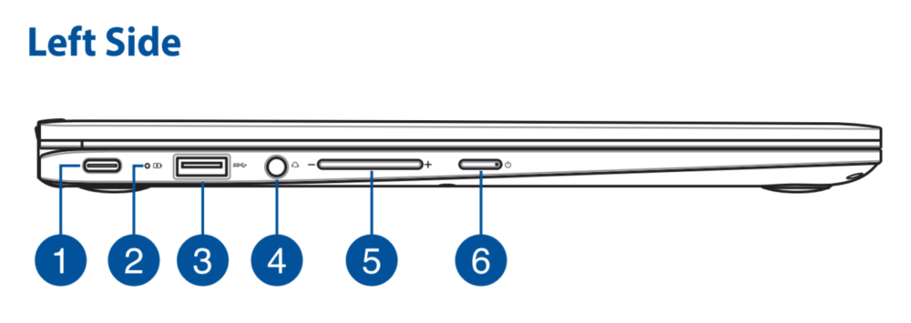
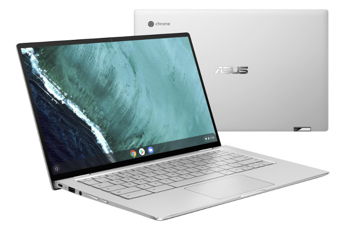

You can't buy it just yet, but if you've been holding out for the new [Asus Chromebook Flip C434 shown off at CES](https://www.aboutchromebooks.com/news/asus-chromebook-flip-c434-release-date-price-specs-availability/) last month, you probably want to get your wallet ready. The [expected launch date, per Google, is March](https://cloud.google.com/blog/products/chrome-enterprise/two-new-enterprise-chromebooks-for-cloud-workers-announced-at-ces) and the 2-in-1 Chromebook was [certified by the FCC last week](https://apps.fcc.gov/oetcf/eas/reports/ViewExhibitReport.cfm?mode=Exhibits&RequestTimeout=500&calledFromFrame=N&application_id=ZdHwVJvF%2BDb87N0cBtJh1A%3D%3D&fcc_id=MSQ7265D2).

There aren't any images of the certified device on the FCC site, but the [user manual](https://apps.fcc.gov/eas/GetApplicationAttachment.html?id=4167102) is there. I wouldn't bother reading it because it's fairly generic, to be honest. But there are left and right drawings of the device to show the ports and buttons for power and volume control, which match up _exactly_ with the new Chromebook Flip.

As a refresher, here are the specs of the Asus Chromebook Flip 434, which is very comparable to the [Pixel Slate](https://www.aboutchromebooks.com/reviews/google-pixel-slate-review/) in terms of the 8th-generation Intel processor choices:

- Intel Core M3-8100Y, 2C/4T, 1.1GHz (4MB cache, up to 3.4GHz)
- Intel Core i5-8200Y, 2C/4T, 1.3GHz (4MB cache, up to 3.9GHz)
- Intel Core i7-8500Y, 2C/4T, 1.5GHz (4MB cache, up to 4.2GHz)
- 14” LED-backlit IPS NanoEdge display, 100% sRGB, 1920 x 1080 with 5mm bezels and a 360-degree hinge
- Up to 8GB LPDDR3
- Up to 128GB eMMC
- MicroSD card reader, 802.11ac Wi-Fi, Bluetooth 4.0
- Two USB Type-C ports, one USB Type-A port (all ports are USB 3.1)
- Backlit keyboard and multi-touch trackpad
- HD webcam, presumably 720p based on the lack of a “FullHD” mention
- 48 WHr battery, no estimated run-time yet
- 3.2 pounds

We still don't have an official price from Asus, although [Android Police appears to have gotten Asus on record](https://www.androidpolice.com/2019/01/08/asus-chromebook-flip-c434-is-the-first-chromebook-worth-waiting-for-in-2019/), noting “Asus expects the launch the Chromebook Flip C434 starting around $569. Asus says there might just be one SKU in the US at first, most likely the Core i5. Core M3 and Core i7 versions will also be out there.”

I suspect we'll find out within a few weeks if that base price of $569 -- and if we'll see multiple configurations in the use -- is the real deal.
