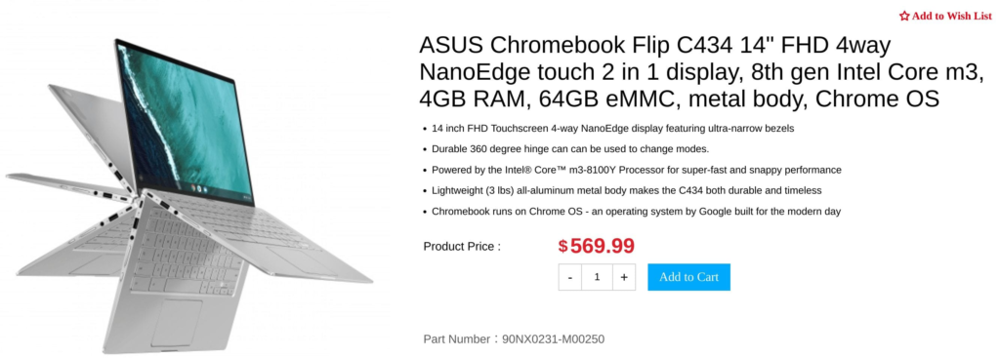

Asus planned to release the Chromebook Flip C434 by the end of March and it has delivered. You can now [order the base model of the Asus Chromebook Flip C434 directly from the company for $569.99](https://store.asus.com/us/item/201903AM260000001/chromebook-ASUS-Chromebook-Flip-C434-14%22-FHD-4way-NanoEdge-touch-2-in-1-display%2C-8th-gen-Intel-Core-m3%2C-4GB-RAM%2C-64GB-eMMC%2C-metal-body%2C-Chrome-OS). As of time of writing, there are no other configurations available, even though we know [there's an i5 model coming soon from a third-party reseller](https://www.aboutchromebooks.com/news/base-asus-chromebook-flip-c434-at-staples-core-i5-model-at-promevo/).

The Asus Chromebook Flip C434 is a refreshed and redesigned version of the very popular C302 model. The C434 display is larger at 14-inches although it now has more of a widescreen aspect ratio. Nearly gone are the display bezels as well thanks to what Asus is calling a NanoEdge display.

Here's a rundown of the base model specs at this price:

- Intel Core m3-8100Y, 2C/4T, 1.1GHz (4MB cache, up to 3.4GHz)
- 14” LED-backlit IPS NanoEdge display, 100% sRGB, 1920 x 1080 with 5mm bezels and a 360-degree hinge
- 4 GB LPDDR3 memory
- 64 GB eMMC storage
- MicroSD card reader, 802.11ac Wi-Fi, Bluetooth 4.0
- Two USB Type-C ports, one USB Type-A port (all ports are USB 3.1)
- Backlit keyboard and multi-touch trackpad
- HD webcam, presumably 720p based on the lack of a “FullHD” mention
- 48 WHr battery with an estimated 10 hours of runtime
- 3.2 pounds

I spent some time with this 2-in-1 back in January and came away mostly impressed with two caveats: I'm not fan of the widescreen aspect and although performance seemed excellent, I could only get my hands on the Core i7 model at the time.

So any early orders are taking a bit of a chance as no formal reviews have landed just yet. I don't think there's much risk as long as you know that a Core m3-powered Chromebook with 4 GB of memory will meet your personal use cases. I don't think it would meet mine, which is why my Pixel Slate has a Core i5 processor and 8 GB of memory; [that combination easily handles my coding classes](https://www.aboutchromebooks.com/news/how-to-code-on-a-chromebook-crostini-pixel-slate/), Android apps and heavy browser use.

Given that [Promevo is showing the same Core m3 model with 8 GB of memory for $599.99](https://shop.promevo.com/index.php/asus-chromebook-c434-c434ta-ds384-8gb-64gb.html), it _may_ make sense to wait and see if Asus rolls that version to its store soon. Unless you really can't wait for the Chromebook Flip C434, the extra $30 for double the memory is a great investment.
