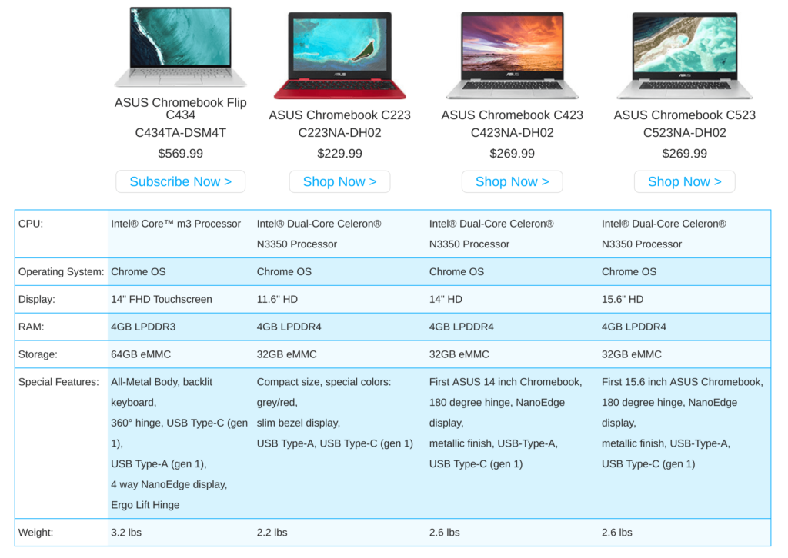

We've seen some online retailers start to tip their hand early for [availability and pricing of the Asus Chromebook Flip C434](https://www.aboutchromebooks.com/news/asus-chromebook-flip-c434-availability-price-specs-promevo/). [Staples joined Promevo last week](https://www.aboutchromebooks.com/news/base-asus-chromebook-flip-c434-at-staples-core-i5-model-at-promevo/) with the latter adding an upgraded model and its cost. Now, Asus is getting its own messaging out.

I realized this when I saw the above ad on a site and later saw the below banner ad. It shows the 2-in-1 Chromebook along with a "Shop Now" call to action.

Unfortunately, clicking that text _doesn't_ let you shop now. However, it does allow you to [subscribe to updates using an Asus Member account for the Asus Chromebook Flip C434 on a new page of the Asus site](https://www.asus.com/us/site/chromebook-moreeverything/?gclid=EAIaIQobChMIsbOf5KaM4QIVjcHACh0k3g9cEAEYASAAEgLFXfD_BwE). That page shows the C434 along with three other older Flip devices which you can purchase.

The page also confirms the direct price of the [base model to be $569.99](https://www.aboutchromebooks.com/news/asus-chromebook-flip-c434-release-date-price-specs-availability/) as well as the previously announced specs:

- Intel Core M3-8100Y, 2C/4T, 1.1GHz (4MB cache, up to 3.4GHz)
- 14” LED-backlit IPS NanoEdge display, 100% sRGB, 1920 x 1080 with 5mm bezels and a 360-degree hinge
- 4 GB LPDDR3 memory
- 64 GB eMMC storage
- MicroSD card reader, 802.11ac Wi-Fi, Bluetooth 4.0
- Two USB Type-C ports, one USB Type-A port (all ports are USB 3.1)
- Backlit keyboard and multi-touch trackpad
- HD webcam, presumably 720p based on the lack of a “FullHD” mention
- 48 WHr battery, no estimated run-time yet
- 3.2 pounds

There's no mention currently of the higher priced models which will come with additional memory and storage as well as either an Intel Core i5-8200Y or Core i7-8500Y processor.

And although we pretty much know everything about the Asus Chromebook Flip C434, the new information page includes this video:

https://youtu.be/Fxu6b6lDo-Y

My hope is that Asus doesn't consider registering for availability information the same as actual product availability by the end of March, which is less than two weeks away.
