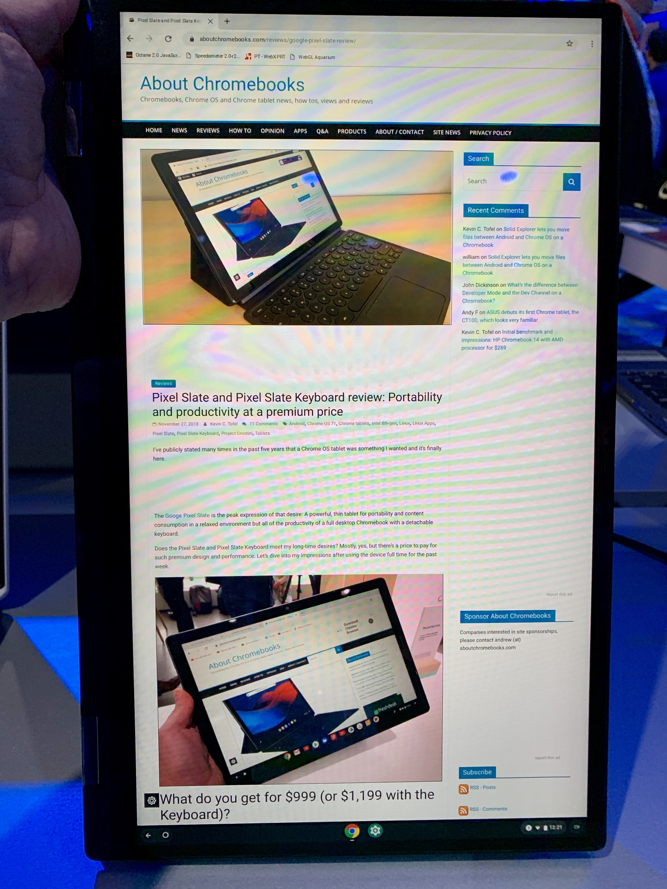
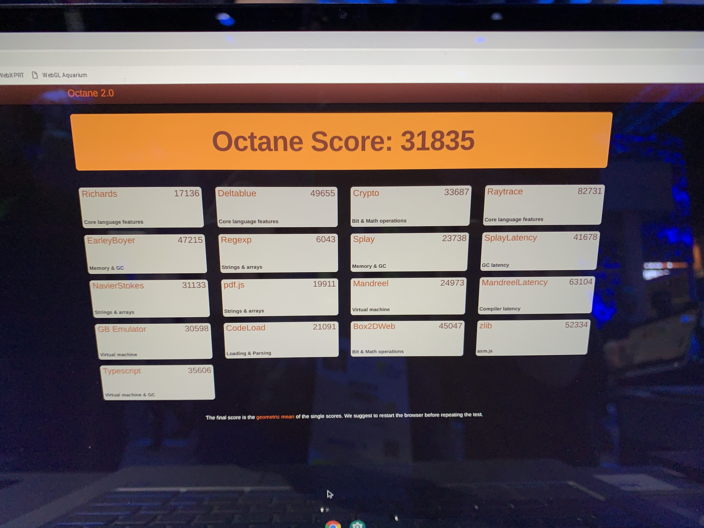

I got some hands-on time with the [new Asus Chromebook Flip C434](https://www.aboutchromebooks.com/news/asus-chromebook-c434-vs-flip-c302-acer-chromebook-spin-13/) last week at the Consumer Electronics Show, showing me it's a great update from the C302 that Asus has been selling for the past two years. I couldn't get a firm release date or price from Asus, however, and the latter is important: I suggested after my time with the device that if Asus could keep the starting price between $550 and $599, it would be a strong contender for those looking to purchase a solid 2-in1 Chromebook.

It appears there are some details on price and availability out there though. Piecing together info from two different sources, the Asus Chromebook Flip C434 should be available in March, with a starting price of $569, right in the target cost range I was hoping for.

[The availability date comes directly from Google](https://cloud.google.com/blog/products/chrome-enterprise/two-new-enterprise-chromebooks-for-cloud-workers-announced-at-ces), so I have little doubt about its veracity. Google's Keyword blog announcing the C434, as well as the new HP Chromebook X360 G1 for enterprises, says "The Asus Chromebook Flip C434 will be available in March 2019. Both devices will be available in select countries globally."

That date makes sense to me after using the device. I saw some software glitches and issues with tablet mode -- the keyboard was not disabled when I folded the 14-inch display behind the keyboard -- and figured it will take a good month or so to resolve.

[As far as pricing, Android Police appears to have gotten Asus on record](https://www.androidpolice.com/2019/01/08/asus-chromebook-flip-c434-is-the-first-chromebook-worth-waiting-for-in-2019/), noting "Asus expects the launch the Chromebook Flip C434 starting around $569. Asus says there might just be one SKU in the US at first, most likely the Core i5. Core M3 and Core i7 versions will also be out there."

While that's not a final price due to the words "expects" and "around", it gives us a good idea that the price will be in that $550 to $599 range to start that I was looking for. Yes, that's probably for an M3 model and may be with 4 GB of memory. To be honest, that's good enough for many people just looking for a decent browsing experience on a high-resolution, large screen.

As a refresher, here are the specs of the Asus Chromebook Flip 434, which is very comparable to the Pixel Slate in terms of the 8th-generation Intel processor choices:

- Intel Core M3-8100Y, 2C/4T, 1.1GHz (4MB cache, up to 3.4GHz)
- Intel Core i5-8200Y, 2C/4T, 1.3GHz (4MB cache, up to 3.9GHz)
- Intel Core i7-8500Y, 2C/4T, 1.5GHz (4MB cache, up to 4.2GHz)
- 14” LED-backlit IPS NanoEdge display, 100% sRGB, 1920 x 1080 with 5mm bezels and a 360-degree hinge
- Up to 8GB LPDDR3
- Up to 128GB eMMC
- MicroSD card reader, 802.11ac Wi-Fi, Bluetooth 4.0
- Two USB Type-C ports, one USB Type-A port (all ports are USB 3.1)
- Backlit keyboard and multi-touch trackpad
- HD webcam, presumably 720p based on the lack of a “FullHD” mention
- 48 WHr battery, no estimated run-time yet
- 3.2 pounds

If you're interested in the C434, I'd caution you if you plan to use it in tablet mode for any length of time. It's a bit heavy and awkward due to the widescreen aspect ratio. Think of it like holding a 3.2-pound legal pad: You'll get a great amount of information from a portrait perspective but it's a bit big in the hands.

In terms of performance, I'd expect the Chromebook 434 to be just like the Pixel Slate since it has the same general internals. It may even be a smidge quicker since the integrated Intel HD Graphics 615 is pushing fewer pixels around too. I did a preliminary Octane 2.0 benchmark on the show floor but use this as a reference only: Without fully optimized software, the score is surely lower than what it will be when the final product arrives.

