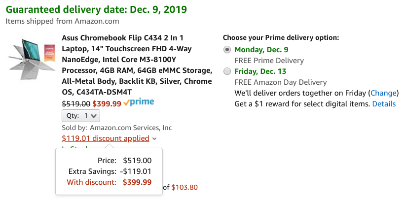

<iframe style="width:120px;height:240px;" marginwidth="0" marginheight="0" align="right" scrolling="no" frameborder="0" src="//ws-na.amazon-adsystem.com/widgets/q?ServiceVersion=20070822&amp;OneJS=1&amp;Operation=GetAdHtml&amp;MarketPlace=US&amp;source=ss&amp;ref=as_ss_li_til&amp;ad_type=product_link&amp;tracking_id=aboutchromebo-20&amp;language=en_US&amp;marketplace=amazon&amp;region=US&amp;placement=B07Q2RB6BY&amp;asins=B07Q2RB6BY&amp;linkId=69afdc0bbe4b7aa06c28bce971dbf8f4&amp;show_border=true&amp;link_opens_in_new_window=true"></iframe>

Every so often I see some hard-to-find discount or coupon savings on Amazon products.

Today is one of those days and it's on [the $569.99 Asus Chromebook Flip C434](https://www.amazon.com/Chromebook-Touchscreen-Processor-All-Metal-C434TA-DSM4T/dp/B07Q2RB6BY/).

With the extra $119.09 discount applied to the current $50 off pricing, you can nab this 2-in-1 convertible Chromebook for $399.99, [as reported by Android Police](https://www.androidpolice.com/2019/12/05/asus-chromebook-flip-c434-deal/).

Just to be clear, Amazon sells two models of this convertible: One with 4GB of RAM and one with 8GB. Both have 64GB of local storage that can be expanded with a memory card.

Click for the Amazon discount deal on the Asus Chromebook Flip C434

**_The discount only applies to the 4GB model_**, which may not be enough memory for some people. But if you plan to use this Chromebook for casual browsing and productivity, it could be enough. Personally, [I always opt for as much RAM as possible](https://www.aboutchromebooks.com/news/acer-chromebook-spin-13-with-16-gb-ram-should-you-buy-one/), but then again, I'm a full-time Chromebook user that relies heavily on lots of browser tabs and Linux desktop apps.

With that said, you're getting a capable all-aluminum Chromebook for this price and it will get Chrome OS software updates all the way out to June 2026:

- Intel Core m3-8100Y, 2C/4T, 1.1GHz (4MB cache, up to 3.4GHz)
- 14” LED-backlit IPS NanoEdge display, 100% sRGB, 1920 x 1080 with 5mm bezels and a 360-degree hinge
- 4 GB LPDDR3 memory
- 64 GB eMMC storage
- MicroSD card reader, 802.11ac Wi-Fi, Bluetooth 4.0
- Two USB Type-C ports, one USB Type-A port (all ports are USB 3.1)
- Backlit keyboard and multi-touch trackpad
- HD webcam, presumably 720p based on the lack of a “FullHD” mention
- 48 WHr battery with an estimated 10 hours of runtime
- 3.2 pounds

Essentially, you're getting many of the same or similar internals as the [Pixelbook Go, which is a Chromebook I really like](https://www.aboutchromebooks.com/news/pixelbook-go-review-a-premium-price-validated-by-a-premium-device/). Of course, the Pixelbook Go is $250 more than this sale price, so even if I was looking at the Go right now, I'd probably lean towards saving a little money and going with the Asus.
