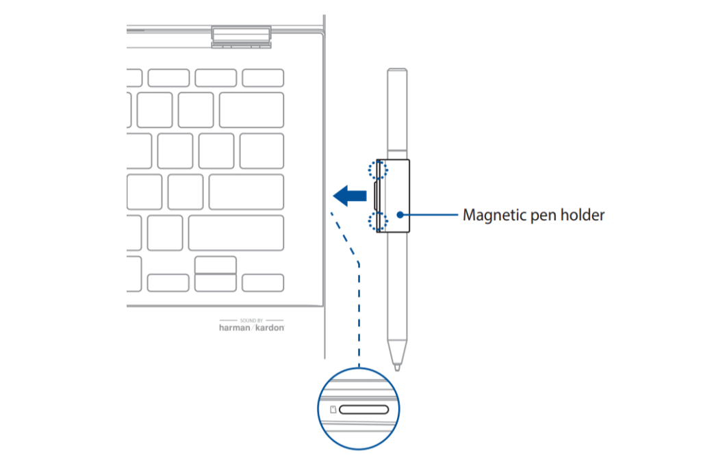

While we're waiting for the [Asus Chromebook Flip C436](https://www.aboutchromebooks.com/news/asus-chromebook-flip-c436-specifications-release-date-price-ces-2020/) to become available, I've been digging around for additional information on this high-end 2-in-1.

Today I found the [user manual (PDF)](https://dlcdnets.asus.com/pub/ASUS/Commercial_NB/C436FA/0409_E15701_C436FA_A.pdf?_ga=2.219647440.872251057.1582047754-1624638369.1579624720), which is a little generic in some places but also shows an optional Asus Universal Stylus Initiative (USI) pen with an ingenious attachment method.

The manual details an unannounced, optional Asus USI Pen and shows a magnetic clip for the pen. Unlike other pen-enabled devices that add some loop to computer, Asus created the pen-holder to clip into the Flip C436's microSD card.

Asus USI pen and Chromebook Flip C436

This is quite clever although I'm wondering if you can also have a memory card in the slot; it's difficult to tell based on the limited information provided.

Even if you can't, it's a small price to pay for heavy stylus users. Keep in mind that the base model of the Asus Chromebook Flip C436 comes with 128 GB of internal storage which reduces the need to have any external storage; [other models will offer 256 and 512 GB of storage](https://www.asus.com/2-in-1-PCs/ASUS-Chromebook-Flip-C436FA/).

I've searched extensively for the Asus USI pen to get a feel for the price, but I've come up empty so far. I do know that as of now, it won't be included with this Chromebook as it's not mentioned through the "in the box" section of the product page.
