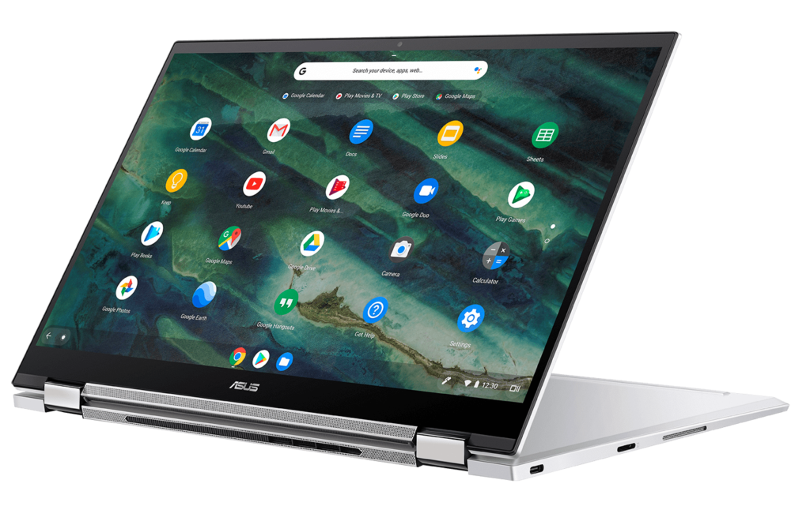
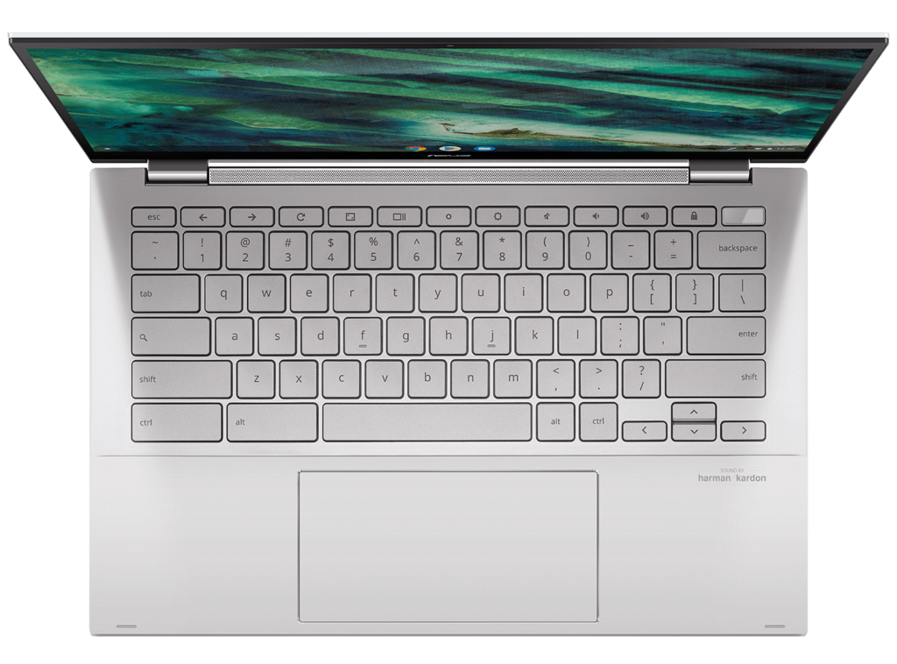
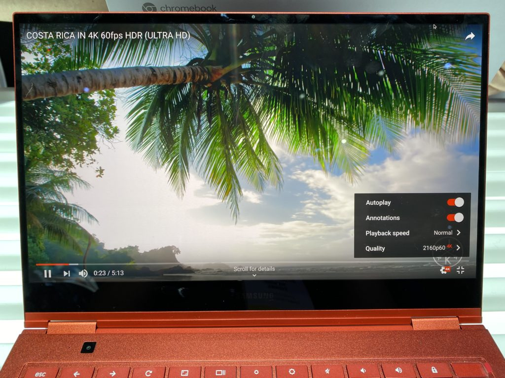

The main question we were left with from the [Asus Chromebook Flip C436 introduction](https://www.aboutchromebooks.com/news/asus-chromebook-flip-c436-specifications-release-date-price-ces-2020/) was the price. And now we have it: The base model of this 2-in-1 with 10th-generation Intel processors starts $200 less than the [$999 Samsung Galaxy Chromebook](https://www.aboutchromebooks.com/news/samsung-galaxy-chromebook-specifications-release-date-price-ces-2020/) at $799. But, that's not a true apples to apples comparison.

[Chrome Unboxed](https://chromeunboxed.com/asus-chromebook-c436-release-date-core-i3-i5-preorder-799/) caught wind of an [Amazon pre-order page for the new Asus Chromebook Flip C436](https://www.amazon.com/ASUS-Touchscreen-Fingerprint-C436FA-DS388T-Magnesium-Alloy/dp/B083ZB9YQ6/), showing just what you get for $799.99. Amazon says the product will be released on February 24, 2020.

Here's a rundown on the specifications for this base model:

<table class=""><tbody><tr><td>CPU</td><td>Intel Core i3-10110U Processor</td></tr><tr><td>GPU</td><td>Intel UHD Graphics</td></tr><tr><td>Display</td><td>14-inch 16:10 1080p touchscreen, USI stylus support, 100% sRGG color gamut</td></tr><tr><td>Memory</td><td>8 GB DDR3</td></tr><tr><td>Storage</td><td>128 GB NVMe M.2, microSD card for expansion</td></tr><tr><td>Connectivity</td><td>Dual-band Wi-Fi 6 (802.11ax), Bluetooth 5.0</td></tr><tr><td>Input</td><td>Backlit keyboard, multitouch trackpad, integrated quad-mic array, webcam</td></tr><tr><td>Ports</td><td>2 USB Type-C (3.2), combination microphone / headphone jack</td></tr><tr><td>Battery</td><td>42 WHr, claimed run-time of 12 hours</td></tr><tr><td>Weight</td><td>2.4 pounds</td></tr><tr><td>Software</td><td>Chrome OS automatic update expiration date: TBD</td></tr></tbody></table>

How does this compare to the $999 Samsung Galaxy Chromebook?

Well, you lose the 4K AMOLED display for starters. And you don't get an integrated stylus although you can purchase an optional USI pen that will work with the Flip C436. The Asus also drops down from the Core i5 processor and 256 GB of storage inside the Samsung. Both devices come with 8 GB of memory.

There is a plus for the Asus Chromebook Flip C436, at least on paper. Asus expects this 2-in-1 to run for up to 12 hours on a charge while Samsung told me to expect 9 hours from its $999 Chromebook.

A truer comparison between the Asus and Samsung offerings is better found in the [$999 configuration for the Chromebook Flip C436, also available for pre-order on Amazon](https://www.amazon.com/ASUS-Touchscreen-Fingerprint-C436FA-DS599T-W-Magnesium-Alloy/dp/B083Z8K6D8/).

This price bumps up the C436 to the same Intel Core i5-10210U found in the Samsung Galaxy Chromebook, a whopping 512 GB of storage and double the memory: You have 16 GB of RAM to work with for $999 in the Asus.

As nice as I found the [Samsung Galaxy Chromebook in my hands-on time](https://www.aboutchromebooks.com/news/samsung-galaxy-chromebook-hands-on-yes-its-as-nice-as-it-looks/), I'm not sure which I would go for.

That 4K AMOLED display on the Samsung is stellar but I could forgo that by getting more battery life and double the memory, which are more important to me personally. Others looking for a strong performing 2-in-1 could be happy to save $200 and just get the base model of the Flip C436.

Anyone pre-ordering the Asus Chromebook Flip C436 or are you holding out for the Samsung Galaxy Chromebook, expected by March?
