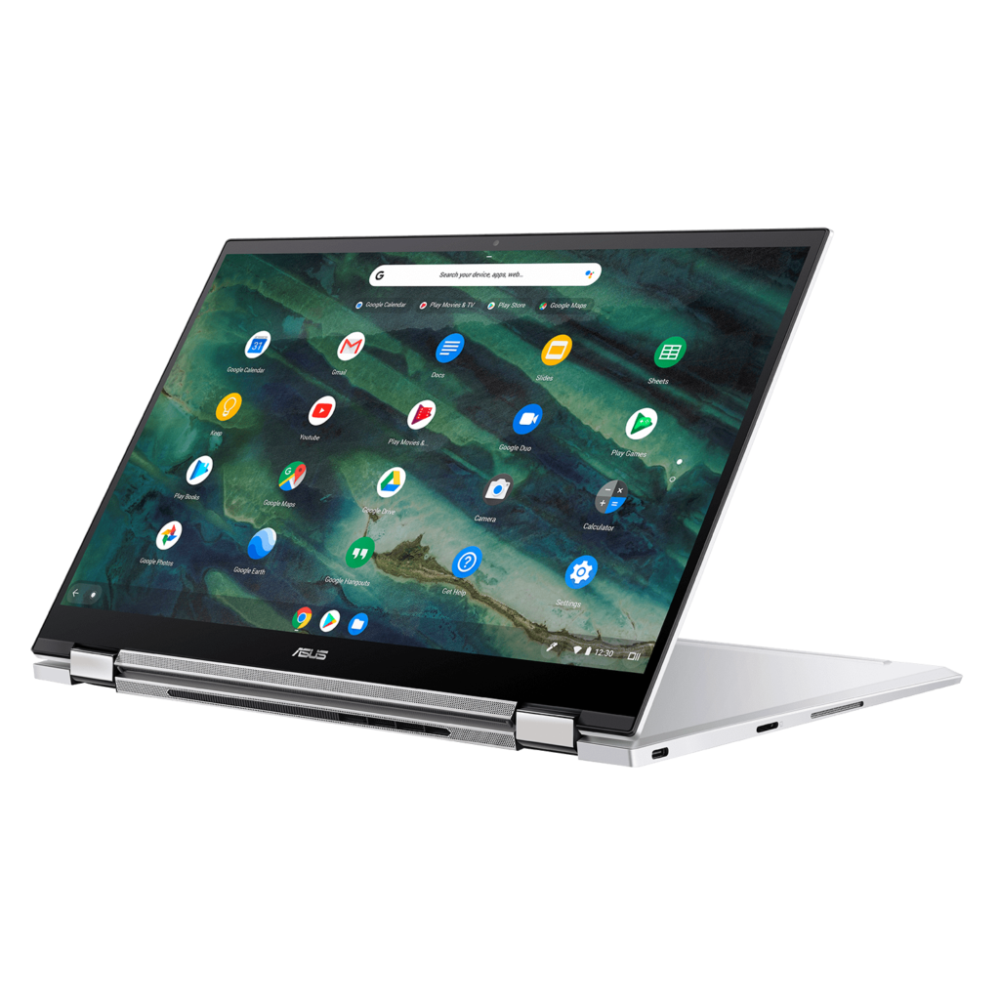
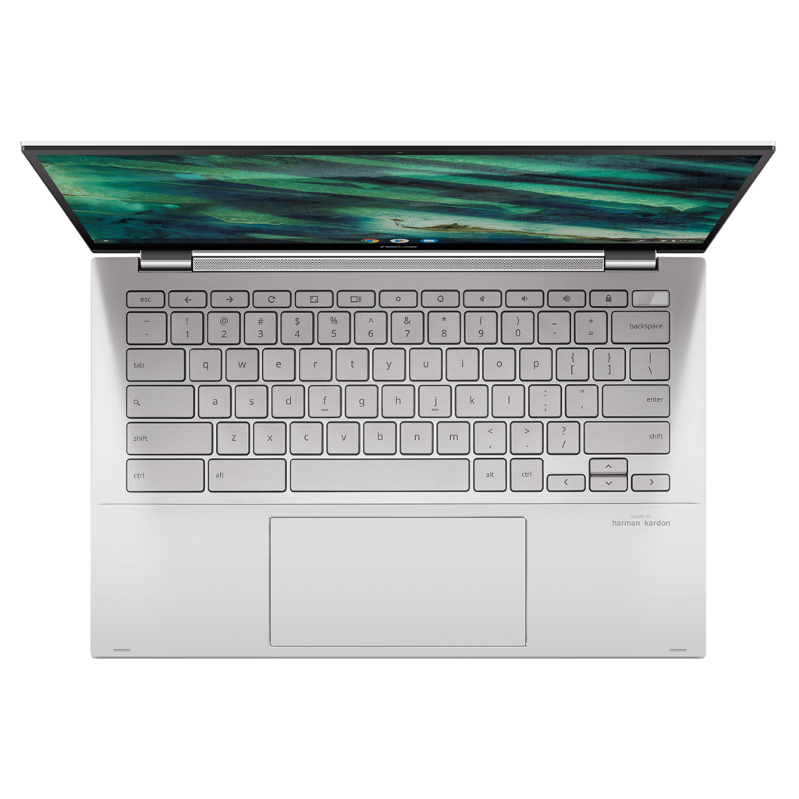
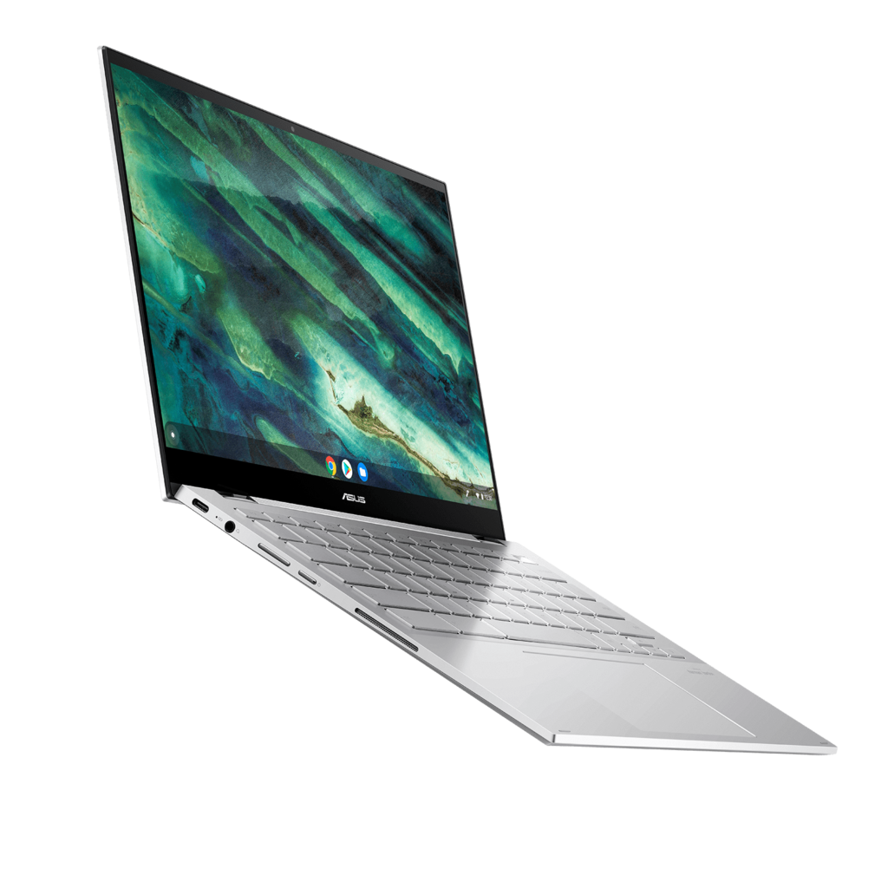
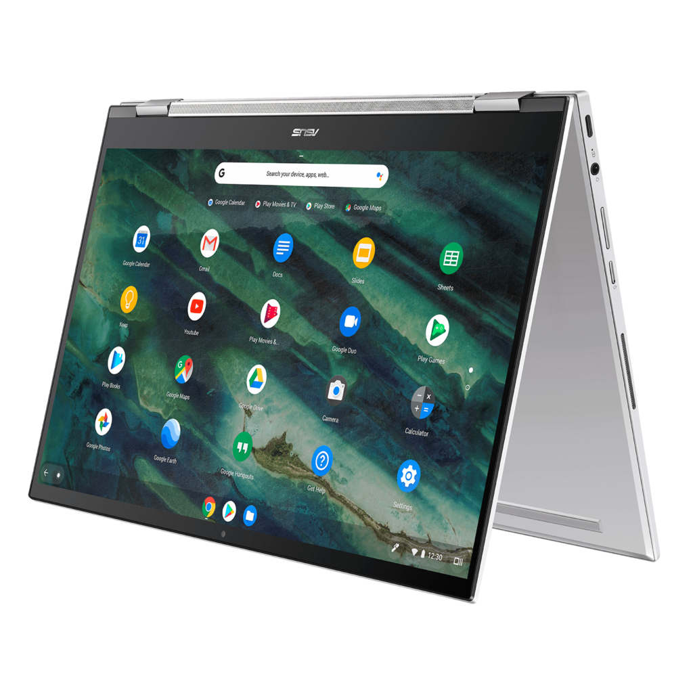

[Samsung isn't the only one getting in on the high-end 2-in-1 Chromebook craze at CES 2020](https://www.aboutchromebooks.com/news/samsung-galaxy-chromebook-specifications-release-date-price-ces-2020/); this morning the [Asus Chromebook Flip C436 was announced too](https://www.businesswire.com/news/home/20200106005598/en/ASUS-Announces-New-Chromebook-Flip-C436). This is a solid update to the current Flip lineup and although it doesn't have an AMOLED 4K display like the Samsung Galaxy Chromebook, it ticks off most of the other bells and whistles for power users.

On the outside, the Asus Chromebook Flip C436 looks similar to the older Flip C434. It has what looks to be the same 16:10 1080 touchscreen display that also works with any USI digital pen. You also still get a pair of USB Type-C ports, although this model drops a full-sized USB Type-A.

There is an additional function though: Just like the Samsung Galaxy Chromebook, the top rightmost keyboard key doubles as a power button and a fingerprint sensor.

Inside are the larger differences.

You'll get a choice of 10-generation Intel Core i3, i5 or i7 processor to power this 2-in-1, with up to 512 GB of storage and a microSD card slot for expansion. Memory can be configured up to 16 GB as well. Intel's wireless chipset adds support for 802.11ax WiFi 6 and Bluetooth 5 as well while the Harman Kardon tuned stereo speakers provide sound.

Like the new Samsung, the Asus Chromebook Flip C436 is an Intel Project Athena device for speedy wake times, long battery life and connectivity while in sleep mode.

Here's a rundown of the full specs that Asus has shared to this point:

<table class=""><tbody><tr><td>CPU</td><td>Up to Intel Core i7-10510U Processor</td></tr><tr><td>GPU</td><td>Intel UHD Graphics</td></tr><tr><td>Display</td><td>14-inch 16:10 1080p touchscreen, USI stylus support, 100% sRGG color gamut</td></tr><tr><td>Memory</td><td>8 / 16 GB DDR3</td></tr><tr><td>Storage</td><td>Up to 512 GB M.2, microSD card for expansion</td></tr><tr><td>Connectivity</td><td>Dual-band Wi-Fi 6 (802.11ax), Bluetooth 5.0</td></tr><tr><td>Input</td><td>Backlit keyboard, multitouch trackpad, integrated quad-mic array, webcam</td></tr><tr><td>Ports</td><td>2 USB Type-C (3.2), combination microphone / headphone jack</td></tr><tr><td>Battery</td><td>42 WHr, claimed run-time of 12 hours</td></tr><tr><td>Weight</td><td>2.4 pounds</td></tr><tr><td>Software</td><td>Chrome OS automatic update expiration date: TBD</td></tr></tbody></table>

At this point, I suspect any Project Athena Chromebooks announced this week or beyond will have similar internals with a few minor differences. For example, you can configure the Samsung Galaxy Chromebook with 1 TB of internal storage while the Asus Chromebook Flip C436 tops out at 512 GB.

Hardware differences such as that one and display options will likely help differentiate pricing between models. And in that regard, Asus hasn't shared any US pricing yet. That information will probably surface in the near future as the Asus Chromebook Flip C436 is expected to launch in stores later either this quarter or the following one, depending on the market.

I'll swing by the Asus booth later this week at CES 2020 for some hands-on thoughts and to see if I can gather any additional details on configurations and pricing. I expect the base model with Core i3 to be well under the $999 Samsung Galaxy Chromebook, likely around $649 to start, but again, I'll see what I can find out.
