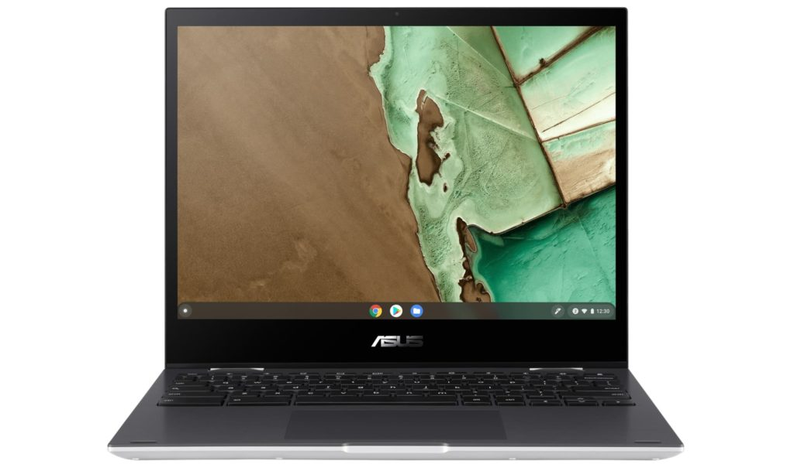

On Friday, I reported news that the [Asus Chromebook Flip CM3 detachable isn't going to be the only CM3](https://www.aboutchromebooks.com/news/asus-chromebook-flip-cm3-is-coming-in-a-larger-convertible-form-too/ "Asus Chromebook Flip CM3 is coming in a larger convertible form too"). There's a convertible option as well. At the time, the official product page didn't have the full technical details of this model. Today though, I see the [Asus Chromebook Flip CM3 convertible specs](https://www.asus.com/us/Laptops/For-Home/Chromebook/Chromebook-Flip-CM3200/techspec/ "https://www.asus.com/us/Laptops/For-Home/Chromebook/Chromebook-Flip-CM3200/techspec/") are live and they're _**mostly**_ what I suggested they'd be.

Yes, this 12-inch convertible Chromebook is powered by the MediaTek 8183 processor. All models come with 4 GB of memory and a fairly limited choice of internal storage options. Acer's product copy mentioned up to 128 GB of eMMC storage, but the current specifications show either 32 or 64 GB.

There is one surprise, however, at least to me.

Since the [smaller 10.5-inch detachable CM3](https://www.aboutchromebooks.com/news/asus-chromebook-flip-cm3000-tablet-vs-lenovo-duet-chromebook/ "Asus Chromebook Flip CM3000 tablet to take on the similar Lenovo Duet Chromebook") will have a 1920 x 1200 screen resolution, I figured for sure the convertible model would have the same. It's a larger screen after all. But.... no.

The 12-inch display isn't FullHD+ like I thought. Instead it's a 1366 x 912 panel. I'm not sure what to say about that other than "ugh". At least that will keep the price down?

Here are the full specifications, according to Asus:

<table><tbody><tr><td>CPU</td><td>MediaTek 8183 Processor 2.0 GHz(1M Cache, up to 2.0 GHz, 8 cores) &nbsp;</td></tr><tr><td>GPU</td><td>Arm Mali-G72 MP3</td></tr><tr><td>Display</td><td>12-inch, LCD, 1366 x 912 resolution, 3:2 aspect ratio, glossy display, 220nits, NTSC: 50%</td></tr><tr><td>Memory</td><td>4GB LPDDR4X on-board</td></tr><tr><td>Storage</td><td>32/64 eMMC plus microSD card expansion</td></tr><tr><td>Connectivity</td><td>TBD</td></tr><tr><td>Input</td><td>Keyboard and trackpad, 720p webcam</td></tr><tr><td>Ports</td><td>1 USB Type-C (2.0), 1 USB Type-A (2.0) built in microphone &amp; stereo speakers</td></tr><tr><td>Battery</td><td>32 WHr, claimed run-time of 16 hours</td></tr><tr><td>Weight</td><td>2.51 pounds</td></tr><tr><td>Software</td><td>Chrome OS automatic update expiration date: TBD but likely June 2028 or June 2029</td></tr></tbody></table>

To me, the biggest letdown is that lower-resolution display which is also dimmer than the detachable model's 300 nits. Well, you can't have it all, I guess. One potential plus is that Asus shows a USI stylus as optional but "in the box".

While we don't know the official price of either ASUS Chromebook Flip CM3, I have to believe that the convertible will cost at least $40 to $80 less than the detachable. There's absolutely no reason to price it higher that I can see. Stay tuned as I suspect we'll find out all the details soon!
