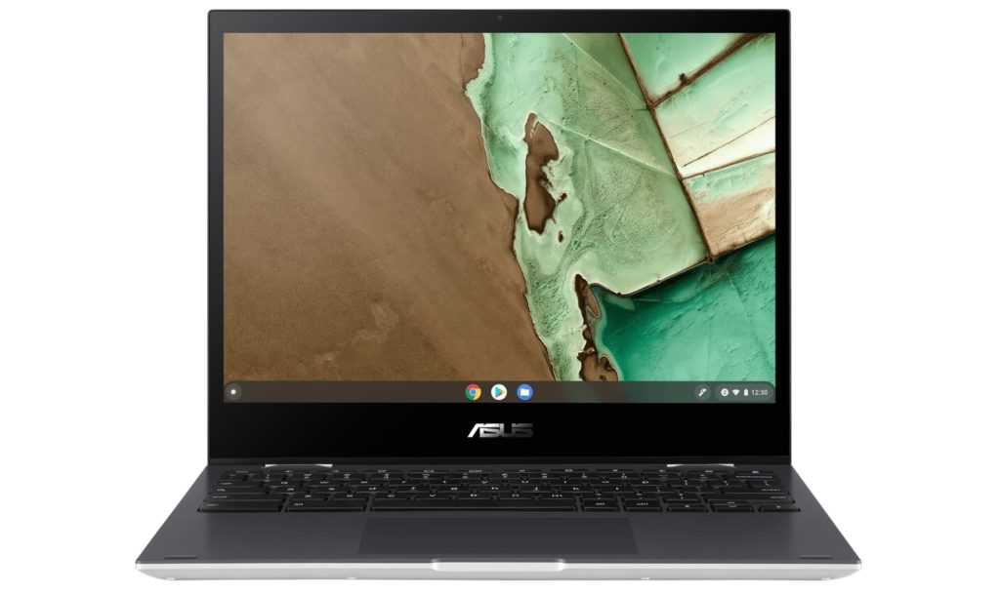
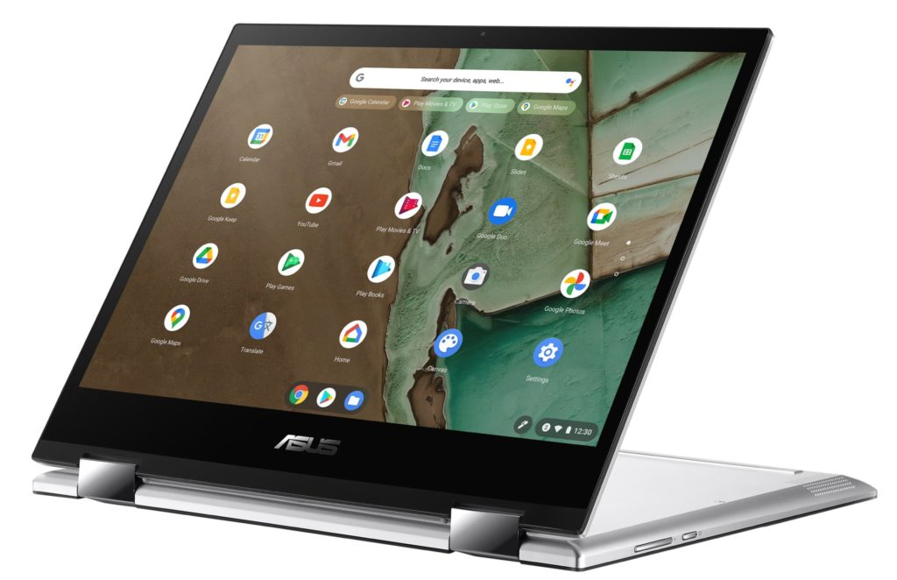
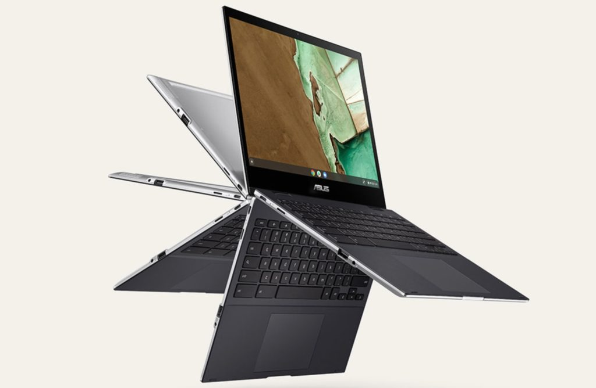

Well, this is interesting. I've been tracking the [Asus Chromebook Flip CM3 with a detachable keyboard and 10.5-inch display](https://www.aboutchromebooks.com/news/asus-chromebook-flip-cm3-tablet-is-official/ "Asus Chromebook Flip CM3 tablet is official") since last month. Today I see a landing page telling me the [Asus Chromebook Flip CM3 is coming in a convertible form factor](https://www.asus.com/us/Laptops/For-Home/Chromebook/Chromebook-Flip-CM3200/ "https://www.asus.com/us/Laptops/For-Home/Chromebook/Chromebook-Flip-CM3200/") with a larger display.

Technically, this model is the CM3200.

As of the time of writing, the Tech Specs section isn't showing any information. However, from reading the landing page copy, this convertible Chromebook will have a 12-inch touch display with 3:2 aspect ratio that supports an optional USI stylus.

From the images, I can also see one USB Type-C port, one USB Type A, a microSD card slot, and a microphone jack on the left side.

Given that that there aren't any secondary USB-ports on the right side, I suspect that the MediaTek 8183 that will power the [detachable version of the CM3](https://www.aboutchromebooks.com/news/asus-chromebook-flip-cm3-price-vs-lenovo-chromebook-duet/ "Asus Chromebook Flip CM3 reportedly will debut at $369") is also inside the convertible edition. There's also mention of up to 128 GB of eMMC storage and up to 16 hours of battery life, which further suggests this is an ARM-based Chromebook with fullHD+ resolution.

There is an off-chance that Asus is using a Snapdragon inside this model, but I don't think it is.  
  
All Snapdragon processors slated for Chromebooks have integrated LTE capabilities, or at the least the option for them. Asus doesn't mention any LTE support on the product page as of now.

Asus says this CM3 model weighs 1.1 kilograms and has velvet touch palm rests alongside the multi-touch trackpad. Otherwise, there's not yet much information to glean.

I'll keep an eye out for that specs page to confirm my thoughts on the hardware being used here.

